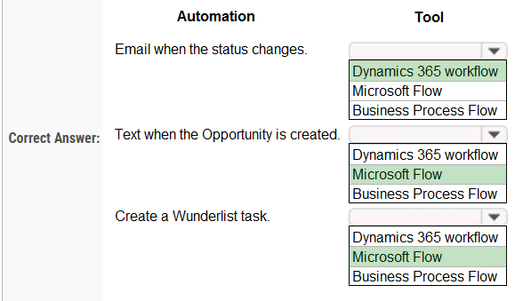
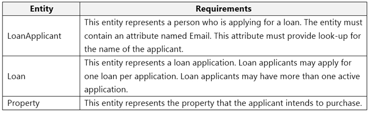
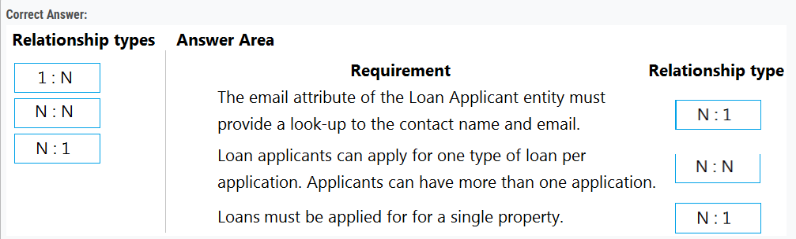

### Question - 1:

The owner of a company needs to know who signs into the system.
You need to ensure that the owner can view the user audit logs.
Where does each action need to be performed? To answer, select the appropriate options in the answer area.
NOTE: Each correct selection is worth one point.

  
Answer

  
  

### Question - 2:

Your organization does not permit the use of custom code for solutions.
You need to create a view that can be viewed by all users in an organization.
Where should you create the view?

-   A. List view of the entity
-   B. Microsoft Visual Studio
-   C. Templates area
-   D. Maker portal

  
Answer

  
  - D. Maker portal

### Question - 3:

You create a Power Apps portal to provide training and documentation for students. Students create a profile on the portal and then select and pay for courses.
You plan to add free courses to the training portfolio. Free courses must be automatically available to all students after they sign in.
You need to assign default permissions to students.
What should you do?

-   A. Create a Students web role and set the Authenticated Users Role option to true. Assign the web role to each registered user.
-   B. Create an entity for managing free courses. Create entity permission records to provide access to entity records for free courses and assign the entity permissions to users when they register on the portal for the first time.
-   C. Create an entity for managing free courses. Create a Students web role and set the Authenticated Users role option to true. Create appropriate entity permissions to access the free course entity records and assign the entity permissions to the web role.

  
Answer

  
  - C. Create an entity for managing free courses. Create a Students web role and set the Authenticated Users role option to true. Create appropriate entity permissions to access the free course entity records and assign the entity permissions to the web role.

### Question - 4:

You create workflows to automate business processes.
You need to configure a workflow to meet the following requirements:

-   Be triggered when a condition is met.
-   Run immediately.
-   Perform an action when a condition is met.
    You need to create a workflow that automatically sends emails based on a mail merge template. To answer, select the appropriate configuration in the answer area.
    NOTE: Each correct selection is worth one point.

  
Answer

  
  

### Question - 5:

You are a Dynamics 365 Customer Service administrator.
You need to configure the following automation for the sales team:

-   Send an email when the status changes on an Opportunity.
-   Text the sales manager when an Opportunity is created.
    Create a Wunderlist task when an Opportunity is open for 30 days.

Which tool should you use for each requirement? To answer, select the appropriate options in the answer area.
NOTE: Each correct selection is worth one point.

  
Answer

  
  

### Question - 6:

A company uses Microsoft Dataverse to manage prospects. The company has a business process flow named BPFA that is associated with the Prospect entity to streamline the prospect management process.
You add a field named Category to the Prospect entity. You create additional business process flows. You apply the business process flows to Prospect records based on the selected category. Users can switch to any other newly configured business process flows but must not use BPFA. 
You need to configure the solution. 
What are two possible ways to achieve this goal? Each correct answer presents a complete solution. 
NOTE: Each correct selection is worth one point.

-   A. Remove all of the privileges for BPFA.
-   B. Use a business rule to prevent users from switching to BPFA.
-   C. Deactivate BPFA.
-   D. Change the display order of the business process flows to move BPFA to the bottom of the list.

  
Answer

-   A. Remove all of the privileges for BPFA
-   C. Deactivate BPFA.

### Question - 7:

You are creating a business rule to implement new business logic.
You must apply the business logic to a canvas app that has a single screen named Screen1. 
You need to configure the scope for the business rule. 
Which scope should you use?

-   A. Screen1
-   B. Entity
-   C. All Forms
-   D. Global

  
Answer

-   B. Entity

### Question - 8:

You are a Dynamics 365 Customer Services administrator. You have a Production instance and Sandbox instance. 
Users record Production instance data in the Sandbox instance.
You need to ensure that the users only record data in the Production instance. 
Which security function needs to be edited to prevent access to the Sandbox? To answer, select the appropriate options in the answer area. 
NOTE: Each correct selection is worth one point.

  
Answer

-   Groups
-   Roles

### Question - 9:

You must create a new entity to support a new feature for an app. Records for the entity must be associated with a business unit and specify security roles for the business unit. 
You need to configure entity ownership. 
Which entity ownership type should you use?

-   A. user or team owned
-   B. organization-owned
-   C. none
-   D. business-owned

  
Answer

-   A. user or team owned

### Question - 10:

You need to ensure that there are no leads for a customer before you create a new opportunity for the customer. 
How can you use duplicate detection rules to achieve this goal? To answer, select the appropriate options in the answer area. 

  
Answer

-   Opportunity
-   Account

### Question - 10:

  
Answer

### Question - 11:

You have two Microsoft Power Platform environments.  
Users in one environment must not be able to see the other environment.  
You need to grant salespeople access to the sales company environment.  
What should you do?

-   A. Add salespeople to an Office 365 security group.
-   B. Add salespeople to a security role.
-   C. Set privileges.
-   D. Set app security.

  
Answer

-   A. Add salespeople to an Office 365 security group.

### Question - 12:

A veterinary office plans to use Power Platform to streamline customer experiences. The customer creates a canvas apps to manage appointments.  
On the client appointment form, there is a dropdown field for clients to select their type of pet. If a client selects the option   Other, the veterinarian wants a text field to appear so that additional details can be added. 
You need to create a dynamically visible field. 
What should you configure?

-   A. workflow
-   B. business process flow
-   C. business rule

  
Answer

-   C. business rule

### Question - 13:

You create an app for the sales team at a company.  
Members of the sales team cannot access the app.  
You need to ensure that sales team members can access the app.  
Where should you configure app permissions?

-   A. Dynamics administration center
-   B. Manage Roles
-   C. Security Roles

  
Answer

-   C. Security Roles

### Question - 14:

You create a parent entity and a child entity. The parent entity has a 1:N relationship with the child entity.  
You need to ensure that when the owner changes on the parent record that all child records are assigned to the new owner.  
You need to configure the relationship behavior type.  
What should you use?

-   A. Referential
-   B. Referential, Restrict Delete
-   C. Parental
-   D. Restrict

  
Answer

-   C. Parental

### Question - 15:

You need to recommend a role for users to perform several required tasks. The solution must use the principle of least privilege.  
Which roles should you recommend? To answer, drag the appropriate roles to the correct functions. Each role may be used once, more than once, or not at all.  >
You may need to drag the split bar between panes or scroll to view content.  
NOTE: Each correct selection is worth one point.  
Select and Place:

  
Answer

### Question - 16:

You are designing an app for a bank.  
You must create entities for the app and configure relationships between entities:  

Which relationship types should you use? To answer, drag the appropriate relationship types to the correct requirements. Each relationship type may be used once, more than once, or not at all. You may need to drag the split bar between panes or scroll to view content.  
NOTE: Each correct selection is worth one point.  
Select and Place:

  
Answer

### Question - 17:

Note: This question is part of a series of questions that present the same scenario. Each question in the series contains a unique solution that might meet the stated goals. Some question sets might have more than one correct solution, while others might not have a correct solution. 
After you answer a question in this section, you will NOT be able to return to it. As a result, these questions will not appear in the review screen. 
You administer the Microsoft 365 and Power Platform environments for Contoso, Ltd. The company has a model-driven app that is used to track customer interactions with employees. The app uses standard table types for customers. A user named Elisabeth Rice signs in to the app by using the following sign in name: Elisabeth.Rice@contoso.com.  
After marriage, Elisabeth changes her legal name to Elisabeth Mueller.  
You need to update the sign in name for the user without losing any application history.  
Solution: Change Elizabeth's username in the user record for the app.  
Does the solution meet the goal?

-   A. Yes
-   B. No

  
Answer

-   B. No

### Question - 18:

Note: This question is part of a series of questions that present the same scenario. Each question in the series contains a unique solution that might meet the stated goals. Some question sets might have more than one correct solution, while others might not have a correct solution. 
After you answer a question in this section, you will NOT be able to return to it. As a result, these questions will not appear in the review screen. 
You administer the Microsoft 365 and Power Platform environments for Contoso, Ltd. The company has a model-driven app that is used to track customer interactions with employees. The app uses standard table types for customers. A user named Elisabeth Rice signs in to the app by using the following sign in name: Elisabeth.Rice@contoso.com. 
After marriage, Elisabeth changes her legal name to Elisabeth Mueller.  
You need to update the sign in name for the user without losing any application history.  
Solution: Ask the Microsoft 365 administrator to sign in to the admin portal and change the username.  
Does the solution meet the goal?

-   A. Yes
-   B. No

  
Answer

-   A. Yes

### Question - 19:

Note: This question is part of a series of questions that present the same scenario. Each question in the series contains a unique solution that might meet the stated goals. Some question sets might have more than one correct solution, while others might not have a correct solution.  
After you answer a question in this section, you will NOT be able to return to it. As a result, these questions will not appear in the review screen.  
You administer the Microsoft 365 and Power Platform environments for Contoso, Ltd. The company has a model-driven app that is used to track customer interactions with employees. The app uses standard table types for customers. A user named Elisabeth Rice signs in to the app by using the following sign in name: Elisabeth.Rice@contoso.com.  
After marriage, Elisabeth changes her legal name to Elisabeth Mueller.  
You need to update the sign in name for the user without losing any application history.  
Solution: Delete the user account in the Power Platform admin portal and recreate the account by using the new name.  
Does the solution meet the goal?

-   A. Yes
-   B. No

  
Answer

-   B. No

---

### Question - 20:

You need to create a system chart for the Account entity. 
The chart must display a count of accounts grouped by owner and then display the accounts by Address 1: State/Province for each owner. You begin to configure chart options as shown in the ./images/image below. 

How should you complete the configuration? To answer, select the appropriate options in the answer area.  
NOTE: Each correct selection is worth one point. The chart must display a count of accounts grouped by owner, and then display the accounts by Address 1 to  
State/Province for each owner.  

  
Answer

---

### Question - 21:

A user has access to an existing Common Data Service database.  
You need to ensure that the user can create canvas apps that consume data from Dataverse.   You must not grant permissions that are not required.  
Which out-of-the-box security role should you assign to the user?

-   A. Environment Admin
-   B. System Customizer
-   C. Common Data Service User
-   D. Environment Maker

  
Answer

-   D. Environment Maker

---

### Question - 22:

A company deploys several model-driven apps. The company uses shared devices in their warehouse. The devices are always powered on. Users log on to the devices and then launch the apps to perform actions.  
Unauthorized users recently uploaded several files after another user failed to log out of a device. The company needs to prevent these incidents from occurring in the future.  
You need to configure the solution to prevent the reported security incidents.  
What should you do? To answer, select the appropriate options in the answer area.  
NOTE: Each correct selection is worth one point.  

  
Answer

-   Set a timeout in the Power Platform admin center
-   Enter the restricted file types in the PowerPlatform Admin center

---

### Question - 23:

A company's sales staff wants a simplified way to manage their opportunities in Dynamics 365 Sales without adding custom code.  
You need to provide a solution for each requirement.  
Which solutions should you provide? To answer, select the appropriate options in the answer area.  
NOTE: Each correct selection is worth one point.  

  
Answer

---

### Question - 24:

Note: This question is part of a series of questions that present the same scenario. Each question in the series contains a unique solution that might meet the stated goals. Some question sets might have more than one correct solution, while others might not have a correct solution.  
After you answer a question in this section, you will NOT be able to return to it. As a result, these questions will not appear in the review screen.  
You administer the Microsoft 365 and Power Platform environments for Contoso, Ltd. The company has a model-driven app that is used to track customer interactions with employees. The app uses standard table types for customers. A user named Elisabeth Rice signs in to the app by using the following sign in name: Elisabeth.Rice@contoso.com.  
After marriage, Elisabeth changes her legal name to Elisabeth Mueller.  
You need to update the sign in name for the user without losing any application history.  
Solution: From Dynamics 365 Settings, select Email Configuration. In the active mailbox for the user, update the name.  
Does the solution meet the goal?  

-   A. Yes
-   B. No

  
Answer

-   No

---

### Question - 25:

You plan to implement Microsoft Dataverse.  
You must track changes for two columns in the Account table. You must maintain a historical log of changes for the two columns and track only what is necessary.  
You configure the appropriate organization settings.  
You need to configure the system to track changes for the two columns.  
Which two actions should you perform? Each correct answer presents part of the solution.  
NOTE: Each correct selection is worth one point.  

-   A. Enable auditing for the Account table.
-   B. Enable auditing for the two specific columns.
-   C. Enable change tracking for the Account table.
-   D. Enable change tracking for the two specific columns.

  
Answer

-   A. Enable auditing for the Account table.
-   B. Enable auditing for the two specific columns.

---

### Question - 26:

Note: This question is part of a series of questions that present the same scenario. Each question in the series contains a unique solution that might meet the stated goals. Some question sets might have more than one correct solution, while others might not have a correct solution.  
After you answer a question in this section, you will NOT be able to return to it. As a result, these questions will not appear in the review screen.  
On a Contact record, a user creates a Note record that contains the word running.  
One week later, the user reports that they cannot find the Contact record associated with the Note record.  
You need to find the Note record.  
Solution: Use Categorized Search to search for the word run.  
Does the solution meet the goal?  

-   A. Yes
-   B. No

  
Answer

-   B. No

---

### Question - 27:

Note: This question is part of a series of questions that present the same scenario. Each question in the series contains a unique solution that might meet the stated goals. Some question sets might have more than one correct solution, while others might not have a correct solution.  
After you answer a question in this section, you will NOT be able to return to it. As a result, these questions will not appear in the review screen.  
On a Contact record, a user creates a Note record that contains the word running.  
One week later, the user reports that they cannot find the Contact record associated with the Note record.  
You need to find the Note record.  
Solution: Use Relevance Search to search for the word run.  
Does the solution meet the goal?  

-   A. Yes
-   B. No

  
Answer

-   Yes

---

### Question - 28:

Note: This question is part of a series of questions that present the same scenario. Each question in the series contains a unique solution that might meet the stated goals. Some question sets might have more than one correct solution, while others might not have a correct solution.  
After you answer a question in this section, you will NOT be able to return to it. As a result, these questions will not appear in the review screen.  
On a Contact record, a user creates a Note record that contains the word running.  
One week later, the user reports that they cannot find the Contact record associated with the Note record.  
You need to find the Note record.  
Solution: Use Quick Find search on the Notes list to search for the word run.  
Does the solution meet the goal?  

-   A. Yes
-   B. No

  
Answer

-   No

---

### Question - 29:

You are implementing a model-driven app to support a new line of business.  
There are several places where automated business logic must be applied.  
You need to determine how to apply the business logic.  
Which method should you use? To answer, drag the appropriate methods to the appropriate business logic statements. Each method may be used once, more than once, or not at all. You may need to drag the split bar between panes or scroll to view content.  
NOTE: Each correct selection is worth one point.  

  
Answer

-   Business rules
-   Real-time workflow
-   Real-time workflow

---

### Question - 30:

Your organization does not permit the use of custom code for solutions.  
You need to create a view that can be viewed by all users in an organization.  
Where should you create the view?  

-   A. Advanced Find
-   B. Entities component of a solution
-   C. Microsoft Excel template
-   D. Templates area

  
Answer

-   B. Entities component of a solution

---

### Question - 31:

You develop a Power Apps app.  
Users report that the main form does not display data from other entities or allow them to edit data from other entities.  
You need to embed information from other entities in the form and allow users to edit the data.  
Which actions should you perform? To answer, select the appropriate options in the answer area.  
NOTE: Each correct selection is worth one point.  

  
Answer

-   Add a sub-grid
-   Add a quick view

### Question - 32:

A company uses a canvas app to manage production resources in a specific region. Employees must be at company locations to use the app.  
Due to a sudden requirement for employees to work remotely, employees no longer commute to a specific location to conduct their work and cannot access the canvas app.  
You must reconfigure the app to ensure that employees only access the app from a limited number of locations.  
You need to restrict access to the app.  
Which components should you configure? To answer, select the appropriate options in the answer area.  
NOTE: Each correct selection is worth one point.  

  
Answer

---

### Question - 33:

You attempt to deactivate several currencies in a Microsoft Dataverse environment.  
You are not able to deactivate one of the currencies.  
You need to determine why you cannot deactivate the currency.  
What is the reason?  

-   A. You are not the currency record owner.
-   B. The currency is used by an active business process.
-   C. The currency is the base currency.
-   D. The currency is used by another record.

  
Answer

-   C. The currency is the base currency.

---

### Question - 34:

A user has access to an existing Microsoft Dataverse database.  
You need to ensure that the user can create canvas apps that consume data from Dataverse. You must not grant permissions that are not required.  
Which out-of-the-box security role should you assign to the user?  

-   A. Environment Admin
-   B. Basic User
-   C. Environment Maker
-   D. System Customizer

  
Answer

-   C. Environment Maker

---

### Question - 35:

You are configuring Microsoft Dataverse security. You plan to assign users to teams.  
Record ownership and permissions will differ based on business requirements.  
You need to determine which team types meet the requirements.  
Which team type should you use? To answer, drag the appropriate team types to the correct requirements. Each team type may be used once, more than once, or not at all. You may need to drag the split bar between panes or scroll to view content.  
NOTE: Each correct selection is worth one point.  

  
Answer

-   Azure Active Directory group Team / Entra ID
-   Access team

---

### Question - 36:

A company has locations in the United States, Brazil, India, and Japan. The company conducts financial transactions in all of these regions.  
Financial transactions in Brazil are going to stop, but the office will remain open.  
Users must no longer be able to create records associated with the Brazilian currency. Historical records must remain intact.  
You need to configure Microsoft Dataverse to meet the requirement  
What should you do?  

-   A. Disable the Brazilian language pack.
-   B. Rename the Brazilian currency.
-   C. Delete the Brazilian currency record.
-   D. Deactivate the Brazilian currency record.

  
Answer

-   D. Deactivate the Brazilian currency record.

---

### Question - 37:

You are setting up Power Apps security for a company. The company has a CEO, two vice presidents, and 10 managers. Five support representatives report to each manager.  
You set up Manager Hierarchy so managers are able to view data only for the representatives who report to them. The CEO must be able to view all data for everyone. All support representatives must be able to view customer information in each other's data across all managers.  
You need to resolve issues that arise during testing.  
What should you do? To answer, select the appropriate options in the answer area.  
NOTE: Each correct selection is worth one point.  

  
Answer

1. Add the manager's name to the representative's user record. (The question should say "reports'")
2. Change Manager Hierarchy depth to 3.
3. Setup a position hierarchy. (This is the only option that lets you view records owned by users in other business units besides if the record is shared.)
 

---

### Question - 38:

You are embedding a Power Apps visual in a Power BI dashboard.  
External customers must authenticate to have access to the dashboard.  
You need to configure the solution.  
Which two actions should you perform? Each correct answer presents part of the solution.  
NOTE: Each correct selection is worth one point.  

-   A. Set the Power BI service to authenticate users.
-   B. Use a table in the Power BI dashboard.
-   C. Publish to Power BI Report Server.
-   D. Set the Power BI service to allow anonymous access.
-   E. Share the Power Apps visual components with external users.

  
Answer

-   A. Set the Power BI service to authenticate users.
-   E. Share the Power Apps visual components with external users.

---

### Question - 39:

Your organization does not permit the use of custom code for solutions.  
You need to create a view that can be viewed by all users in an organization.  
Where should you create the view?  

-   A. Advanced Find
-   B. Entities component of a solution
-   C. Microsoft Excel template
-   D. System Settings

  
Answer

-   B. Entities component of a solution

---

### Question - 40:

You are designing the organization structure for a company that has 5,000 users.  
You need to configure security roles for the company while minimizing administrative effort.  
What should you do? To answer, select the appropriate options in the answer area.  
NOTE: Each correct selection is worth one point.  
Hot Area:

  
Answer

-   Assign the security role to the default business unit team.
-   Grant the user a security role from the child business unit

---

### Question - 41:

Your organization does not permit the use of custom code for solutions.  
You need to create a view that can be viewed by all users in an organization.  
Where should you create the view?  

-   A. Microsoft Visual Studio
-   B. Maker portal
-   C. Advanced Find
-   D. System Settings

  
Answer

-   B. Maker portal

---

### Question - 42:

Note: This question is part of a series of questions that present the same scenario. Each question in the series contains a unique solution that might meet the stated goals. Some question sets might have more than one correct solution, while others might not have a correct solution.  
After you answer a question in this section, you will NOT be able to return to it. As a result, these questions will not appear in the review screen.  
On a Contact record, a user creates a Note record that contains the word running.  
One week later, the user reports that they cannot find the Contact record associated with the Note record.  
You need to find the Note record.  
Solution: Use Dataverse Search to search for the word run.  
Does the solution meet the goal?  

-   A. Yes
-   B. No

  
Answer

-   A. Yes

---

### Question - 43:

You are using the Data import wizard to import records into the account table from a CSV file.
The CSV-to-table mapping is as follows:  
✑ The Name column represents the account name and maps to the Account Name column.  
✑ The Parent Name column represents the holding company of the account with subsidiaries underneath.  
Records that are imported into the table are only related to other records in the file.  
You need to configure the import to create the relationship between records.  
What should you do?  

-   A. Map Parent Name in the CSV file to the Parent Account column. Select Account Name as the lookup criteria.
-   B. Map Parent Name in the file to the Parent Account column. Select Parent Account as the lookup criteria.
-   C. Create an alternate key on the account table by using the Account Name column. Do not map Parent Name in the file.
-   D. Look up the record IDs of the records in the Parent Account column. Add the record IDs as a new column in the file. Map the new column to the Parent Account column.

  
Answer

-   A. Map Parent Name in the CSV file to the Parent Account column. Select Account Name as the lookup criteria.

---

### Question - 44:

A company has a sales application that is supported by an Azure SQL database. You are developing a Power Apps app for use by customer service agents.  
The app must reference customer data from the sales application. Data in the sales application is constantly changing and must not be replicated in Microsoft Dataverse.  
Some customer data is considered sensitive. You must protect data for specific fields when users view data in the app.  
You need to configure table creation for the app.  
How should you configure the app? To answer, select the appropriate options in the answer area.  
NOTE: Each correct selection is worth one point.  

  
Answer

1. Create a virtual table.
2. Create a secured column
 

---

### Question - 45:

A customer uses Power Apps to view and maintain their contacts that are stored in Microsoft Dataverse.  
Several columns must be configured to ensure the security settings for sales associates are view only.  
You need to configure the access restrictions.  
Which component for field-level security should you use? To answer, select the appropriate options in the answer area.  
NOTE: Each correct selection is worth one point.  

  
Answer

1. PowerApps app designer
2. Field security profiles
 

---

### Question - 46:

You modify a model-driven app for a bicycle repair help desk. The model-driven app is for help desk users when customers have an issue with their bicycle.  
After you add a custom table named bicycle, you configure the table for Microsoft Dataverse search. The table will contain information from callers about their bicycles. The account table is related to the custom table. Contact information is brought over to the custom table.  
You add the following columns to the table:  
✑ Bicycle type  
✑ Tire brand  
✑ Special equipment  
Users must be able to perform the following types of searches:  
✑ Search for all customers who have a bicycle type of Contoso and live in Florida.  
✑ Search all tables for any record that contains the word broken.  
You need to decide which type of search will give you the results desired.  
Which search should you configure? To answer, drag the appropriate search types to the correct requirements. Each search type may be used once, more than once, or not at all. You may need to drag the split bar between panes or scroll to view content.  
NOTE: Each correct selection is worth one point.  

  
Answer

---

### Question - 47:

You make the following customizations to a Microsoft Dataverse environment:  
• Create a new table.  
• Add data to the new table.  
• Delete an unused area from the site map.  

The components must be transported to a different environment.  
You need to determine the method required to transport each component.  
Which method should you use? To answer, drag the appropriate methods to the correct components. Each method may be used once, more than once, or not at all. You may need to drag the split bar between panes or scroll to view content.  

  
Answer

1. Solution
2. Configuration Migration tool
3. Solution
 

---

### Question - 48:

Your organization does not permit the use of custom code for solutions.  
You need to create a view that can be viewed by all users in an organization.  
Where should you create the view?  

-   A. Microsoft Excel template
-   B. Entities component of a solution
-   C. Microsoft Virtual Studio
-   D. Templates area

  
Answer

-   B. Entities component of a solution

---

### Question - 49:

A company plans to add another language to a Microsoft Dataverse environment.  
Several components were added or modified in the environment.  
You need to ensure that these components get translated.  
Which method should you use? To answer, drag the appropriate methods to the correct component types. Each method may be used once, more than once, or not at all. You may need to drag the split bar between panes or scroll to view content.  
NOTE: Each correct selection is worth one point.

  
Answer

1. Export and import translations
2. Separate component for each language
3. Separate component for each language
 

---

### Question - 50:

A company uses Power Apps.  
Users must be able to view only the address1 columns in the Account table.  
You need to ensure other address columns are not visible to users when creating views and filters.  
What should you do?  

-   A. Delete the other address columns from the table.
-   B. Disable the Search option for the columns.
-   C. Use column-level security to remove read access to all users.
-   D. Create business rules to hide the other address columns.

  
Answer

-   C. Use column-level security to remove read access to all users.

---

### Question - 51:

A company uses Power Apps.  
You create a custom table and configure a child table relationship with the contact table.  
You need to configure the cascading rules for each action.  
Which behavior should you use? To answer, drag the appropriate behaviors to the correct actions. Each behavior may be used once, more than once, or not at all. You may need to  
drag the split bar between panes or scroll to view content.  

  
Answer

1. Restrict
2. Cascade None
 

---

### Question - 52:

You plan to add a Power Apps app to Microsoft Teams.  
A Microsoft Dataverse for Teams environment has not been provisioned.  
You need to create a Dataverse for Teams environment.  
Which two actions can you perform? Each correct answer presents a complete solution.  
NOTE: Each correct selection is worth one point.  

-   A. Create a new app in Teams.
-   B. Install an existing app in Teams.
-   C. Create a new environment in the Microsoft Power Platform Admin Center.
-   D. Create an app permission policy in the Teams admin center.

  
Answer

-   A. Create a new app in Teams.
-   B. Install an existing app in Teams.

---

### Question - 53:

A company uses Power Apps with Microsoft Dataverse.  
The company enables auditing on the Dataverse database. The company tenant reaches the maximum storage capacity.  
You need to delete some auditing data.  
Which three deletion options should you use? Each correct answer presents a complete solution.  
NOTE: Each correct selection is worth one point.  

-   A. by record
-   B. between two specified dates
-   C. by table
-   D. older than a specified date
-   E. by column

  
Answer

-   A. by record
-   C. by table
-   D. older than a specified date

---

### Question - 54:

A company uses a Power Apps app with Microsoft Dataverse.  
The company requires the import of records into Dataverse. Duplicate records in the data must be deleted without user intervention.  
You create a duplicate detection rule.  
You need to configure the rule for the data import.  
Which option should you configure?  

-   A. Enable the During data import option.
-   B. Enable the Templates for Data Import option.
-   C. Disable the Allow Duplicates option.
-   D. Enable the When a record is created or updated option.

  
Answer

-   A. Enable the During data import option.

---

### Question - 55:

A company has a model-driven app that uses Microsoft Dataverse.  
Users need to add an alternate phone number when entering their account information. The users also require a list that displays the customers that do not have an alternate phone number.  
You need to enable the required features.  
Which features should you use? To answer, drag the appropriate features to the correct requirements. Each feature may be used once, more than once, or not at all. You may need to drag the split bar between panes or scroll to view content.  

  
Answer

---

### Question - 56:

You create a model-driven app for an automobile parts help desk.  
A help desk agent uses a form to gather information about customers’ automobiles in two custom tables. The names of the tables are Client and Automobile.  
The form must prepopulate the following information about the customer from the client table:  
• First name  
• Last name  

The agent must be able to type the following information about the automobile:  
• Automobile make  
• Automobile model  

You need to implement the form.  
What should you configure? To answer, select the appropriate options in the answer area.  
NOTE: Each correct selection is worth one point.  

  
Answer

1. Relationship
2. Table
 

---

### Question - 57:

A company uses Power Apps. You enable auditing in Microsoft Dataverse.  
Users report the following issues when viewing the audit logs:  
• Unable to view the read access audit logs.  
• Unable to view the Account table audit logs.  

You need to troubleshoot the issues.  
What are the causes of the issues? To answer, select the appropriate options in the answer area.  

  
Answer

---

### Question - 58:

A company is implementing a data model by using Dataverse.  
The company requires the following columns in a new custom table:  

You need to choose the column type that uses the least amount of database storage for each column.  
Which column types should you choose? To answer, select the appropriate options in the answer area.  

  
Answer

---

### Question - 59:

Accompany plans to implement a model-driven app. The company will enter data through the app.  

The company has the following requirements:  
• Users must be able to search for the data inside the app.  
• Users must be able to search for the data outside the app.  

You need to configure a solution for each requirement.  
What should you use? To answer, select the appropriate options in the answer area.  

    
Answer

-   Quick find Search
-   Microsoft Search

---

### Question - 60:

A company is implementing Microsoft Power Platform solutions.  
The company requests information on the features that are supported by Power Fx.  
You need to identify the features of Power Fx.  
What should you identify?  

-   A. It uses an undefined value for uninitialized variables.
-   B. It uses formulas that are similar to Microsoft Excel formulas.
-   C. It uses synchronous data operations.
-   D. It uses the model-driven app formula language.

    
Answer

-   B. It uses formulas that are similar to Microsoft Excel formulas.

---

### Question - 61:

A company is evaluating the capabilities in Dataverse and the scenarios for using virtual tables.  
You need to identify the capabilities of virtual tables.  
What is a capability of virtual tables?  

-   A. Virtual tables store data in the Dataverse environment.
-   B. Virtual tables retrieve data from an external data source.
-   C. Virtual tables can be configured for user and team ownership.
-   D. Virtual tables support Dataverse auditing.

    
Answer

-   B. Virtual tables retrieve data from an external data source.

---

### Question - 62:

Note: This question is part of a series of questions that present the same scenario. Each question in the series contains a unique solution that might meet the stated goals. Some question sets might have more than one correct solution, while others might not have a correct solution.  
After you answer a question in this section, you will NOT be able to return to it. As a result, these questions will not appear in the review screen.  
A company uses a Dataverse environment. The environment is accessed from canvas and model-driven apps.  

The Dataverse environment contains a table that has the following columns:  
• Name  
• Company  
• Contacted On  

The company requires that the table not contain any duplicate rows when users create data in the environment.  
You need to implement a solution that meets the requirement.  
Solution: Create an alternate key for the columns.  
Does the solution meet the goal?  

-   A. Yes
-   B. No

    
Answer

-   A. Yes

---

### Question - 63:

Note: This question is part of a series of questions that present the same scenario. Each question in the series contains a unique solution that might meet the stated goals. Some question sets might have more than one correct solution, while others might not have a correct solution.  
After you answer a question in this section, you will NOT be able to return to it. As a result, these questions will not appear in the review screen.  
A company uses a Dataverse environment. The environment is accessed from canvas and model-driven apps.  

The Dataverse environment contains a table that has the following columns:  
• Name  
• Company  
• Contacted On  

The company requires that the table not contain any duplicate rows when users create data in the environment.  
You need to implement a solution that meets the requirement.  
Solution: Create a Microsoft Power Fx formula for the columns.  
Does the solution meet the goal?  

-   A. Yes
-   B. No

    
Answer

-   B. No

---

### Question - 64:

Note: This question is part of a series of questions that present the same scenario. Each question in the series contains a unique solution that might meet the stated goals. Some question sets might have more than one correct solution, while others might not have a correct solution.  
After you answer a question in this section, you will NOT be able to return to it. As a result, these questions will not appear in the review screen.  
A company uses a Dataverse environment. The environment is accessed from canvas and model-driven apps.  

The Dataverse environment contains a table that has the following columns:  
• Name  
• Company  
• Contacted On  

The company requires that the table not contain any duplicate rows when users create data in the environment.  
You need to implement a solution that meets the requirement.  
Solution: Create a duplicate detection rule for the columns.  
Does the solution meet the goal?  

-   A. Yes
-   B. No

    
Answer

-   B. No

---

### Question - 65:

Note: This question is part of a series of questions that present the same scenario. Each question in the series contains a unique solution that might meet the stated goals. Some question sets might have more than one correct solution, while others might not have a correct solution.  
After you answer a question in this section, you will NOT be able to return to it. As a result, these questions will not appear in the review screen.  
A company uses a Dataverse environment. The environment is accessed from canvas and model-driven apps.  

The Dataverse environment contains a table that has the following columns:  
• Name  
• Company  
• Contacted On  

The company requires that the table not contain any duplicate rows when users create data in the environment.  
You need to implement a solution that meets the requirement.  
Solution: Create a business rule for the columns.  
Does the solution meet the goal?  

-   A. Yes
-   B. No

    
Answer

-   B. No

---

### Question - 66:

You must create a new table to support a new feature for an app. Records for the table must be associated with a business unit and specify security roles for the business unit.  
You need to configure table ownership.  
Which table ownership type should you use?  

-   A. user or team owned
-   B. business-owned
-   C. none
-   D. organization-owned

    
Answer

-   A. user or team owned

---

### Question - 67:

A company uses Power Apps.  
You create a custom phone table that is a child of the contact table.  
You need to configure the cascading rules for each action.  
Which behavior should you use? To answer, drag the appropriate behaviors to the correct actions. Each behavior may be used once, more than once, or not at all. You may need to drag the split bar between panes or scroll to view content.  
NOTE: Each correct selection is worth one point.  

    
Answer

---

### Question - 68:

Your organization does not permit the use of custom code for solutions.  
You need to create a view that can be viewed by all users in an organization.  
Where should you create the view?  

-   A. System Settings
-   B. Advanced Find
-   C. Table component of a solution
-   D. Microsoft Excel template

    
Answer

-   C. Table component of a solution

---

### Question - 69:

Your organization does not permit the use of custom code for solutions.  
You need to create a view that can be viewed by all users in an organization.  
Where should you create the view?  

-   A. Templates area
-   B. System Settings
-   C. List view of the table
-   D. Table component of a solution

    
Answer

-   D. Table component of a solution

---

### Question - 70:

A company is evaluating the capabilities in Dataverse and the scenarios for using virtual tables.  
You need to identify the capabilities of virtual tables.  
What is a capability of virtual tables?  

-   A. Virtual tables can be configured for user and team ownership.
-   B. Virtual tables support Dataverse auditing.
-   C. Virtual tables contain columns for Status, Created On, and Modified On by default.
-   D. Virtual tables require configuration of a data provider.

    
Answer

-   D. Virtual tables require configuration of a data provider.

---

### Question - 71:

Note: This question is part of a series of questions that present the same scenario. Each question in the series contains a unique solution that might meet the stated goals. Some question sets might have more than one correct solution, while others might not have a correct solution.  

After you answer a question in this section, you will NOT be able to return to it. As a result, these questions will not appear in the review screen.  
A company uses Dataverse.  
The company plans to store and manage documents and data in the environment. The company requires a solution that minimizes Dataverse storage consumption.  
You need to recommend a solution.  
Solution: Enable attachments for a table.  
Does the solution meet the goal?  

-   A. Yes
-   B. No

    
Answer

-   B. No

---
