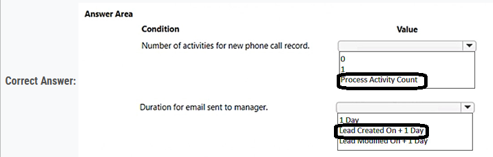
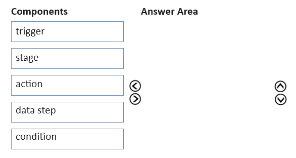
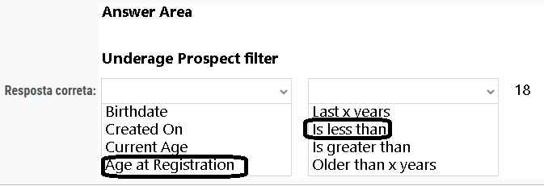
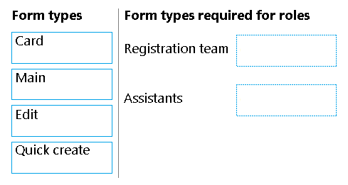
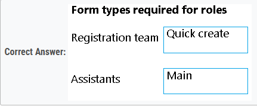

### Question - 1:

You create an app to manage customer service cases.  
Cases entered in forms require different types of data to be stored in different types of columns.  
You need to create forms for each of the following case types:  

Which form types should you create? To answer, drag the appropriate form types to the meet the data entry requirements. Each source may be used once, more than once, or not at all. You may need to drag the split bar between panes or scroll to view content.  
NOTE: Each correct selection is worth one point.  
Select and Place:  

  
Answer

1. Main
2. Main
3. Card
4. Quick create
5. Quick view
 

---

### Question - 2:

DRAG DROP -
You are a Dynamics 365 Customer Service developer.  
A salesperson creates a chart.  
You need to ensure that the chart is available to all users on the team.  
Which actions should the salesperson perform? To answer, drag the appropriate actions to the correct users. Each action may be used once, more than once, or not at all. You may need to drag the split bar between panes or scroll to view content.  
NOTE: Each correct selection is worth one point.  
Select and Place:  

  
Answer

1. Share the chart with the team
2. Export the user chart for import as a user chart
 

### Question - 3:

HOTSPOT -
You implement an editable grid for the Account entity.  
The business team provides the following list of features that they would like you to implement:  
✑ Group by or sort columns in the current view.  
✑ Configure a business rule to show an error message.  
✑ Edit values in calculated fields.  
✑ Edit the Address composite field.  
✑ Use the editable grid on mobile phones.  
Which actions can you perform? To answer, select the appropriate options in the answer area.  
NOTE: Each correct selection is worth one point.  
Hot Area:  

  
Answer

-   Yes
-   Yes
-   No
-   No
-   No

---

### Question - 4:

DRAG DROP  
You must create a form for team members to use. The form must provide the ability to:  
✑ Lock a field on a form.  
✑ Trigger business logic based on a field value.  
✑ Use existing business information to enhance data entry.  
You need to implement business rule components to create the form.  
Which components should you use? To answer, drag the appropriate components to the correct requirements. Each component may be used once, more than once, or not at all. You may need to drag the split bar between panes or scroll to view content.  
NOTE: Each correct selection is worth one point.  
Select and Place:  

  
Answer

 

---

### Question - 5:

You have a form that displays a custom field from an entity.  
A customer wants to restrict users from filtering on the custom field.  
You need to prevent users from filtering the field in Advanced Find.  
What should you modify?  

-   A. Fields in the Edit Filter Criteria option of the Quick Find view
-   B. a searchable field on the Field Properties form
-   C. Fields in the Add Find Columns option of the Quick Find view

  
Answer

-   B. a searchable field on the Field Properties form

---

### Question - 6:

You are designing a canvas app that connects to Common Data Service.  
You need to configure the app to meet the requirements and ensure that the canvas app is available offline.  
What should you implement? To answer, select the appropriate options in the answer area.  
NOTE: Each correct selection is worth one point.  

  
Answer

 

---

### Question - 7:

You have a canvas app that allows users to view, select, and purchase products. The app uses a Gallery control to display products and checkboxes that allow users to select products.  
When users select items from the product catalog, they move to a different screen to complete a purchase.  
Users must be able to clear all product selections when they click the button.  
You need to configure the button.  
What should you do?  

-   A. Use the Reset(Control) formula and pass the gallery control as a parameter to the Reset formula.
-   B. Use the Reload(Control) formula and pass the gallery control as a parameter to the Reload formula.
-   C. Use the ForAll() function to iterate through each item of the Gallery and clear user selections.
-   D. Set the OnCheck value to populate a collection and the OnUncheck value to remove the item from the collection. Clear collection when the user selects the button.

  
Answer

-   D. Set the OnCheck value to populate a collection and the OnUncheck value to remove the item from the collection. Clear collection when the user selects the button.

---

### Question - 8:

You have a canvas app that contains the following text input fields: Id, FirstName, LastName. The app also has a button named Button1.  
The OnSelect property for Button1 contains the following expression:  
Collect(People, {Id:Id.Text, FirstName:FirstName.Text, LastName:LastName.Text})  
For each of the following statements, select Yes if the statement is true. Otherwise, select No.  
NOTE: Each correct selection is worth one point.  

  
Answer

---

### Question - 9:

You are a Dynamics 365 Customer Service administrator.  
A user must be able to view system posts and activities in a dashboard.  
You need to create the dashboard for the user.  
Which components should you use? To answer, select the appropriate options in the answer area.  
NOTE: Each correct selection is worth one point.  

  
Answer

---

### Question - 10:

Your organization does not permit the use of custom code for solutions.  
You need to create a view that can be viewed by all users in an organization.  
Where should you create the view?  

-   A. Entities component of a solution
-   B. Microsoft Excel template
-   C. Microsoft Visual Studio
-   D. List view of the entity

  
Answer

-   A. Entities component of a solution

---

### Question - 11:

A company is implementing Power Apps and Power Automate.  
Several components are created within Power Apps, Microsoft Dataverse, and Power Automate. These components must be promoted from the development environment to the user acceptance test environment in a single solution package.  
You need to create the solution package for promotion.  
Where should you create the package?  

-   A. Azure DevOps
-   B. Power Apps designer
-   C. Microsoft Power Platform admin center
-   D. Azure portal
-   E. Office 365 admin center

  
Answer

-   B. Power Apps designer

---

### Question - 12:

A company is creating a Power Apps solution for a production facility.  
The current solution is in English. The customized components must be translated into several languages.  
You need to extract the text for translation.  
In which location can you achieve this goal?  

-   A. The tables in the web application.
-   B. The selected environment in the Microsoft Power Platform admin center.
-   C. The solution in the web application.
-   D. The individual solution components in the web application.

  
Answer

-   C. The solution in the web application.

---

### Question - 13:

You have a canvas app that allows users to view, select, and purchase products. The app uses a Gallery control to display products and checkboxes that allow users to select products.  
When users select items from the product catalog, they move to a different screen to complete a purchase.  
Users must be able to clear all product selections when they click the button.  
You need to configure the button.  
What should you do?  

-   A. Use the Reload(Control) formula and pass the gallery control as parameter to the Reload formula.
-   B. Use the Reset(control) formula and pass the checkbox to the formula to clear user selections.
-   C. Set the OnCheck value to populate a collection and the OnUncheck value to remove the item from the collection. Clear the collection when the user selects the button.
-   D. Use the Revert(Products) formula and pass the checkbox to the formula to clear user selections.
-   E. Use the Reset(Control) formula and pass the gallery control as a parameter to the Reset formula.

  
Answer

-   C. Set the OnCheck value to populate a collection and the OnUncheck value to remove the item from the collection. Clear the collection when the user selects the button.

---

### Question - 14:

A customer tracks events by using a custom entity.  
The custom entity includes a custom field for the venue of the events. The customer must be able to display the events by venue in a calendar.  
You need to ensure that all events display by venue in the calendar.  
To which component should you add a control?  

-   A. Form
-   B. Subgrid
-   C. Chart
-   D. View

  
Answer

-   D. View

---

### Question - 15:

You are creating a canvas app.  
A user will click a button on each screen of a Power Apps app to proceed to the next screen.  
You need to implement the action which selects the next screen that the user sees.  
Which event should you handle?  

-   A. ScreenTransition
-   B. OnSelect
-   C. OnLoad
-   D. OnCheck

  
Answer

-   B. OnSelect

---

### Question - 16:

A company has a canvas app that includes the following screens: Screen1 and Screen2.  
The OnVisible property for Screen1 contains the following expression.  
Set(AgeGroups, ["1-25", "26-54", "55+"])  
For each of the following statements, select Yes if the statement is true. Otherwise, select No.  
NOTE: Each correct selection is worth one point.  

  
Answer

1. Yes
2. No
3. No
 

---

### Question - 17:

You are a Dynamics 365 Customer Service developer.  
A salesperson creates a chart.  
You need to ensure that the chart is available to all users on the team.  
What should you do?  

-   A. Share the chart with the team.
-   B. Assign the chart to each person on the team.
-   C. Export the user chart to Power BI. Import the chart as a Power BI visualization.
-   D. Export the user chart for import as a user chart.

  
Answer

-   A. Share the chart with the team.

---

### Question - 18:

You create an app.  
You need to create the site map for the app.  
Which three actions should you perform in sequence? To answer, move the appropriate actions from the list of actions to the answer area and arrange them in the correct order.  
Select and Place:  

  
Answer

---

### Question - 19:

Your organization does not permit the use of custom code for solutions.  
You need to create a view that can be viewed by all users in an organization.  
Where should you create the view?  

-   A. Advanced Find
-   B. Entities component of a solution
-   C. Microsoft Virtual Studio
-   D. Templates area

  
Answer

-   B. Entities component of a solution

---

### Question - 20:

You are configuring a new Power Apps portal. You have two web roles, one for authenticated users and one for anonymous users. You grant the Anonymous  
Users role to users.  
A test user reports that they can access the home page but cannot view a page linked from the home page.  
You need to determine why the test user cannot view the portal page.  
What is the cause of the issue?  

-   A. The setting to make the page available to everyone is disabled.
-   B. Inherited permissions are not enabled for the linked page.
-   C. The Authenticated Users Web role does not have permission to view the page.
-   D. Maintenance mode is enabled on the portal.

  
Answer

-   A. The setting to make the page available to everyone is disabled.

---

### Question - 21:

A company is configuring a Power Apps portal using Microsoft Dataverse.  
The company requires the following:  
✑ Only authenticated users must be able to sign into the portal.  
✑ Authenticated users must have varying degrees of access to the different parts of the portal.  
✑ Users must enter one of several external identities when creating an account during the open registration process.  
You need to configure user authentication and permissions.  
Which component should you use? To answer, select the appropriate options in the answer area.  
NOTE: Each correct selection is worth one point.  

  
Answer

---

### Question - 22:

You create a new solution for a business process.  
The business process includes uploading specific file types to a web service.  
You need to ensure that the business process works the same way anywhere the solution is deployed.  
Which option should you use? To answer, drag the appropriate options to the correct configurations. Each option may be used once, more than once, or not at all.  
You may need to drag the split bar between panes or scroll to view content.  
NOTE: Each correct selection is worth one point.  

  
Answer

---

### Question - 23:

A company collaborates by using Microsoft Teams.  
You must create a Power Apps app directly from within a Teams channel. The app will be used by members of the channel to manage sales orders.  
You need to create the app by using Dataverse for Teams.  
How should you create the app?  

-   A. Create a canvas app by using a Power Apps personal app in Teams.
-   B. Create a canvas app by using the App Studio app.
-   C. Use the Power Apps web designer.
-   D. Create a model-driven app by using the App Studio app.

  
Answer

-   A. Create a canvas app by using a Power Apps personal app in Teams.

---

### Question - 24:

A company has a portal. Users sign into the portal by using a social media account.  
The company wants to replace the existing portal with a Power Apps portal. Users must sign up for access to the portal by using a Microsoft account and a unique invitation code that will be provided to the users.  
You need to configure authentication for the home page.  
Which values should you use? To answer, drag the appropriate values to the appropriate authentication settings. Each value may be used once, more than once, or not at all. You may need to drag the split bar between panes or scroll to view content.  
NOTE: Each correct selection is worth one point.  

  
Answer

1. Yes
2. No
 

---

### Question - 25:

You are customizing a model-driven app for a company. You create a Theme template to ensure the company logo and colors are properly used within these apps.  
The theme must meet the following requirements:  
✑ Updated to add the logo  
✑ Downloaded by the makers to create the app  
You need to configure the assets. To answer, drag the appropriate configurations to the correct requirements. Each configuration may be used once, more than once, or not at all. You may need to drag the split bar between panes or scroll to view content.  
NOTE: Each correct selection is worth one point.  

  
Answer

---

### Question - 26:

A user needs to create a Power Apps portal app.  
The user is getting a permission denied error when creating the portal app.  
You need to configure permissions to create the portal app.  
Which three permissions should you configure? Each correct answer presents part of the solution.  
NOTE: Each correct selection is worth one point.  

-   A. In the Power Platform admin center, ensure that the user account has read-write access.
-   B. In Azure Active Directory, assign the Contributor role to the application at the subscription scope.
-   C. In Azure Active Directory, ensure that the user has permission to register an app.
-   D. In the Power Platform admin center, change the portal app owner to the user.
-   E. In the Power Platform admin center, ensure that the user has the System administrator security role.

  
Answer

-   A. In the Power Platform admin center, ensure that the user account has read-write access.
-   C. In Azure Active Directory, ensure that the user has permission to register an app.
-   E. In the Power Platform admin center, ensure that the user has the System administrator security role.

---

### Question - 27:

You have a Power Apps portal app that supports a sales community and a service community in the same environment. The only language configured in the environment is English. The company wants to add support for two more languages.  
The solution must meet the following requirements:  
✑ Languages must be for both sales and service functions.  
✑ The company logo and colors must be used and apply to all screens.  
✑ Communities must be separate with different URLs and access lists.  
You need to configure the solution.  
What should you configure? To answer, select the appropriate options in the answer area.  

  
Answer

---

### Question - 28:

A company is creating a canvas app and a model-driven app to manage their customer accounts.  
The canvas app requires a business rule to set the Business Type column to large if the customer size is greater than a specific currency value.  
The model-driven app requires a business rule to recommend the account rating be re-evaluated when the account goes on credit hold for this app only.  
You need to configure the scope for the business rules.  
Which scope should you use? To answer, drag the appropriate scopes to the correct business rules. Each scope may be used once, more than once, or not at all.  
You may need to drag the split bar between panes or scroll to view content.  

  
Answer

---

### Question - 29:

A company uses a Microsoft Power Platform environment.  
The company plans to implement a Power Apps app. The application must meet the following requirements:  
• Audit all user activity and only retain the audit logs for one year.  
• Annually remove products that were created over a year ago.  
You need to configure the automated processes.  
What should you configure? To answer, drag the appropriate configurations to the correct requirements. Each configuration may be used once, more than once, or not at all. You may need to drag the split bar between panes or scroll to view content.  
NOTE: Each correct selection is worth one point.  

  
Answer

---

### Question - 30:

A company creates a canvas app.  
The app requires users to enter their social security number. The app should only display the last four digits when the user tabs to a different column.  
You need to configure the app.  
Which option should you use?  

-   A. Business rule
-   B. Business process flow
-   C. Power BI DAX
-   D. Power Fx

  
Answer

-   D. Power Fx

---

### Question - 31:

A company uses Power Apps.  
The company plans to create a canvas app that uses a responsive design.  
You need to configure the app.  
Which two actions should you perform? Each correct answer presents part of the solution.  
NOTE: Each correct selection is worth one point.  

-   A. Disable the Scale to fit setting.
-   B. Configure the height and width properties by using drag handles.
-   C. Enable the lock orientation setting.
-   D. Configure the height and width properties by using a formula.

  
Answer

-   A. Disable the Scale to fit setting.
-   D. Configure the height and width properties by using a formula.

---

### Question - 32:

A company uses model-driven apps.  
Users in the sales department enter the first name, last name, and phone number of customers in the app. The users request a single screen in the app to enter the customer data.  
You need to configure the app.  
What should you do?  

-   A. Create a Power Automate flow.
-   B. Use a Power Virtual Agents app.
-   C. Create a canvas app.
-   D. Modify the site map.

  
Answer

-   C. Create a canvas app.

---

### Question - 33:

You create a Power Apps app for Microsoft Teams using Microsoft Dataverse for Teams.  
Users report that they are unable to view the app in Teams.  
You need to ensure that users can access the app.  
What should you do?

-   A. Share the app with a security group by using the Maker portal.
-   B. Publish the app by using the Maker portal.
-   C. Request that a tenant administrator pin the app to the app bar in Teams.
-   D. Share the app with a security group in Teams.
-   E. Share the app with individual users by using the Maker portal.

  
Answer

-   D. Share the app with a security group in Teams.

---

### Question - 34:

You create a canvas app.  
The app requires access to data that is stored in collections. The app must provide the following actions:  
• Create a new collection variable.  
• Remove table values from a collection.  

You need to configure functions for the app.  
Which functions should you use? To answer, select the appropriate options in the answer area.

  
Answer

---

### Question - 35:

A company creates a canvas app.  
The company plans to make the app available in Microsoft Teams. Only employees will be allowed to use the app.  
You need to add the app to Teams.  
Which three actions should you perform in sequence? To answer, move the appropriate actions from the list of actions to the answer area and arrange them in the correct order.  

  
Answer

5. Go to makerportal.
6. Select the required app.
7. Add to teams.

---

### Question - 36:

A company creates a Microsoft Teams app that stores data in two tables in a Microsoft Dataverse for Teams environment.  
Users require access to the app and the app data.  
You need to configure access.  
What should you do? To answer, select the appropriate options in the answer area.  

  
Answer

---

### Question - 37:

A company plans to implement Power Pages.  
The company requests that you create demonstration sites based on the following requirements:  
• A website that supports automated scheduling  
• A website that supports event registration  
• A website that can be extended by using the company's branding  

In addition, custom development work must be minimized.  
You need to identify the appropriate Power Pages templates to use.  
Which templates should you use? To answer, drag the appropriate templates to the correct requirements. Each template may be used once, more than once, or not at all. You may need to drag the split between panes or scroll to view content.  

  
Answer

---

### Question - 38:

You are modifying a model-driven app. You set up a customer table in Microsoft Power Platform to retrieve user data.  
You set up a form with the following columns for users to enter their data. The form includes the following columns:  

The form must do the following:  
• The Country/region column must automatically populate with US when English is chosen as a language. If the user selects Other for this column, the column must remain blank so that user can enter a value.  
• The Passport expiration date column must appear only if the user selects Yes in the Passport ownership column.  

You need to configure the app with the least amount of effort.  
What should you configure? To answer, drag the appropriate solution component to the correct requirements. Each solution component may be used once, more than once, or not at all. You may need to drag the split bar between panes or scroll to view content.  

  
Answer

---

### Question - 39:

You have a canvas app.  
The canvas app must store data in a variable that is available only to the current screen.  
You need to create the variable.  
Which two functions should you use? Each correct answer presents a complete solution.  
NOTE: Each correct selection is worth one point.  

-   A. UpdateContext
-   B. Navigate
-   C. SaveData
-   D. Set
-   E. Collect

  
Answer

-   A. UpdateContext
-   B. Navigate

---

### Question - 40:

You plan to create a canvas app with multiple screens.  
The app needs to store temporary data while the app is running. The app has the following data requirements:  
• Each screen must maintain a separate copy of data and pass the data to another screen.  
• The app must be able to update separate rows of a table independently.  

You need to configure variables for the data.  
Which variable types should you use? To answer, drag the appropriate variable types to the correct requirements. Each variable type may be used once, more than once, or not at all. You may need to drag the split bar between panes or scroll to view content.  

  
Answer

1. Context variable
2. Collection

---

### Question - 41:

You plan to create a canvas app.  
The app must meet the following requirements:  
• Send an email after a record is saved.  
• Display the expiration column on a form if the creation date of the record is older than 90 days.  

You need to configure the app.  
Which features should you use? To answer, select the appropriate options in the answer area.  

  
Answer

1. Automate
2. Formula
 

---

### Question - 42:

A company plans to create two Microsoft Power Platform applications.  
One of the applications requires a custom control layout without using code. The other application will be used primarily by external users.  
You need to create the applications.  
Which application types should you use? To answer, drag the appropriate application types to the correct requirements. Each application type may be used once, more than once, or not at all. You may need to drag the split bar between panes or scroll to view content.  

  
Answer

1. Canvas App
2. Power Pages

---

### Question - 43:

You create a Power Apps app.  
The app must be able to display a list of records that are sorted by category. The app must also expand or hide the list by subtopics.  
You need to configure the app.  
Which tool should you use?

-   A. card
-   B. expression
-   C. gallery
-   D. Power BI dashboard

  
Answer

-   C. gallery

---

## **Study-Case**:

This is a case study. Case studies are not timed separately. You can use as much exam time as you would like to complete each case. However, there may be additional case studies and sections on this exam. You must manage your time to ensure that you are able to complete all questions included on this exam in the time provided. 

To answer the questions included in a case study, you will need to reference information that is provided in the case study. Case studies might contain exhibits and other resources that provide more information about the scenario that is described in the case study. Each question is independent of the other questions in this case study. 

At the end of this case study, a review screen will appear. This screen allows you to review your answers and to make changes before you move to the next section of the exam. After you begin a new section, you cannot return to this section.  

To start the case study -  
To display the first question in this case study, click the Next button. Use the buttons in the left pane to explore the content of the case study before you answer the questions. Clicking these buttons displays information such as business requirements, existing environment, and problem statements. If the case study has an All Information tab, note that the information displayed is identical to the information displayed on the subsequent tabs. When you are ready to answer a question, click the Question button to return to the question.  

Background -  
Bellows College is a post-secondary school that wants to start a football team. The college uses Microsoft Power Platform to manage its recruiting efforts. The registration team and assistants use model-driven apps. The coaches use canvas apps on their mobile devices.  

Prospects are considered underage if they are younger than 18 years old at the time of registration.  

**Current environment -**

Environment -  
• Custom code is not allowed in the system.  
• Server-side synchronization is configured for emails, appointments, contacts, and tasks.  
• The database and file storage of Dataverse must be minimized to keep costs low.  

Contact table -  
• Birthdate is a custom date and time field.  
• Age at Registration is a calculated field that displays the age of the prospect at the time of registration.  
• Current Age is a calculated field that displays the age of the prospect based on the current date and time.  

Evaluation table -  
• The Evaluation table is a custom table used to track evaluation criteria.  
• Evaluation records cannot be manually created.  
• Users must not be able to continue until an evaluation record is created automatically for the prospect.  

Consent table -  
• The consent forms completed by the parents are stored as records in the Consent table.  
• Occasionally, a parent cannot complete the consent online and a paper copy must be printed. The signed copy must be scanned and stored with the consent record.  

Team website -  
• The team website is created by using Power Pages.  
• A starter layout template was used to create the site.  
• The site consists of five pages:  
o Home: A page open to everyone to view the announcements from the team. o Schedule: A page open to everyone to view the tryout and game schedule. o Evaluations: A page that displays tracking from the evaluation table. Prospects are able to view their own information only. o Forms: A page that displays the consent form. o Contact Us: A page for anyone to submit questions and comments.  
• Two web roles for authenticated users are created: Primary Contact User and Prospect User. o All primary contacts and prospects are assigned to their respective roles.  

**Requirements -**

Registration -  
• Parents and prospects are created as contacts and must be linked.  
• The registration team must be able to rapidly create prospects without navigating away from the Parents form. Only the First Name, Last Name, and Birthdate fields should be displayed for the team.  
• Assistants must be able to update prospect information and add teams that the prospect has previously played on to a subgrid.  

Parental consent -  
• When a prospect is underage, a Primary Contact field will appear. The field must be populated before the prospect record can be saved.  
• A view named Underage Prospects that lists all underaged prospects is required.  
• The Underage Prospects view must run once a week without requiring modifications to display correct information.  
• A consent email must meet the following requirements:  
o be sent to the primary contact of each new underage prospect o contain a link to the team website o be automatically sent weekly and tracked to the contact record in Dataverse o include the current date using the full month name, date, and year  

Evaluations -  
• Coaches rate prospects each day on a scale of 1-10 in three categories: endurance, coordination, and skill.  
• The total of the three categories is displayed at the bottom of the form. If the total for the day is greater than 25, the number should appear green.  

You need to view website questions and comments.  

### Question - 44 - In Study Case:

Where should you view this information?  

-   A. Evaluations
-   B. Lead
-   C. Contact
-   D. Feedback

  
Answer

-   D. Feedback

---

### Question - 45 - In Study Case:

Which permissions must you set? To answer, move the appropriate permissions to the correct page. You may use each permission once, more than once, or not at all. You may need to move the split bar between panes or scroll to view content.

  
Answer

---

### Question - 46 - In Study Case:

You need to create forms required for the registration team and assistants.  

Which form types should you create? To answer, move the appropriate form types to the correct roles. You may use each form type once, more than once, or not at all. You may need to move the split bar between panes or scroll to view content.  

  
Answer

---

### Question - 47 - In Study Case:

You need to configure the Total field on the Evaluation form.  

Which property should you select for the formula? To answer, move the appropriate property to the correct formula. You may use each property once, more than once, or not at all. You may need to move the split bar between panes or scroll to view content.  

  
Answer

---

### Question - 48 - In Study Case:

You need to create the evaluation record for a prospect.  
What should you use?  

-   A. a classic Dataverse workflow
-   B. a cloud flow
-   C. a plug-in
-   D. a quick create form

  
Answer

-   B. a cloud flow

---

### Question - 49:

A company is implementing Power Apps and Power Automate.  
Several components are created within Power Apps, Microsoft Dataverse, and Power Automate. These components must be promoted from the development environment to the user acceptance test environment in a single solution package.  
You need to create the solution package for promotion.  
Where should you create the package?  

-   A. Azure portal
-   B. Microsoft Power Platform admin center
-   C. Office 365 admin center
-   D. Power Apps maker portal

  
Answer

-   D. Power Apps maker portal

---
