### Question - 1:

You plan to create user interface (UI) flows to automate several web-based business processes that you currently perform manually.  
You need to ensure that users can create and run web UI flows.  
Which three components must you install and configure on user's devices? Each correct answer presents part of the solution.  
NOTE: Each correct selection is worth one point.  

-   A. Power Automate Desktop
-   B. Latest version of Microsoft Edge
-   C. On-premises data gateway
-   D. Selenium IDE
-   E. Latest version of Mozilla Firefox

    
Answer

-   A. Power Automate Desktop
-   B. Latest version of Microsoft Edge
-   D. Selenium IDE

---

### Question - 2:

You are designing a desktop user interface (UI) flow.  
The UI flow automates legacy software.  
You need to prepare data for transfer to Microsoft SharePoint list.  
Which four actions should you perform in sequence? To answer, move the appropriate actions from the list of actions to the answer area and arrange them in the correct order.  
Select and Place:  

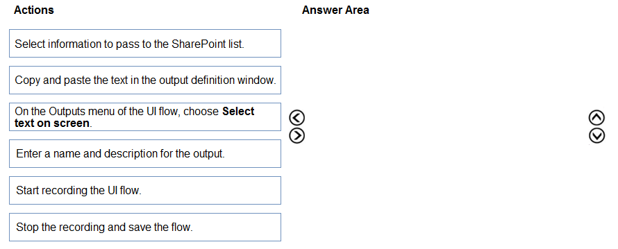

    
Answer

1. Start recording the Ul flow.
2. On the Outputs menu of the Ul flow, choose Select text on screen.
3. Enter a name and description for the output.
4. Stop the recording and save the flow.

---

### Question - 3:

You have a business process flow.  
You need to update the business process flow while minimizing administrative and maintenance efforts.  
What should you implement? To answer, drag the appropriate features to the correct requirements. Each feature may be used once, more than once, or not at all.  
You may need to drag the split bar between panes or scroll to view content.  
NOTE: Each correct selection is worth one point.  
Select and Place:  

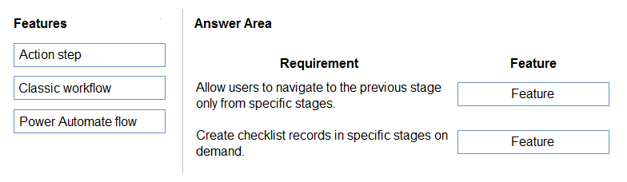

    
Answer

1. Action Step
2. Action Step

---

### Question - 4:

Você está criando um novo fluxo de processo de negócios para qualificar leads.  
Você cria uma ação. A ação não está disponível dentro da Etapa de Ação.  
Você precisa tornar a ação disponível para a Etapa de Ação.  
Quais são as duas etapas que você deve executar? Cada resposta correta apresenta parte da solução.  
OBSERVAÇÃO: Cada seleção correta vale um ponto.  

-   A. Certifique-se de que a entidade para a ação corresponda à entidade correspondente para o estágio do fluxo do processo de negócios.
-   B. Adicione pelo menos uma etapa à ação.
-   C. Selecione Executar como um processo sob demanda.
-   D. Ative a ação.

    
Answer

---

### Question - 5:

You plan to automate several different processes by using Power Automate.  
Each process has unique characteristics.  
You need to recommend components for each process.  
Which components should you recommend? To answer, drag the appropriate components to the correct processes. Each component may be used once, more than once, or not at all. You may need to drag the split bar between panes or scroll to view content.  
NOTE: Each correct selection is worth one point.  
Select and Place:  

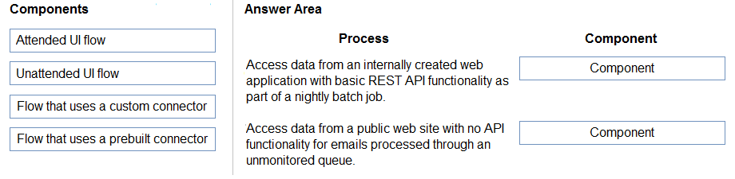

    
Answer

1. Custom connector (REST API access)
2. Unatteded UI flow

---

### Question - 6:

You create workflows to automate business processes.  
You need to create a workflow that automatically sends emails based on a mail merge template. The workflow must contain the following configurations:  
✑ Run immediately.  
✑ Validate when a condition is met.  
✑ Perform an action when a condition is met.  
To answer, select the appropriate configuration in the answer area.  
NOTE: Each correct selection is worth one point.  

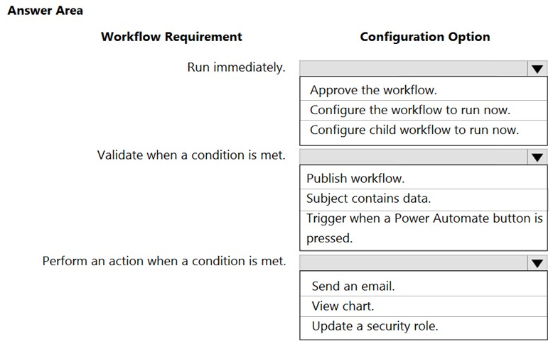

    
Answer

1. Configure workflow to run now
2. Subject contains data
3. Send an email

---

### Question - 7:

You are developing a canvas app.  
You need to apply business rules to the app without writing code.  
Which three actions can you use? Each correct answer presents a complete solution.  
NOTE: Each correct selection is worth one point.  

-   A. Validate data and show error messages.
-   B. Enable or disable fields.
-   C. Set field requirement levels.
-   D. Set field values.
-   E. Show or hide fields

    
Answer

-   A. Validate data and show error messages.
-   C. Set field requirement levels.
-   D. Set field values.

---

### Question - 8:

A company plans to use Power Automate to increase employee efficiency.  
You need to recommend the types of flows that the company should use.  
Which flow type should you recommend? To answer, drag the appropriate flow types to the correct tasks. Each flow type may be used once, more than once, or not at all. You may need to drag the split bar between panes or scroll to view content.  
NOTE: Each correct selection is worth one point.  

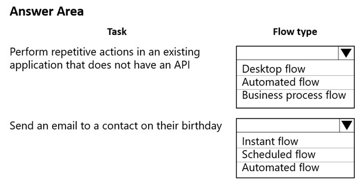

    
Answer

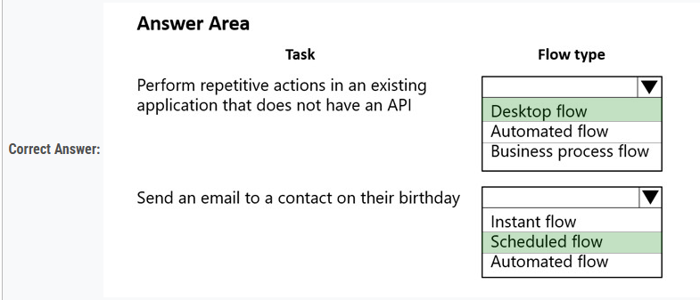

---

### Question - 9:

A company is creating a business process flow in Power Automate to analyze the probability that a customer will buy a specific product.  
The company uses ratings from zero to one hundred. The company assigns likelihoods based on the following table:  

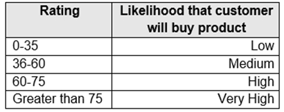

You need to define the business process steps. All logic must be included in a single evaluation statement.  
Which step should you use? To answer, drag the appropriate steps to the correct ratings. Each step may be used once, more than once, or not at all. You may need to drag the split bar between panes or scroll to view content.  
NOTE: Each correct selection is worth one point.  

    
Answer

1. Check Condition: Used to check specific conditions, in this case, if the rating is between 0-35.
2. Conditional Branch: Used to create branches in the flow for the 36-60 and 61-75 rating ranges.
3. Default Action: Used to handle the scenario where the rating is above 75.

---

### Question - 10:

You are creating a Power Platform solution.  
You need to help end users understand which actions to take next and ensure that user interaction occurs in manageable steps.  
Which actions should you perform? To answer, select the appropriate options in the answer area.  
NOTE: Each correct selection is worth one point.  

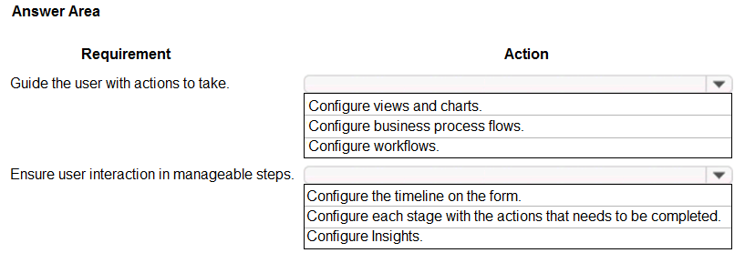

    
Answer

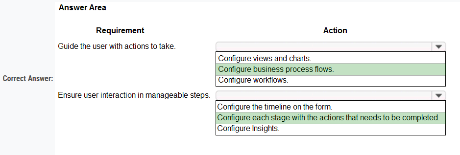

---

### Question - 11:

You are developing an app.  
You must trigger a mobile notification whenever a specific hashtag is posted from Twitter. The notification will send email to the company's social media teams distribution list.  
You need to create a connection to the Twitter service and build a solution.  
Which four actions should you perform in sequence? To answer, move the appropriate actions from the list of actions to the answer area and arrange them in the correct order.  
Select and Place:

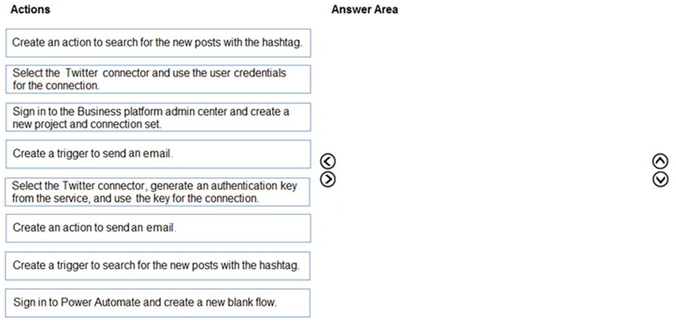

    
Answer

1. sign into power automate and create a blank flow
2. create a trigger to search for new post with the hashtag
3. select the twitter connector, generate the auth key from service, and use the key for the connection
4. create an action to send email

---

### Question - 12:

You manage Microsoft Power Platform apps for a company.  
You need to hide the Flows button on the user interface.  
Which configuration setting should you change?  

-   A. the SiteMap
-   B. the Customizations section of System Settings
-   C. the Entity component of the default solution
-   D. the Buttons tab of Flow

    
Answer

-   B. the Customizations section of System Settings

---

### Question - 13:

You configure and test a user interface (UI) flow. You plan to run the flow as a scheduled flow.  
The UI flow must run on a Windows 10 device. As part of process automation, the UI flow must sign into the Windows 10 device with the credentials for a user account named User1.  
You need to ensure that the flow runs during non-peak hours and requires no physical user intervention.  
What should you do?  

-   A. Ensure that the User1 account has an active user session on the device.
-   B. Ensure that all user sessions are signed out.
-   C. Ensure that there are no active user sessions on the device.
-   D. Ensure that all user sessions are signed out except for locked user sessions.

    
Answer

-   B. Ensure that all user sessions are signed out.

---

### Question - 14:

A company plans to send escalation emails to all customers with overdue invoices. You are creating a Microsoft Power Automate flow to determine whether to send an escalation email.  
The system must send an alert for all invoices that are seven days or more overdue.  
You need to configure the flow.  
Which expression should you use?  

-   A. @GreaterOrEquals(TriggerEmail()?['OverdueDate']: '7')
-   B. 'OverdueDate' >= '7'?'TriggerEmail()': false
-   C. TriggerEmail() = 'OverdueDate' >= 7;

    
Answer

-   A. @GreaterOrEquals(TriggerEmail()?['OverdueDate']: '7')

---

### Question - 15:

You add a business process flow to the Account table. The flow has three stages.  
You need to ensure that a workflow can run when a user completes the final stage.  
Which option should you use?  

-   A. Start when: Record status changes
-   B. Available to run: Run this workflow in the background
-   C. Available to run: As an on-demand process
-   D. Available to run: As a child process

    
Answer

-   C. Available to run: As an on-demand process

---

### Question - 16:

You need to create a Power Automate desktop flow.  
What are two possible ways to create the flow? Each correct answer presents a complete solution.  
NOTE: Each correct selection is worth one point.  

-   A. Record mouse and keyboard events.
-   B. Configure a pre-built template.
-   C. Use pre-built actions.
-   D. Create models by using Microsoft Visio.

    
Answer

-   A. Record mouse and keyboard events.
-   C. Use pre-built actions.

---

### Question - 17:

You are using Power Automate to create a list of customers from a Microsoft Excel file.  
The list must contain customers who meet one of the following criteria:  
✑ Sales of less than $500,000.  
✑ Customers who are on credit hold.  
You need to create a condition to filter the list of customers.  
How should you complete the filter condition? To answer, select the appropriate options in the answer area.  
NOTE: Each correct selection is worth one point.  
Hot Area:

    
Answer

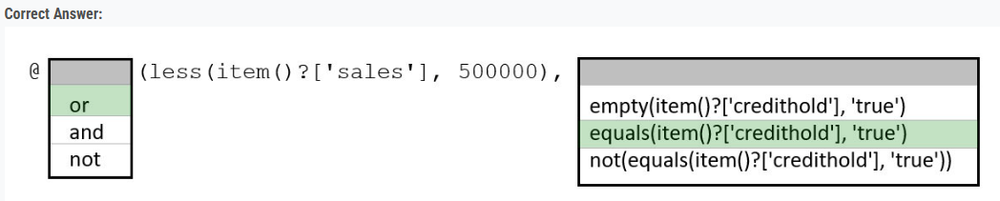

---

### Question - 18:

A farm uses a canvas app to manage schedules for planting fields with crop seeds. The farm uses business intelligence to provide recommendations for schedule changes based on weather data.  
You must implement a business rule that changes information for several forms in the canvas app based on business intelligence data.  
You need to configure the business rule.  
Which scope should you use?  

-   A. Table
-   B. All Forms
-   C. Form specific

    
Answer

-   A. Table

---

### Question - 19:

A company uses Power Apps and Power Automate.  
There is an issue with the existing flow in the test environment. Development changes are allowed in the test environment.  
You need to troubleshoot the issue with the flow.  
Which command should you use? To answer, select the appropriate options in the answer area.  
NOTE: Each correct selection is worth one point.  
Hot Area:

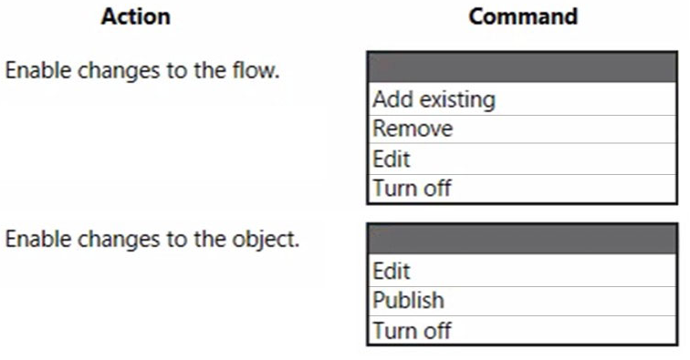

    
Answer

1. Turn off the flow
2. Edit the flow

---

### Question - 20:

You plan on implementing complex business logic in Microsoft Dataverse tables by using Power Automate flows.  
You realize that the functionality required to implement the business logic is not available in a Power Automate flow.  
The new business logic must work in multiple Dataverse tables. In addition, the operation must return a value after it finishes and must be able to run from an existing Dataverse action.  
You need to recommend the method to implement the missing logic.  
What should you recommend?  

-   A. Bound action
-   B. Custom API
-   C. Unbound action
-   D. Scheduled workflow

    
Answer

-   C. Unbound action

---

### Question - 21:

A company plans to automate the following manual processes by using Power Automate.  

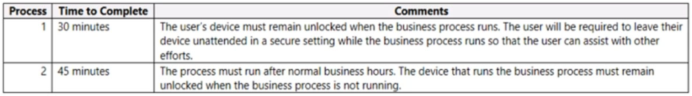

You need to identify UI flow types for the two business processes.  
Which desktop flow type should you use? To answer, drag the appropriate desktop flow types to the correct business processes. Each desktop flow type may be used once, more than once, or not at all. You may need to drag the split bar between panes or scroll to view content.  
NOTE: Each correct selection is worth one point.  
Select and Place:  

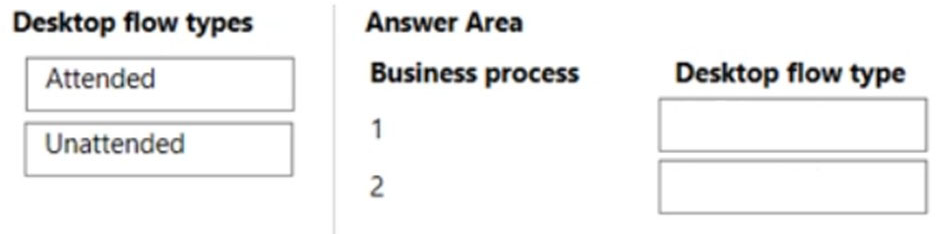

    
Answer

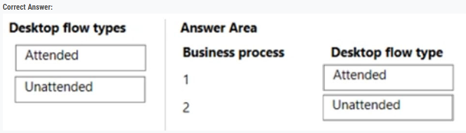

---

### Question - 22:

You are creating a business process flow for a Power Apps app.  
The business process flow must meet the following requirements:  
• Must be available offline.  
• Send an email to the team when a record is created.  

You need to set up business process flow.  
What should you do? To answer, select the appropriate options in the answer area.  
NOTE: Each correct selection is worth one point.

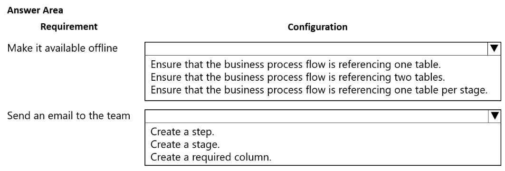

    
Answer

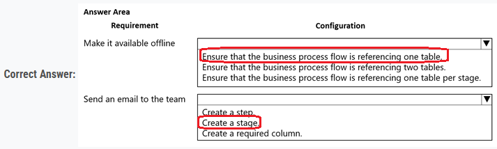

---

### Question - 23:

A company has a model-driven app.  
The app must meet the following requirements:  
• Prevent users from saving a record if validation from a custom action fails.  
• Query and update a list of records.  

You need to configure processes for the app without using code.  
Which processes should you use? To answer, drag the appropriate processes to the correct requirements. Each process may be used once, more than once, or not at all. You may need to drag the split bar between panes or scroll to view content.  
NOTE: Each correct selection is worth one point.  

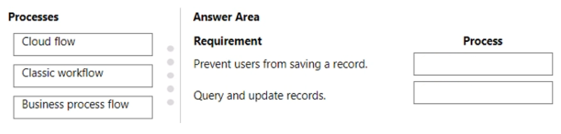

    
Answer

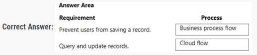

---

### Question - 24:

You plan to create a canvas app.  
The app requires a button on the data entry screen that users can select to send an email.  
You need to configure the app.  
What should you create?

-   A. Classic workflow
-   B. Power Automate cloud flow
-   C. Azure Logic App
-   D. Business process flow

    
Answer

-   B. Power Automate cloud flow

---

### Question - 25:

You need to build a Power BI dashboard for sales managers to track opportunities.  
When a new sale closes that is greater than $1 million, a notification must pop up and an email must be sent to the leadership team.  
You need to ensure the email is sent without editing the Microsoft Dataverse.  
Which two elements should you configure? Each correct answer is part of the solution.  
NOTE: Each correct selection is worth one point.

-   A. a Power Automate flow
-   B. a calculated column in the Dataverse
-   C. a paginated report to save to Microsoft OneDrive
-   D. a custom connector
-   E. alerts in Power BI

    
Answer

-   A. a Power Automate flow
-   E. alerts in Power BI

---

### Question - 26:

A company uses a model-driven app for customer support.  
The company has the following requirements for the app:  
• Send an email in real-time to customers when they enter their email address.  
• Send an email to customers at the same time every day for cases that are open for more than 24 hours.  

The solution should require the least amount of customization.  
You need to configure the model-driven app.  
Which components should you use? To answer, drag the appropriate components to the requirements. Each component may be used once, more than once, or not at all. You may need to drag the split bar between panes or scroll to view content.  
NOTE: Each correct selection is worth one point.  

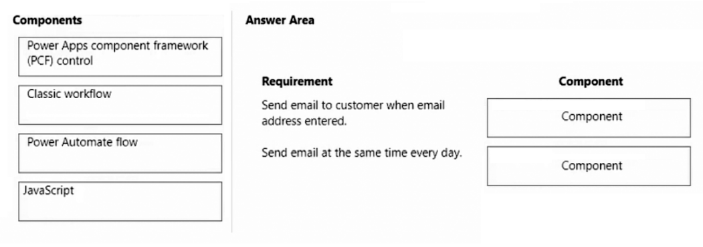

    
Answer

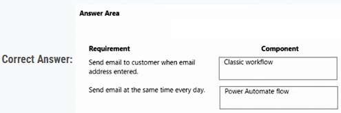

---

### Question - 27:

You have a classic workflow. The workflow updates a custom column on a record when an account record is created.  
The workflow must update the custom column based on the following conditions:  
• Update the custom column value using the Account Number.  
• If the Account Number column is blank, update the custom column value using the Ticker Symbol.  
• If the Ticker Symbol column is blank, update the custom column value to N/A.  

You need to configure the custom column value by using the update record step.  
What should you do?  

-   A. Add a formula that evaluates the two column values and uses the first populated value or else the default value.
-   B. Add an expression that evaluates the two column values and uses the first populated value or else the default value.
-   C. Add the two columns with the default value by using the Forms Assistant.
-   D. Add check conditions to determine if the two columns contain data.

    
Answer

-   D. Add check conditions to determine if the two columns contain data.

---

### Question - 28:

A company uses a canvas app.  
Supervisors must approve transactions when a user from the sales department enters a revenue amount that is over $1 million.  
You need to configure an approval process without using code.  
What should you create?

-   A. Power Automate cloud flow
-   B. Power Apps component framework (PCF) control
-   C. Column Expression
-   D. Azure Service Bus service

    
Answer

-   A. Power Automate cloud flow

---

### Question - 29:

A company creates a Power Automate cloud flow for a Power Apps app.  
The cloud flow must send a daily email that contains a list of year-to-date (YTD) totals.  
You need to configure the flow.  
Which feature should you use?

-   A. Loop
-   B. Wait
-   C. Condition
-   D. Parallel branch

    
Answer

-   A. Loop

---

### Question - 30:

Note: This question is part of a series of questions that present the same scenario. Each question in the series contains a unique solution that might meet the stated goals. Some question sets might have more than one correct solution, while others might not have a correct solution.  
After you answer a question in this section, you will NOT be able to return to it. As a result, these questions will not appear in the review screen.  
A company uses a model-driven app.  
The company needs to automatically update the Status column in real time.  
You need to configure this feature.  
Solution: Create a flow that has an Update item action.  
Does the solution meet the goal?

-   A. Yes
-   B. No

    
Answer

-   B. No

---

### Question - 31:

Note: This question is part of a series of questions that present the same scenario. Each question in the series contains a unique solution that might meet the stated goals. Some question sets might have more than one correct solution, while others might not have a correct solution.  
After you answer a question in this section, you will NOT be able to return to it. As a result, these questions will not appear in the review screen.  
A company uses a model-driven app.  
The company needs to automatically update the Status column in real time.  
You need to configure this feature.  
Solution: Create a workflow that has an Update Record step.  
Does the solution meet the goal?

-   A. Yes
-   B. No

    
Answer

-   A. Yes

---

### Question - 32:

Note: This question is part of a series of questions that present the same scenario. Each question in the series contains a unique solution that might meet the stated goals. Some question sets might have more than one correct solution, while others might not have a correct solution.  
After you answer a question in this section, you will NOT be able to return to it. As a result, these questions will not appear in the review screen.  
A company uses a model-driven app.  
The company needs to automatically update the Status column in real time.  
You need to configure this feature.  
Solution: Create a flow that has an Update a row action.  
Does the solution meet the goal?

-   A. Yes
-   B. No

    
Answer

-   B. No

---

### Question - 33:

A company uses a model-driven app. The app uses a workflow to send email. Emails are sent to new customers that enter an email address for the first time in the app.  
Customers report that they do not receive an email after entering an email address.  
You need to troubleshoot the issue.  
In which order should you perform the actions? To answer, move the appropriate actions from the list of actions to the answer area and arrange them in the correct order.

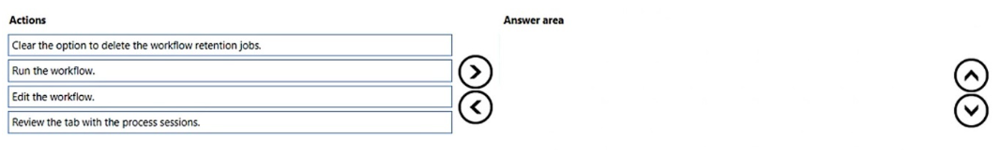

    
Answer

1. Edit the workflow. Check if the workflow is set up correctly and it's set to be triggered when an email address is entered for the first time.
2. Run the workflow. Test the workflow manually to see if it functions as expected. Make sure you are testing with a new customer and a new email address as per the workflow trigger condition.
3. Review the tab with the process sessions. This is where you will find logs for each time the workflow has run. Look for any errors or warnings that might tell you why the workflow didn't run as expected.
4. Clear the option to delete the workflow retention jobs. This step may help in case the retention policy is causing the workflow history to be deleted before you can review it, but it's more of a preventive measure for future troubleshooting rather than something that will directly solve the current issue.

---

### Question - 34:

A company has a Power Apps app.  
The app must meet the following requirements:  
• Managers assign lead records to the sales department. A new phone call record must be created if a lead record has no activities.  
• An email must be sent to the manager if the phone call record created is not completed after one day.  

A classic workflow must run when a lead record is assigned.  
You need to configure the check conditions for the workflow.  
Which value should you use for each condition? To answer, select the appropriate options in the answer area.  
NOTE: Each correct selection is worth one point.

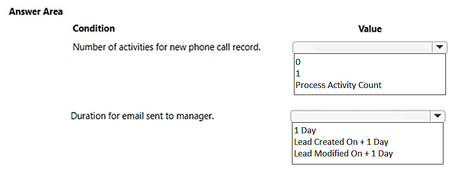

    
Answer

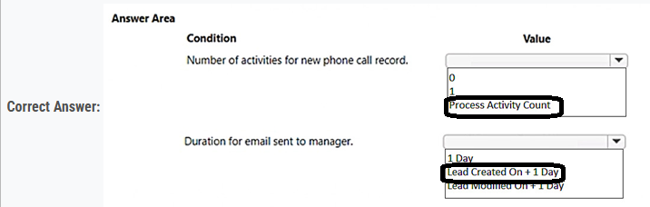

---

### Question - 35:

You plan to create classic workflows for process automation on the Account table.  
The process automation has the following requirements:  
• If the Account Name column changes, a custom column named Previous Name must be updated with the original value.  
• If the Credit Limit column changes, an email must be sent to the record owner with the new value.  
• Asynchronous processes must be used whenever possible.  

You need to implement the process automation.  
What is the minimum number of workflows you should use? To answer, select the appropriate options in the answer area.  
NOTE: Each correct selection is worth one point.

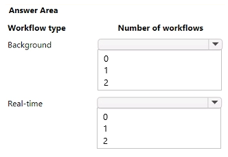

    
Answer

1. background: 1
2. real-time: 1

---

### Question - 36:

Note: This question is part of a series of questions that present the same scenario. Each question in the series contains a unique solution that might meet the stated goals. Some question sets might have more than one correct solution, while others might not have a correct solution.  
After you answer a question in this section, you will NOT be able to return to it. As a result, these questions will not appear in the review screen.  
A company uses a model-driven app.  
The company needs to automatically update the Status column in real time.  
You need to configure this feature.  
Solution: Create a workflow that has a Change Status step.  
Does the solution meet the goal?

-   A. Yes
-   B. No

    
Answer

-   A. Yes

---

### Question - 37:

A company uses Power Apps to create maintenance requests. The maintenance manager emails the manager of the department noted in the request.  
The maintenance manager wants to automate the email process when a new maintenance request is created.  
You need to build a Power Automate flow to automate the email process.  
Which three components should you add to the flow in sequence? To answer, move the appropriate components from the list of components to the answer area and arrange them in the correct order.

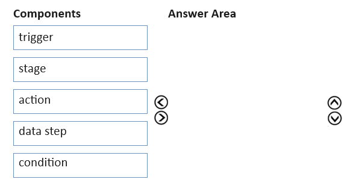

    
Answer

1. Trigger
2. Condition
3. Action

---

### **Study-Case-1:**

This is a case study. Case studies are not timed separately. You can use as much exam time as you would like to complete each case. However, there may be additional case studies and sections on this exam. You must manage your time to ensure that you are able to complete all questions included on this exam in the time provided.  
To answer the questions included in a case study, you will need to reference information that is provided in the case study. Case studies might contain exhibits and other resources that provide more information about the scenario that is described in the case study. Each question is independent of the other questions in this case study.  
At the end of this case study, a review screen will appear. This screen allows you to review your answers and to make changes before you move to the next section of the exam. After you begin a new section, you cannot return to this section.  

To start the case study -  
To display the first question in this case study, click the Next button. Use the buttons in the left pane to explore the content of the case study before you answer the questions. Clicking these buttons displays information such as business requirements, existing environment, and problem statements. If the case study has an All Information tab, note that the information displayed is identical to the information displayed on the subsequent tabs. When you are ready to answer a question, click the Question button to return to the question.  

Background -
Bellows College is a post-secondary school that wants to start a football team. The college uses Microsoft Power Platform to manage its recruiting efforts. The registration team and assistants use model-driven apps. The coaches use canvas apps on their mobile devices.  
Prospects are considered underage if they are younger than 18 years old at the time of registration.  

**Current environment -**

Environment-  
• Custom code is not allowed in the system.  
• Server-side synchronization is configured for emails, appointments, contacts, and tasks.  
• The database and file storage of Dataverse must be minimized to keep costs low.  

Contact table -  
• Birthdate is a custom date and time field.  
• Age at Registration is a calculated field that displays the age of the prospect at the time of registration.  
• Current Age is a calculated field that displays the age of the prospect based on the current date and time.  

Evaluation table -  
• The Evaluation table is a custom table used to track evaluation criteria.  
• Evaluation records cannot be manually created.  
• Users must not be able to continue until an evaluation record is created automatically for the prospect.  

Consent table -  
• The consent forms completed by the parents are stored as records in the Consent table.  
• Occasionally, a parent cannot complete the consent online and a paper copy must be printed. The signed copy must be scanned and stored with the consent record.  

Team website -  
• The team website is created by using Power Pages.  
• A starter layout template was used to create the site.  
• The site consists of five pages:  
o Home: A page open to everyone to view the announcements from the team.  
o Schedule: A page open to everyone to view the tryout and game schedule.  
o Evaluations: A page that displays tracking from the evaluation table. Prospects are able to view their own information only.  
o Forms: A page that displays the consent form.  
o Contact Us: A page for anyone to submit questions and comments.  
• Two web roles for authenticated users are created: Primary Contact User and Prospect User.  
o All primary contacts and prospects are assigned to their respective roles.  

**Requirements -**

Registration -  
• Parents and prospects are created as contacts and must be linked.  
• The registration team must be able to rapidly create prospects without navigating away from the Parents form. Only the First Name, Last Name, and Birthdate fields should be displayed for the team.  
• Assistants must be able to update prospect information and add teams that the prospect has previously played on to a subgrid.  

Parental consent -  
• When a prospect is underage, a Primary Contact field will appear. The field must be populated before the prospect record can be saved.  
• A view named Underage Prospects that lists all underaged prospects is required.  
• The Underage Prospects view must run once a week without requiring modifications to display correct information.  
• A consent email must meet the following requirements:  
o be sent to the primary contact of each new underage prospect  
o contain a link to the team website  
o be automatically sent weekly and tracked to the contact record in Dataverse  
o include the current date using the full month name, date, and year  

Evaluations -  
• Coaches rate prospects each day on a scale of 1-10 in three categories: endurance, coordination, and skill.  
• The total of the three categories is displayed at the bottom of the form. If the total for the day is greater than 25, the number should appear green.  

### Question - 38 (Study-Case):

You need to create a filter for the Underage Prospects view.  
How should you set up the expression for the filter? To answer, select the appropriate options in the answer area.  

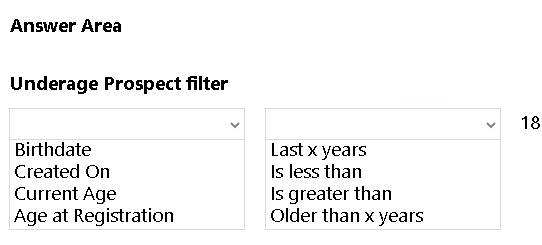

    
Answer

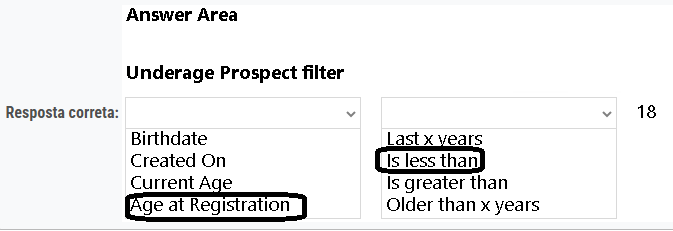

---

### Question - 39 (Study-Case):

You need to create a flow to send an email to the primary contacts.  
Which action should you configure? To answer, select the appropriate options in the answer area.  
NOTE: Each correct selection is worth one point.

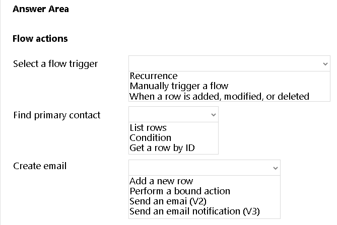

    
Answer

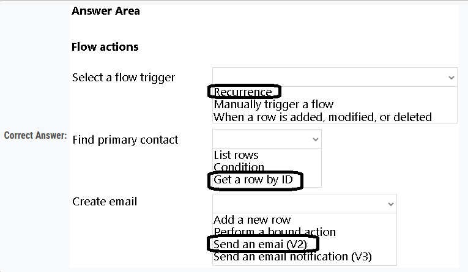

---

### Question - 40:

You are creating Power Automate automations targeting Dataverse.  
The automations must meet the following requirements:  
• Run a custom API created by a developer. The API performs an action against an existing Account row in the system.  
• Create three rows in Dataverse. If an error occurs when you create the second row, the first row must be deleted.  
• Run several create, update, and delete operations as part of a single transaction without writing custom code.  
• Run several complex operations targeting multiple rows in the system as part of a single transaction.  

You need to configure the actions.  
Which actions should you configure? To answer, move the appropriate actions to the correct requirements. You may use each action once, more than once, or not at all. You may need to move the split bar between panes or scroll to view content.

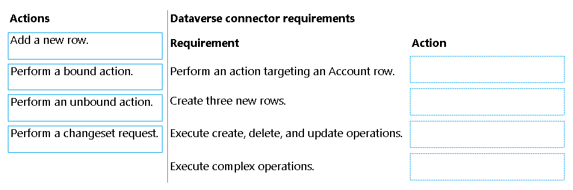

    
Answer

1. Perform a bound action
2. Perform a changeset request
3. Perform a changeset request
4. Perform a changeset request

---

### Question - 41:

A company has a business process flow that executes on the Contact table.  
The company requires that the steps in the flow be executed in real time when users create a new task and update the status of a Contact row.  
You need to implement a solution that automates the steps.  
Which three actions should you perform in sequence? To answer, move the appropriate actions from the list of actions to the answer area and arrange them in the correct order.  
NOTE: More than one order of answer choices is correct. You will receive credit for any of the correct orders you select.

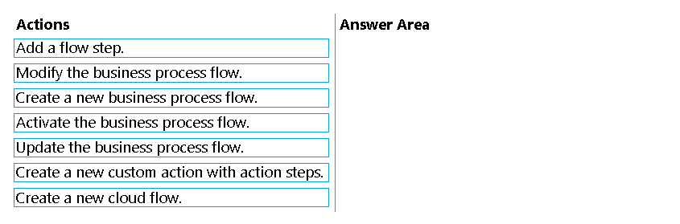

    
Answer

-   Modify the business proecss flow
-   Add a flow step
-   Create a new custom action with action steps

---

### **Study-Case-2:**

This is a case study. Case studies are not timed separately. You can use as much exam time as you would like to complete each case. However, there may be additional case studies and sections on this exam. You must manage your time to ensure that you are able to complete all questions included on this exam in the time provided.  

To answer the questions included in a case study, you will need to reference information that is provided in the case study. Case studies might contain exhibits and other resources that provide more information about the scenario that is described in the case study. Each question is independent of the other questions in this case study.  

At the end of this case study, a review screen will appear. This screen allows you to review your answers and to make changes before you move to the next section of the exam. After you begin a new section, you cannot return to this section.  

**To start the case study -**
To display the first question in this case study, click the Next button. Use the buttons in the left pane to explore the content of the case study before you answer the questions. Clicking these buttons displays information such as business requirements, existing environment, and problem statements. If the case study has an All Information tab, note that the information displayed is identical to the information displayed on the subsequent tabs. When you are ready to answer a question, click the Question button to return to the question.

**Background -**
ADatum Corporation provides verification and investigation services that are used by insurance companies, law firms, and other organizations in the public sector. Services include verifying an individual’s background, qualifications, and specific scenarios that require onsite visit.  

The thorough work ADatum Corporation performs results in highly accurate cases with minimal critical information missing. Because of these high-quality results, ADatum Corporation is quickly proving itself as one of the best in the industry. In recent months, business has significantly increased, with most new business coming from high-profile companies and individuals.  

Management has decided to create a new qualification verification (QV) role to help ensure that clients get the most accurate results. This role examines completed work to ensure that nothing is missed.  

**Current environment -**

**Data storage and retention -**

-   All information sent by clients for services is stored in Microsoft Dataverse with a model-driven app as the interface.
-   Clients enter their data in a website, which then uses a service account to create the records in the Dataverse database.
-   Team members currently have full access to all Service Request records.

**Service requests -**

-   The Service Request table includes header information about the individual or organization that is the subject of verification.
-   New Service Request records are assigned to a queue. All potential users who will be performing the verifications have access to these records.
-   A service request is assigned to a single user who will ensure that all qualifications are verified. This single user is the only one able to process Qualification records related to their own service requests.
-   Many required tasks when performing verification services are currently done by using manual processes.
-   To keep up with demand, ADatum Corporation identifies several processes that can be replaced by using Power Automate flows to hire fewer new staff and keep costs down.

**Qualification verification -**

-   The qualification table contains details about an individual school degree, professional qualifications, and other qualifications that must be verified.
-   A service request can have one or more Qualification records associated with it.
-   Record status is pending verification until the initial team member finishes, at which point the member changes the status to Complete.
-   When all qualification records related to a service request are verified either by manual or automated processes, the results are made available to ADatum Corporation’s client.
-   In the rare event that results are questioned, a new service request is created and verified independently of the previous work that took place.
-   To complete a service request, users perform the following actions: o Send a templated email by using Microsoft Outlook to the client after all qualifications for a service request are checked. o Change the service request status to Completed. Currently, service requests do not indicate when all Qualification records are addressed.

**Microsoft Power platform environment**

-   The following environments exist: development, testing, user acceptance testing (UAT), and production.
-   Managed solutions are used to move customizations from the development environment to other higher-level environments. These solutions are created and maintained by the power users and provided to internal IT for deployment when they are ready.
-   Two managed solutions, Verification Process Automation and Onsite Visit, share several components.
-   All customizations to Power Platform components are performed by several power users who have received training and are certified as subject matter experts.
-   Power users have been granted the System Administrator security role in the development environment.
-   Corporate policy prohibits power users from writing code due to lack of a formal code review process.
-   Internal IT will not be able to supply any development resources for this project due to a lack of staff. This means that any customizations and automation created for this project must be low-code/no-code for the power users to implement them.
-   Customizations created by power users are deployed by internal IT.

**Requirements -**

**Process automation -**
ADatum Corporation plans to establish a new QV department to verify completed work so that the quality of work is maintained. The new process for verifying professional qualifications must automate the following:

-   Enter data and navigate the authority’s website. The authority website UI changes frequently because the company constantly improves the user experience.
-   Search page contents for a specified value to determine validity.
-   Update the corresponding Qualification record in Dataverse.

The new process for completing a service request must automate the following:

-   Set the Service Request record status to Complete when work on all Qualification records is finished.
-   Send an email to the client with the results when the service request is completed. The email must list each qualification as either Valid or Not Valid, depending on the verification.

**Qualification verification -**

-   Service request results will not be released to clients until all related Qualification records are set to a Complete status.
-   To check work done by a wide array of users, 10 percent of Qualification records must be double checked.
-   Qualification records must be automatically assigned to a queue.
-   Qualification records must be flagged with a new status field named Assigned to ensure that records are rechecked.
-   Ensure that only QV team members can change the status from Assigned to In Progress to Complete.
-   Record the name of the QV team member who performed the work and the date completed.

**Governance and security -**

-   All components required for the verification process must be included in a new solution.
-   Corporate security requires that deployments to non-development environments must be automated using service accounts.
-   User security and data access must also be consistent across environments, except for the elevated access of the power users in the development environment.
-   The Onsite Visit managed solution has a table that is not in the Verification Process Automation managed solution. This table must be upgraded prior to the go-live date without the other shared components.
-   A VP of sales requires a test environment to demonstrate to potential clients the security policies that are included in their initial offering.

**Issues -**

-   More employees than are required can access individual client information and continue to have access after a service request is completed.
-   When users go on vacation, all their outstanding Service Request records are assigned to a substitute employee. The substitute employees are unable to see all the qualifications related to their service requests.
-   Currently, testing the new QV functionality outside the development environment is not possible due to corporate security policies requiring the same security role across all environments.
-   Internal IT reports that the solution import to the test environment failed because of missing dependencies related to the flow for completing service requests.

### Question - 42 (Study-Case-2):

You need to create the automation for the qualification verification process.  
Which two actions should you perform? Each correct answer presents a complete solution.  
NOTE: Each correct selection is worth one point.

-   A. Add a Dataverse connector.
-   B. Add an Outlook connector.
-   C. Create an on-premises data gateway reference.
-   D. Update the Qualification records to finished.
-   E. Create a Service Request record.

    
Answer

-   A. Add a Dataverse connector.
-   B. Add an Outlook connector.

---

### Question - 43:

A company is using the Account table and a main form named Account Main.  
The company defines the following requirements for the Account Main form:  
• Evaluate a single value selected as part of a drop-down list.  
• Display a message and suggestion based on business intelligence if the drop-down list value equals a specific value.  
• Logic must run against this form only.  

You need to implement the logic.  
Which four actions should you perform in sequence? To answer, move the appropriate actions from the list of actions to the answer area and arrange them in the correct order.  
NOTE: More than one order of answer choices is correct. You will receive credit for any of the correct orders you select.  

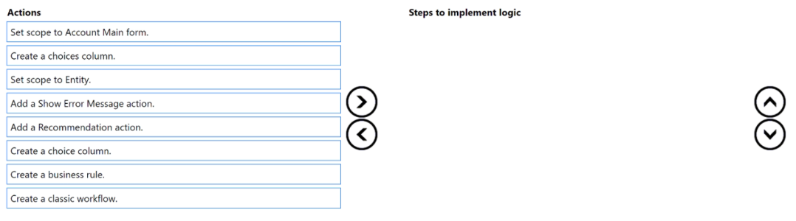

    
Answer

1. Create a choice column: This will allow you to have a drop-down list with selectable values.
2. Create a business rule: Business rules can be used to implement logic without writing code.
3. Set scope to Account Main form: This ensures that the logic runs only on the specified form.
4. Add a Recommendation action: This action will display a message and suggestion based on the selected value.

---

### Question - 44:

A company creates a Power Automate cloud flow for a Power Apps app.  
The cloud flow must send an email to each active contact.  
You need to configure the flow.  
Which feature should you use?

-   A. Condition
-   B. Apply to each
-   C. Wait
-   D. Parallel branch

    
Answer

-   B. Apply to each

---

### Question - 45:

You are creating a cloud flow for an automation targeting Dataverse.  
When a new account is created in Dataverse, the name of the account must be updated based on the following logic:  
• If the Account Category Code equals Preferred Customer (1), pre append the value Preferred | to the name.  
• If the Account Category Code equals Standard (2) or is not populated, pre-append Standard | to the name.  

You need to define the correct formula to use for the automation.  
Which formula should you use?

-   A. if(equals(triggerOutputs()?['body/accountcategorycode'), 1), concat('Standard | ', triggerOutputs()?['body/name']), concat('Preferred | ', triggerOutputs()?['body/name']))
-   B. if(equals(triggerOutputs()?['body/accountcategorycode'), 2), concat('Standard ', |triggerOutputs()?[‘body/name']), concat('Preferred | ', triggerOutputs()?['body/name']))
-   C. if(equals(outputs('trigger')?['body/accountcategorycode'], 1), concat('Standard | ', outputs('trigger')?['body/name']), concat('Preferred | ', outputs('trigger')?['body/name']))
-   D. if(equalsfoutputs('trigger')body/accountcategorycode'], 2), concat('Standard | ', outputs('trigger')?['body/name']), concat('Preferred | ',outputs('trigger')?['body/name']))

    
Answer

-   A. if(equals(triggerOutputs()?['body/accountcategorycode'), 1), concat('Standard | ', triggerOutputs()?['body/name']), concat('Preferred | ', triggerOutputs()?['body/name']))

---

### Question - 46:

A cloud flow you authored failed several times in production due to a transient network issue. The issue is now resolved.  
You need to reprocess the failed flow runs with the least amount of administrative effort.  
What should you do?  

-   A. Resubmit each run individually.
-   B. Resubmit all runs in bulk.
-   C. Rerun the trigger action.
-   D. Turn the flow off and then on.

    
Answer

-   B. Resubmit all runs in bulk.

---

### Question - 47:

You are creating a Power Automate cloud flow. The cloud flow will create several SharePoint Online list items based on a variety of conditions.  
If any of the dependent SharePoint Online actions fail, you must revert the changes while the automation runs.  
You need to design the cloud flow to meet the requirement.  
Which two actions should you implement for the design? Each correct answer presents part of the solution.  
NOTE: Each correct selection is worth one point.

-   A. Add a scope.
-   B. Set Run After to Has failed.
-   C. Perform a changeset request action.
-   D. Retrigger the flow run.

    
Answer

-   A. Add a scope.
-   B. Set Run After to Has failed.

---

### **Study-Case-3**

This is a case study. Case studies are not timed separately. You can use as much exam time as you would like to complete each case. However, there may be additional case studies and sections on this exam. You must manage your time to ensure that you are able to complete all questions included on this exam in the time provided.  

To answer the questions included in a case study, you will need to reference information that is provided in the case study. Case studies might contain exhibits and other resources that provide more information about the scenario that is described in the case study. Each question is independent of the other questions in this case study.  

At the end of this case study, a review screen will appear. This screen allows you to review your answers and to make changes before you move to the next section of the exam. After you begin a new section, you cannot return to this section.  

**To start the case study -**
To display the first question in this case study, click the Next button. Use the buttons in the left pane to explore the content of the case study before you answer the questions. Clicking these buttons displays information such as business requirements, existing environment, and problem statements. If the case study has an All Information tab, note that the information displayed is identical to the information displayed on the subsequent tabs. When you are ready to answer a question, click the Question button to return to the question.  

**Background -**

Contoso Suites is an animal shelter that specializes in finding homes for dogs that have been given up by their owners. The shelter can house up to 20 dogs.  
The shelter is implementing one model-driven Power Apps app to track the dogs and schedule meetings with potential adopters. No other apps will be created.  
The model-driven app uses Dataverse with out-of-the-box functionality when possible. Dataverse is set up with the following configuration:  

-   The solution prefix “cs” is used for all new components.
-   Only the root business unit is used.
-   All tables are stored in Dataverse and do not require rapid scaling.
-   Exchange server-side sync is not configured.

**Adopters -**

-   Adopter information is stored in a Contact table.
-   Contacts are considered to be duplicates if they have the same email address and last name.
-   Adopters are often late to meetings, so a reminder email is sent to them two hours before their meeting.
-   The email reminders must not be tracked in the system.

**Dogs -**

-   Dog information is stored in a Dog table, which is organization owned.
-   Breed, size, and weight are fields in the table.

**Dog residency -**

-   A Resident table tracks the stay of each dog.
-   Each resident record has a lookup for the dog and its food.
-   The food type and amount are logged on each resident record. Auto-posting is not configured for changes to food type and amount.
-   A fee of $120 is in a currency column named Adoption Fee. This fee can be changed depending on the adoption circumstances.
-   A formula column named Deposit is automatically populated with 20% of the adoption fee.
-   A resident record is generated automatically when a dog record is created. This is the only way a resident record can be created.

**Exercise and feedings -**

-   Exercise for the dogs is tracked in an Exercise table.
-   Feedings are tracked in a Feeding table.
-   Exercise and feeding records appear in a resident record timeline.

**Care staff -**

-   The care staff must be able to view who changed the food type and the amount that was given, for up to three months ago.
-   The staff must be able to update the weight of a dog on the resident record.
-   The staff report that the buttons are too small on the touch screen they use to log exercise and feeding.
-   The staff must be able to view who the adopters are for upcoming meetings. The staff must not be able to update adopter information.

**Administrative staff -**

-   Administrative staff must receive a weekly list of duplicate contacts. Duplicate alerts must not appear when a staff member saves a new contact.
-   When an adopter wants to adopt a dog, the staff must perform a series of adoption duties in order. The following duty list must be displayed on the screen: o Commitment:
-   Obtain adopter signature in a commitment document.
-   Collect deposit.
    o Pre-pickup:
-   Document spay or neutering date.
-   Perform spay or neutering.
-   Document pickup date.
    o Pickup:
-   Collect full payment.
-   Verify dog is picked up.
    o A dog must be picked up no sooner than two days after spaying or neutering. o A pop-up window must appear with an error message if the Pickup date is too soon. o Only administrative staff must be able to add new adopters and dogs.

### Question - 48 (Case-Study-3):

You need to create adoption duties for the administrative staff.  
What should you create?  

-   A. business unit
-   B. business process flow
-   C. business rule

    
Answer

-   C. business rule

---

### Question - 49 (Case-Study-3):

You need to manage contact duplicates for the administrative staff.  
What should you do?  

-   A. Create two duplicate detection rules and two duplicate detection jobs, and update duplicate detection settings.
-   B. Create two duplicate detection rules and one duplicate detection job.
-   C. Create one duplicate detection rule and one duplicate detection job, and update duplicate detection settings.

    
Answer

-   C. Create one duplicate detection rule and one duplicate detection job, and update duplicate detection settings.

---

### Question - 50 (Case-Study-3):

You need to ensure that an appropriate date is selected for dog pickup.  
What should you configure? To answer, select the appropriate options in the answer area.  
NOTE: Each correct selection is worth one point.

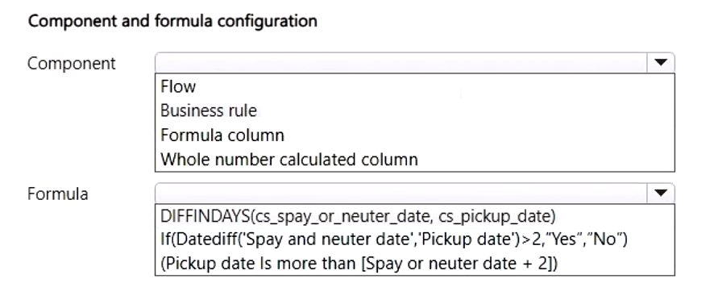

    
Answer

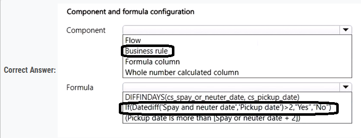

---

### Question - 51:

A company has a Power Apps app.  
The app must meet the following requirements:  
• Managers assign lead rows to the sales department. A new phone call row must be created if a lead row has no activities.  
• An email must be sent to the manager if the phone call row created is not completed after one day.  

A classic workflow must run when a lead row is assigned.  
You need to configure the check conditions for the workflow.  
Which value should you use for each condition? To answer, select the appropriate options in the answer area.  
NOTE: Each correct selection is worth one point.

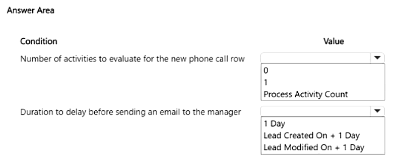

    
Answer

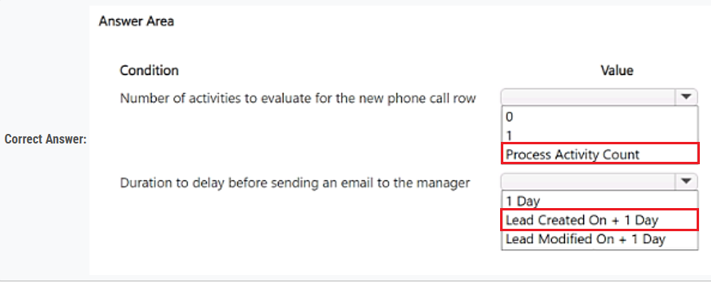

---

### Question - 52:

    
Answer

---

### Question - 53:

    
Answer

---

### Question - 54:

    
Answer

---

### Question - 55:

    
Answer

---

### Question - 56:

    
Answer

---

### Question - 57:

    
Answer

---

### Question - 58:

    
Answer

---

### Question - 59:

    
Answer

---
