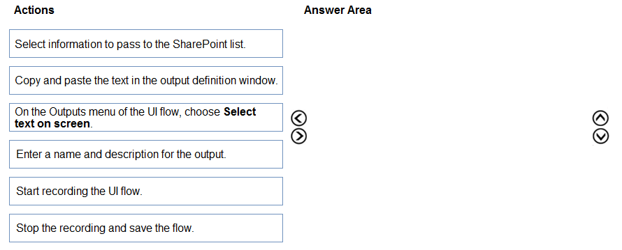
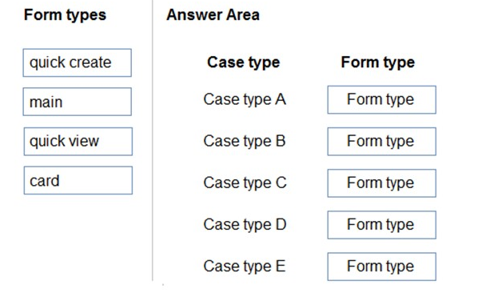
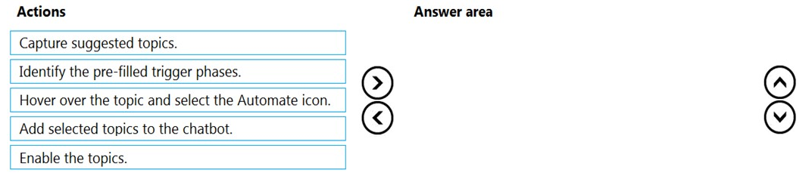
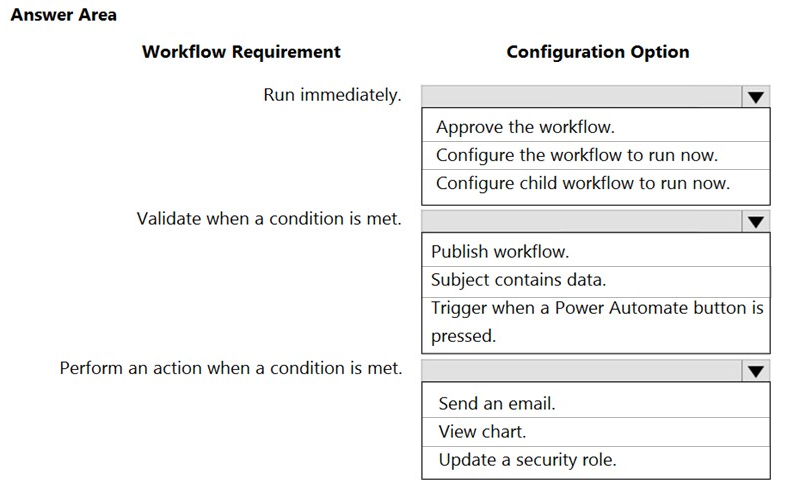
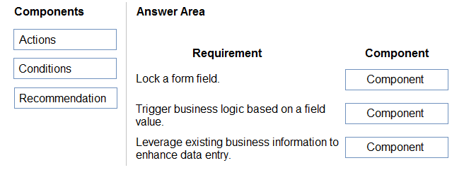
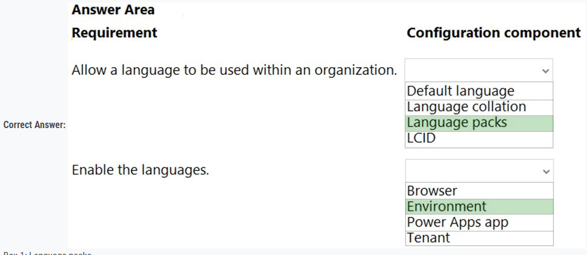

### Question - 1:

Note: This question is part of a series of questions that present the same scenario. Each question in the series contains a unique solution that might meet the stated goals. Some question sets might have more than one correct solution, while others might not have a correct solution.  
After you answer a question in this section, you will NOT be able to return to it. As a result, these questions will not appear in the review screen.  
You are creating Power Virtual Agents chatbot that captures demographic information about customers.  
The chatbot must determine the group a customer belongs to based on their age. The age groups are:  
✑ 0 - 17  
✑ 18 - 25  
✑ 26 - 35  
✑ 36 - 55  
✑ 55 - 100  
You need to configure the chatbot to ask a question that can be used to determine the correct age group.  
Solution: Use age for Identify in the question and then add branches for each group that use conditional logic.  
Does the solution meet the goal?  

-   A. Yes
-   B. No

    
Answer

-   A. Yes

---

### Question - 2:

You are designing a Power Virtual Agents chatbot.  
The chatbot must be able to maintain customer information if the conversation topic changes during a dialog.  
You need to configure variables to store customer name and email address.  
Which type of variable should you create?  

-   A. session
-   B. slot
-   C. bot
-   D. topic

    
Answer

-   C. bot

---

### Question - 3:

You are designing a Power Virtual Agents chatbot for a store.  
You need to teach the chatbot to acknowledge the store's product categories and the variations within specific categories.  
You need to create custom entities to provide the chatbot with the knowledge of the product categories.  
Which features should you use? To answer, select the appropriate options in the answer area.  
NOTE: Each correct selection is worth one point.  
Hot Area:

    
Answer

---

### Question - 4:

A customer has a support website that includes FAQ pages, knowledge articles, and support content.  
You plan to leverage an existing Power Virtual Agents bot to enhance and streamline existing support functionality for the existing support portal.  
You need to create topics from existing website content. The process must minimize human errors during topic creation.  
Which three actions should you perform in sequence? To answer, move the appropriate actions from the list of actions to the answer area and arrange them in the correct order.  
Select and Place:  

    
Answer

---

### Question - 5:

You are creating a Power Virtual Agents chatbot that uses multiple topics.  
Each user interaction can reference more than one topic.  
You need to be able to capture a value in an initial topic and use it in subsequent topics.  
Which type of variable should you create?  

-   A. Context
-   B. Bot
-   C. Topic

    
Answer

-   B. Bot

---

### Question - 6:

A company has a custom website.  
You need to embed a Power Virtual Agents chatbot into the website.  
What should you use?  

-   A. Webpage URL
-   B. Form ID
-   C. Bot ID
-   D. Custom web channel

    
Answer

-   D. Custom web channel

---

### Question - 7:

A company is developing several Power Virtual Agents chatbots. The company manufactures more than 1,000 different products.  
The chatbots must prompt users to enter or select a product.  
You need to store the product information so that it can be reused across all chatbots.  
Where should you store the model data?  

-   A. Global variables
-   B. Custom entities
-   C. Topics
-   D. Multiple choice options

    
Answer

-   B. Custom entities

---

### Question - 8:

A company creates a Power Virtual Agents chatbot.  
You need to determine when live agents are engaged to provide support.  
Which metrics should you use? To answer, drag the appropriate metrics to the correct processes. Each metric may be used once, more than once, or not at all.  
You may need to drag the split bar between panes or scroll to view content.  
NOTE: Each correct selection is worth one point.  
Select and Place:  

    
Answer

---

### Question - 9:

Note: This question is part of a series of questions that present the same scenario. Each question in the series contains a unique solution that might meet the stated goals. Some question sets might have more than one correct solution, while others might not have a correct solution.  
After you answer a question in this section, you will NOT be able to return to it. As a result, these questions will not appear in the review screen.  
You are creating Power Virtual Agents chatbot that captures demographic information about customers.  
The chatbot must determine the group a customer belongs to based on their age. The age groups are:  
✑ 0 - 17  
✑ 18 - 25  
✑ 26 - 35  
✑ 36 - 55  
✑ 55 - 100  
You need to configure the chatbot to ask a question that can be used to determine the correct age group.  
Solution: Use Date and time for Identify in the question and then add branches that use conditional logic to determine the age group.  
Does the solution meet the goal?

-   A. Yes
-   B. No

    
Answer

-   B. No

---

### Question - 10:

Note: This question is part of a series of questions that present the same scenario. Each question in the series contains a unique solution that might meet the stated goals. Some question sets might have more than one correct solution, while others might not have a correct solution.  
After you answer a question in this section, you will NOT be able to return to it. As a result, these questions will not appear in the review screen.  
You are creating Power Virtual Agents chatbot that captures demographic information about customers.  
The chatbot must determine the group a customer belongs to based on their age. The age groups are:  
0 - 17  
✑ 18 - 25  
✑ 26 - 35  
✑ 36 - 55  
✑ 55 - 100  
You need to configure the chatbot to ask a question that can be used to determine the correct age group.  
Solution: Use multiple choice options for Identify in the question and create options that represent each of the age groups.  
Does the solution meet the goal?  

-   A. Yes
-   B. No

    
Answer

-   A. Yes

---

### Question - 11:

Note: This question is part of a series of questions that present the same scenario. Each question in the series contains a unique solution that might meet the stated goals. Some question sets might have more than one correct solution, while others might not have a correct solution.  
After you answer a question in this section, you will NOT be able to return to it. As a result, these questions will not appear in the review screen.  
You are creating Power Virtual Agents chatbot that captures demographic information about customers.  
The chatbot must determine the group a customer belongs to based on their age. The age groups are:  
✑ 0 - 17  
✑ 18 - 25  
✑ 26 - 35  
✑ 36 - 55  
✑ 55 - 100  
You need to configure the chatbot to ask a question that can be used to determine the correct age group.  
Solution: Create a custom Age group entity and synonyms for each individual age in the corresponding item. Use Age group for Identify in the question.  
Does the solution meet the goal?  

-   A. Yes
-   B. No

    
Answer

-   A. Yes

---
