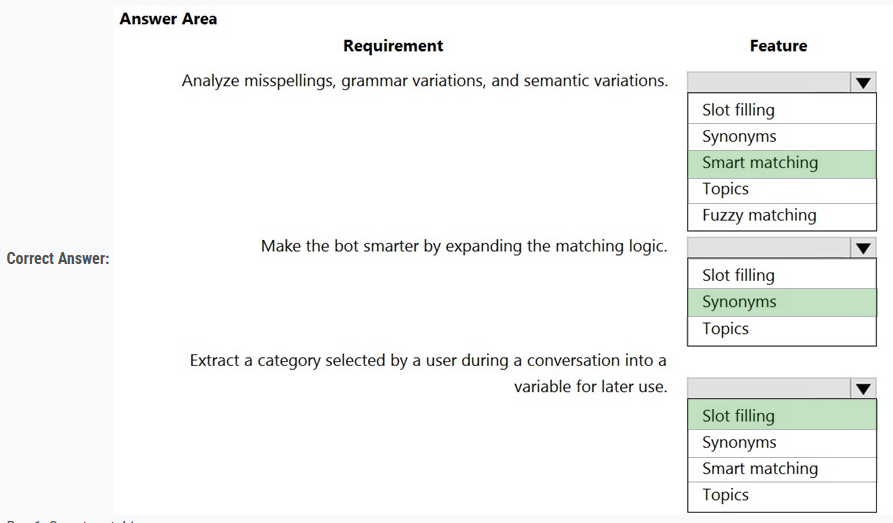

### Question - 1:

Note: This question is part of a series of questions that present the same scenario. Each question in the series contains a unique solution that might meet the stated goals. Some question sets might have more than one correct solution, while others might not have a correct solution.  
After you answer a question in this section, you will NOT be able to return to it. As a result, these questions will not appear in the review screen.  
You are creating Power Virtual Agents chatbot that captures demographic information about customers.  
The chatbot must determine the group a customer belongs to based on their age. The age groups are:  
✑ 0 - 17  
✑ 18 - 25  
✑ 26 - 35  
✑ 36 - 55  
✑ 55 - 100  
You need to configure the chatbot to ask a question that can be used to determine the correct age group.  
Solution: Use age for Identify in the question and then add branches for each group that use conditional logic.  
Does the solution meet the goal?  

-   A. Yes
-   B. No

    
Answer

-   A. Yes

---

### Question - 2:

You are designing a Power Virtual Agents chatbot.  
The chatbot must be able to maintain customer information if the conversation topic changes during a dialog.  
You need to configure variables to store customer name and email address.  
Which type of variable should you create?  

-   A. session
-   B. slot
-   C. bot
-   D. topic

    
Answer

-   C. bot

---

### Question - 3:

You are designing a Power Virtual Agents chatbot for a store.  
You need to teach the chatbot to acknowledge the store's product categories and the variations within specific categories.  
You need to create custom entities to provide the chatbot with the knowledge of the product categories.  
Which features should you use? To answer, select the appropriate options in the answer area.  
NOTE: Each correct selection is worth one point.  
Hot Area:

    
Answer

---

### Question - 4:

A customer has a support website that includes FAQ pages, knowledge articles, and support content.  
You plan to leverage an existing Power Virtual Agents bot to enhance and streamline existing support functionality for the existing support portal.  
You need to create topics from existing website content. The process must minimize human errors during topic creation.  
Which three actions should you perform in sequence? To answer, move the appropriate actions from the list of actions to the answer area and arrange them in the correct order.  
Select and Place:  

    
Answer

---

### Question - 5:

You are creating a Power Virtual Agents chatbot that uses multiple topics.  
Each user interaction can reference more than one topic.  
You need to be able to capture a value in an initial topic and use it in subsequent topics.  
Which type of variable should you create?  

-   A. Context
-   B. Bot
-   C. Topic

    
Answer

-   B. Bot

---

### Question - 6:

A company has a custom website.  
You need to embed a Power Virtual Agents chatbot into the website.  
What should you use?  

-   A. Webpage URL
-   B. Form ID
-   C. Bot ID
-   D. Custom web channel

    
Answer

-   D. Custom web channel

---

### Question - 7:

A company is developing several Power Virtual Agents chatbots. The company manufactures more than 1,000 different products.  
The chatbots must prompt users to enter or select a product.  
You need to store the product information so that it can be reused across all chatbots.  
Where should you store the model data?  

-   A. Global variables
-   B. Custom entities
-   C. Topics
-   D. Multiple choice options

    
Answer

-   B. Custom entities

---

### Question - 8:

A company creates a Power Virtual Agents chatbot.  
You need to determine when live agents are engaged to provide support.  
Which metrics should you use? To answer, drag the appropriate metrics to the correct processes. Each metric may be used once, more than once, or not at all.  
You may need to drag the split bar between panes or scroll to view content.  
NOTE: Each correct selection is worth one point.  
Select and Place:  

    
Answer

---

### Question - 9:

Note: This question is part of a series of questions that present the same scenario. Each question in the series contains a unique solution that might meet the stated goals. Some question sets might have more than one correct solution, while others might not have a correct solution.  
After you answer a question in this section, you will NOT be able to return to it. As a result, these questions will not appear in the review screen.  
You are creating Power Virtual Agents chatbot that captures demographic information about customers.  
The chatbot must determine the group a customer belongs to based on their age. The age groups are:  
✑ 0 - 17  
✑ 18 - 25  
✑ 26 - 35  
✑ 36 - 55  
✑ 55 - 100  
You need to configure the chatbot to ask a question that can be used to determine the correct age group.  
Solution: Use Date and time for Identify in the question and then add branches that use conditional logic to determine the age group.  
Does the solution meet the goal?

-   A. Yes
-   B. No

    
Answer

-   B. No

---

### Question - 10:

Note: This question is part of a series of questions that present the same scenario. Each question in the series contains a unique solution that might meet the stated goals. Some question sets might have more than one correct solution, while others might not have a correct solution.  
After you answer a question in this section, you will NOT be able to return to it. As a result, these questions will not appear in the review screen.  
You are creating Power Virtual Agents chatbot that captures demographic information about customers.  
The chatbot must determine the group a customer belongs to based on their age. The age groups are:  
0 - 17  
✑ 18 - 25  
✑ 26 - 35  
✑ 36 - 55  
✑ 55 - 100  
You need to configure the chatbot to ask a question that can be used to determine the correct age group.  
Solution: Use multiple choice options for Identify in the question and create options that represent each of the age groups.  
Does the solution meet the goal?  

-   A. Yes
-   B. No

    
Answer

-   A. Yes

---

### Question - 11:

Note: This question is part of a series of questions that present the same scenario. Each question in the series contains a unique solution that might meet the stated goals. Some question sets might have more than one correct solution, while others might not have a correct solution.  
After you answer a question in this section, you will NOT be able to return to it. As a result, these questions will not appear in the review screen.  
You are creating Power Virtual Agents chatbot that captures demographic information about customers.  
The chatbot must determine the group a customer belongs to based on their age. The age groups are:  
✑ 0 - 17  
✑ 18 - 25  
✑ 26 - 35  
✑ 36 - 55  
✑ 55 - 100  
You need to configure the chatbot to ask a question that can be used to determine the correct age group.  
Solution: Create a custom Age group entity and synonyms for each individual age in the corresponding item. Use Age group for Identify in the question.  
Does the solution meet the goal?  

-   A. Yes
-   B. No

    
Answer

-   A. Yes

---

### Question - 12:

You create a new Power Virtual Agents chatbot for an organization.  
Testing and production deployment of the chatbot are not complete.  
You need to ensure that appropriate users can access the chatbot.  
Which methods should you use? To answer, select the appropriate options in the answer area.  
NOTE: Each correct selection is worth one point.  
Hot Area:

    
Answer

---

### Question - 13:

You are designing a chatbot for a sports outlet.  
You need to complete the chatbot.  
Which features should you use? To answer, drag the appropriate features to the correct requirements. Each feature may be used once, more than once, or not at all. You may need to drag the split bar between panes or scroll to view content.  
NOTE: Each correct selection is worth one point.  
Select and Place:  

    
Answer

---

### Question - 14:

A company has marketing teams for different regions.  
A user creates and publishes a chatbot within Microsoft Teams for their specific marketing team.  
The base metrics retrieved by the chatbot are relevant to all marketing teams.  
The other marketing teams request access to the chatbot.  
You need to publish the chatbot to the entire company.  
What should you do?  

-   A. Configure the chatbot to be used with the Teams channel.
-   B. Submit the chatbot for admin approval.
-   C. Copy the published chatbot link and email it to the other teams.
-   D. Invite the other teams to the team that has the chatbot.
-   E. Export the chatbot and import it into a corporate environment.

    
Answer

-   B. Submit the chatbot for admin approval.

---

### Question - 15:

You create a Power Virtual Agents chatbot to reduce the number of incoming support calls that require a live person.  
The chatbot does not direct users to the correct information. You determine that this is because the chatbot is not able to identify which product a user is referring to in a conversation.  
You need to present a list of products so that users can select the correct product.  
What should you create?  

-   A. Table
-   B. Variable
-   C. Slot filling
-   D. Entity

    
Answer

-   D. Entity

---

### Question - 16:

You are creating a Power Virtual Agents chatbot for a Microsoft Power Platform power apps portal app.  
The job title of users must be stored automatically when users log in. The job title must always appear in the chatbot.  
You need to configure the job title functionality.  
Which mechanism should you use?  

-   A. artificial intelligence
-   B. variable
-   C. entity
-   D. topic

    
Answer

-   B. variable

---

### Question - 17:

You are designing a Power Virtual Agents chatbot.  
The environment you plan to use does not appear as an option in the Power Virtual Agents user interface.  
You need to ensure that you can create the chatbot in the environment.  
What should you do?  

-   A. Change the region for the environment.
-   B. Convert the environment to a sandbox environment.
-   C. Create an environment in a supported region.

    
Answer

-   C. Create an environment in a supported region.

---

### Question - 18:

You are a system administrator for a company with locations in Mexico, United States, and France. The company has both fulltime employees and contractors in all regions. Fulltime employees use a mobile app. The company has two security groups: fulltime employees and contractors.  
The company requests a chatbot in Microsoft Teams to answer employee benefit questions. The chatbot must meet the following requirements:  
• It must be in the local language.  
• Only fulltime employees may access the chatbot.  

You need to configure the chatbot.  
What should you do? To answer, select the appropriate options in the answer area.  
NOTE: Each correct selection is worth one point.

    
Answer

1. C
2. A

---

### Question - 19:

A company sells all types of bicycles, bicycle parts, and accessories. You are creating a chatbot by using Microsoft Power Virtual Agent for the bicycle shop.  
When someone types in a bicycle brand name or terms such as helmet or shoes, the chatbot must automatically go to the accessories section of the chatbot.  
You need to configure the chatbot functions.  
Which two functions should you configure? Each correct answer presents part of the solution.  
NOTE: Each correct selection is worth one point.

-   A. Entities
-   B. Fallback topic
-   C. Smart matching
-   D. Synonyms
-   E. Slot filling

    
Answer

---

### Question - 20:

You plan to create a Power Virtual Agents bot.  
The bot must support single sign-on.  
You need to publish the bot.  
Which two locations should you use? Each correct answer presents a complete solution.  
NOTE: Each correct selection is worth one point.

-   A. Mobile app developed for iOS and Android
-   B. Website developed using pro developer tools
-   C. Microsoft Teams
-   D. Azure Bot Service channels

    
Answer

-   B. Website developed using pro developer tools
-   C. Microsoft Teams

---

### Question - 21:

A company is planning to create a Power Virtual Agents bot.  
The bot has the following requirements:  
• The bot must provide address information for the company.  
• The bot must be available from Microsoft Teams and from the internet website of the company.  

You need to configure the bot.  
Which component should you use?

-   A. Channel
-   B. Template
-   C. Composer
-   D. Skill

    
Answer

-   A. Channel

---

### Question - 22:

A company plans to implement a voice-enabled Power Virtual Agents bot.  
The company has the following requirements for the bot:  
• Recognize when a caller states Tennis or any variation of the word.  
• Provide options when a caller states the name of a sport.  

You need to configure the bot.  
Which features should you use? To answer, select the appropriate options in the answer area.

    
Answer

---

### Question - 23:

A company plans to implement chatbots by using Power Virtual Agents.  
The company has the following requirements for the bots:  
• Users in the accounting department must be able to create a bot for frequently asked questions. 
• The support desk users must be able to use the bot. 

The users must not be able to change environment parameters in the Microsoft Power Platform environment.  
You need to configure the permissions for the bots.  
Which actions should you implement? To answer, select the appropriate options in the answer area.  
NOTE: Each correct selection is worth one point.

    
Answer

-   C. Assign users the Maker permission: This permission allows users to create and manage their own bots without giving them the ability to change environment parameters.
-   B. Share the bot with a security group: Sharing the bot with a security group ensures that support desk users can access and use the bot without having permissions to modify it or the environment settings.

---

### Question - 24:

You use Power Virtual Agents to create a bot that will answer and transfer help desk calls.  
You create topics that contain nodes and functions. The company has the following requirements for the bot:  
• When a caller states the word issue, help, or problem, the bot must respond with the question, “How can we help you today?”  
• When the bot responds with the question, “How can we help you today?”, the bot must provide the caller with the choices of hardware, software, or other.  
• When the caller asks a question, the bot must save the response so that it can perform an action on the response.  

You need to configure the bot.  
Which nodes or functions should you use? To answer, select the appropriate options in the answer area.  
NOTE: Each correct selection is worth one point.

    
Answer

---

### Question - 25:

A company creates a bot by using Power Virtual Agents.  
The company requires the bot to transfer callers to an agent if the bot is unable to recognize a customer’s request.  
You need to configure the bot for the unrecognized information from the customer.  
Which feature should you use?

-   A. Fallback skill
-   B. Fallback topic
-   C. Fallback workstream
-   D. Fallback entity
-   E. Fallback queue

    
Answer

-   B. Fallback topic

---

### Question - 26:

A company plans to create a Power Virtual Agents chatbot.  
The bot has the following requirements:  
• Prompt for a location of the customer and the call must be routed to a support agent for the location.  
• Transfer support calls at each location to a support bot that uses the Bot Framework.  

You need to configure the bot.  
Which components should you use? To answer, drag the appropriate components to the correct requirements. Each component may be used once, more than once, or not at all. You may need to drag the split bar between panes or scroll to view content.  
NOTE: Each correct selection is worth one point.

    
Answer

1. Topics
2. Skills

---

### Question - 27:

A company is building a Power Virtual Agents chatbot.  
Users in the accounting department require access to collaborate with the building of the bot. Users in the sales department require access to only chat with the bot.  
You need to configure the bot.  
Which sharing options should you use? To answer, drag the appropriate sharing options to the correct requirements. Each sharing option may be used once, more than once, or not at all. You may need to drag the split bar between panes or scroll to view content.  
NOTE: Each correct selection is worth one point.

    
Answer

---

### Question - 28:

You create a Power Virtual Agents bot.  
You observe that the bot is not able to recognize input from some users.  
You need to configure the bot response for unrecognized input from users.  
What are two possible ways to achieve this goal? Each correct answer presents a complete solution.  
NOTE: Each correct selection is worth one point.

-   A. Connect to a different channel.
-   B. Display a system-defined error message.
-   C. Use a fallback topic.
-   D. Transfer to an agent.

    
Answer

-   C. Use a fallback topic.
-   D. Transfer to an agent.

---

### Question - 29:

You plan to create a Power Virtual Agents bot.  
The bot has the following requirements:  
• Ensure that user responses are available to any topic.  
• Recognize a list of words from spoken language of users.  

You need to configure the bot.  
Which features should you use? To answer, select the appropriate options in the answer area.  
NOTE: Each correct selection is worth one point.

    
Answer

1. Bot variable
2. Entity

---

### Question - 30:

You deploy a Power Virtual Agents chatbot that integrates with Dynamics 365 Omnichannel for Customer Service.  
You observe that the chatbot is not able to recognize the questions asked by users.  
You need to ensure that the chatbot can respond to unrecognized questions. The solution must minimize administrative effort.  
What should you do?

-   A. Add a fallback topic.
-   B. Create new topics.
-   C. Create an entity.
-   D. Modify the Escalate system topic.

    
Answer

-   A. Add a fallback topic.

---

### Question - 31:

A company deploys a chatbot that is embedded in a Power Pages website.  
The company has the following requirements for the chatbot:  
• Microsoft Entra ID users only must be able to use the chatbot when accessing sensitive data.  
• The chatbot must be accessible only from the Power Pages website.  

You need to recommend a solution that meets the requirements.  
Which two options should you recommend? Each correct answer presents part of the solution.  
NOTE: Each correct selection is worth one point.

-   A. Enable Only for Teams authentication.
-   B. Configure a data loss prevention policy.
-   C. Set up a new channel for the chatbot.
-   D. Enable Manual authentication.
-   E. Enable web channel security.

    
Answer

-   C. Set up a new channel for the chatbot.
-   E. Enable web channel security.

---

### **Study-Case-1**

This is a case study. Case studies are not timed separately. You can use as much exam time as you would like to complete each case. However, there may be additional case studies and sections on this exam. You must manage your time to ensure that you are able to complete all questions included on this exam in the time provided.  

To answer the questions included in a case study, you will need to reference information that is provided in the case study. Case studies might contain exhibits and other resources that provide more information about the scenario that is described in the case study. Each question is independent of the other questions in this case study.  

At the end of this case study, a review screen will appear. This screen allows you to review your answers and to make changes before you move to the next section of the exam. After you begin a new section, you cannot return to this section.  

**To start the case study -**
To display the first question in this case study, click the Next button. Use the buttons in the left pane to explore the content of the case study before you answer the questions. Clicking these buttons displays information such as business requirements, existing environment, and problem statements. If the case study has an All Information tab, note that the information displayed is identical to the information displayed on the subsequent tabs. When you are ready to answer a question, click the Question button to return to the question.

**Background -**  
Bellows College is a post-secondary school that wants to start a football team. The college uses Microsoft Power Platform to manage its recruiting efforts. The registration team and assistants use model-driven apps. The coaches use canvas apps on their mobile devices.  

Prospects are considered underage if they are younger than 18 years old at the time of registration.  

#### **Current environment -**

**Environment -**

-   Custom code is not allowed in the system.
-   Server-side synchronization is configured for emails, appointments, contacts, and tasks.
-   The database and file storage of Dataverse must be minimized to keep costs low.

**Contact table -**

-   Birthdate is a custom date and time field.
-   Age at Registration is a calculated field that displays the age of the prospect at the time of registration.
-   Current Age is a calculated field that displays the age of the prospect based on the current date and time.

**Evaluation table -**

-   The Evaluation table is a custom table used to track evaluation criteria.
-   Evaluation records cannot be manually created.
-   Users must not be able to continue until an evaluation record is created automatically for the prospect.

**Consent table -**

-   The consent forms completed by the parents are stored as records in the Consent table.
-   Occasionally, a parent cannot complete the consent online and a paper copy must be printed. The signed copy must be scanned and stored with the consent record.

**Team website -**

-   The team website is created by using Power Pages.
-   A starter layout template was used to create the site.
-   The site consists of five pages:
    -   Home: A page open to everyone to view the announcements from the team.
    -   Schedule: A page open to everyone to view the tryout and game schedule.
    -   Evaluations: A page that displays tracking from the evaluation table. Prospects are able to view their own information only.
    -   Forms: A page that displays the consent form.
    -   Contact Us: A page for anyone to submit questions and comments.
-   Two web roles for authenticated users are created: Primary Contact User and Prospect User.
    -   All primary contacts and prospects are assigned to their respective roles.

#### **Requirements -**

**Registration -**

-   Parents and prospects are created as contacts and must be linked.
-   The registration team must be able to rapidly create prospects without navigating away from the Parents form. Only the First Name, Last Name, and Birthdate fields should be displayed for the team.
-   Assistants must be able to update prospect information and add teams that the prospect has previously played on to a subgrid.

**Parental consent -**

-   When a prospect is underage, a Primary Contact field will appear. The field must be populated before the prospect record can be saved.
-   A view named Underage Prospects that lists all underaged prospects is required.
-   The Underage Prospects view must run once a week without requiring modifications to display correct information.
    -   A consent email must meet the following requirements:
    -   be sent to the primary contact of each new underage prospect
    -   contain a link to the team website
    -   be automatically sent weekly and tracked to the contact record in Dataverse
    -   include the current date using the full month name, date, and year

**Evaluations -**

-   Coaches rate prospects each day on a scale of 1-10 in three categories: endurance, coordination, and skill.
-   The total of the three categories is displayed at the bottom of the form. If the total for the day is greater than 25, the number should appear green.

### Question - 32:

You need to configure the Primary Contact field.  
What should you configure? To answer, select the appropriate options in the answer area.  
NOTE: Each correct selection is worth one point.

    
Answer

1. Data Type: Lookup
2. Visibility: Business rule where the Set Visibility action is Yes
3. Requirement: Business rule where the Business Required action is Business Required

---
