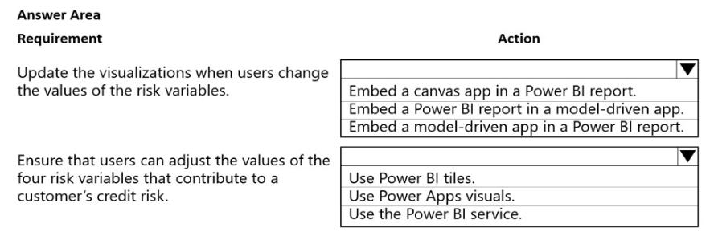
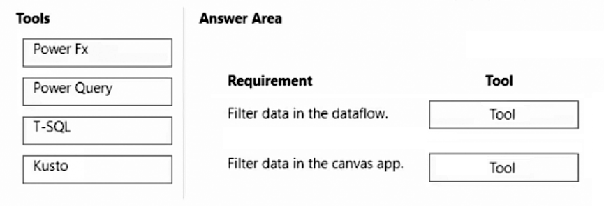
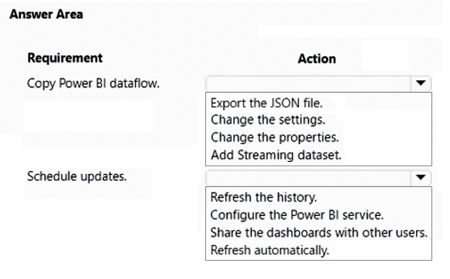
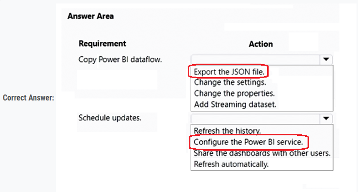
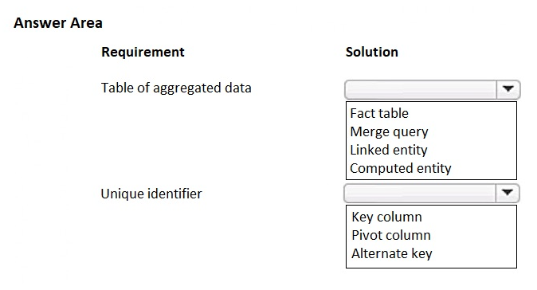
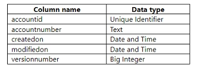
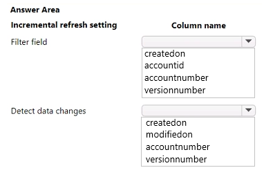
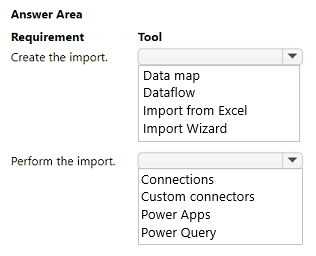

### Question - 1:

You are a Dynamics Sales administrator for a car dealership. The dealership uses only out-of-the-box functionality. When a new car is sold, the salesperson uses a Word template to generate a letter from the quote to thank the customer.  
You need to determine if you can revise the template.  
Which Word template change can you make?  

-   A. Add the Discount field conditionally.
-   B. Format the table to have alternating color rows.
-   C. Format the Created On field to a long date format.
-   D. Add the address of the customer.

    
Answer

-   D. Add the address of the customer.

---

### Question - 2:

You manage the Dynamics 365 Customer Service environment for an organization.  
Microsoft SharePoint will not be deployed in the environment for a year.  
You need to integrate Microsoft Office 365 solutions with the Dynamics 365 instance to help the sales team with internal collaboration efforts.  
Which three solutions can you currently implement? Each correct answer presents part of the solution.  
NOTE: Each correct selection is worth one point.  

-   A. Microsoft Skype for Business
-   B. Microsoft Exchange Online
-   C. Microsoft OneNote
-   D. Microsoft Yammer
-   E. Microsoft OneDrive for Business

    
Answer

-   A. Microsoft Skype for Business
-   B. Microsoft Exchange Online
-   D. Microsoft Yammer

---

### Question - 3:

A company plans to implement AI Builder to add intelligence to several business processes.  
Each business process uses different sources and produces different outputs.  
You need to determine which AI Builder model types to use.  
Which model types should you use? To answer, select the appropriate options in the answer area.  
NOTE: Each correct selection is worth one point.  

    
Answer

1. Entity extraction
2. Form Processing

---

### Question - 4:

You create and publish a Power BI report that contains an embedded canvas app. The report will be used by multiple people.  
The canvas app has an issue that must be corrected.  
You update the canvas app.  
You need to ensure that the updated canvas app is available in the published Power BI report.  
What should you do?  

-   A. Manually refresh the data source on the published Power BI report
-   B. Publish the canvas app
-   C. Publish the Power BI report from Power BI Desktop and reshare to any users
-   D. Publish the Power BI report from Power BI Desktop

    
Answer

-   B. Publish the canvas app

---

### Question - 5:

You create a report by using Power BI Desktop and publish the report to the Power BI service. You enable Power BI visualization embedding in a model-driven app.  
You need to configure the model-driven app to display a Power BI tile.  
Which three actions should you perform in sequence? To answer, move the appropriate actions from the list of actions to the answer area and arrange them in the correct order.  

    
Answer

1. Pin
2. Create
3. Add

---

### Question - 6:

You use Power BI Desktop to configure Power BI reports.  
You need to create a canvas app that displays user account information and include the app in a Power BI report.  
Which three actions should you perform? Each correct answer presents part of the solution.  
NOTE: Each correct selection is worth one point.  

-   A. From the Power Apps Insert menu, add a Power BI tile
-   B. From the Power BI Desktop menu, insert a Power Apps visual and include the required fields in the Power Apps data
-   C. Publish the report to the Power BI service
-   D. Connect to Common Data Service from Power BI Desktop

    
Answer

-   B. From the Power BI Desktop menu, insert a Power Apps visual and include the required fields in the Power Apps data
-   C. Publish the report to the Power BI service
-   D. Connect to Common Data Service from Power BI Desktop

---

### Question - 7:

A company uses Microsoft Dataverse to store sales data.  
For the past few quarters, the company has experienced a decrease in sales revenue. The company wants to improve sales forecasting.  
The company plans to use AI Builder to implement the solution. You select fields that will be used for prediction.  
Which three actions should you perform in sequence? To answer, move the appropriate actions from the list of actions to the answer area and arrange them in the correct order.  

    
Answer

---

### Question - 8:

Note: This question is part of a series of questions that present the same scenario. Each question in the series contains a unique solution that might meet the stated goals. Some question sets might have more than one correct solution, while others might not have a correct solution.  
After you answer a question in this section, you will NOT be able to return to it. As a result, these questions will not appear in the review screen.  
The sales team at a software company wants to attach a large number of supporting documents to customer records, but management does not want to incur the cost of additional storage.  
The company does not have any Office 365 application integrations enabled.  
You need to recommend a storage solution that keeps storage costs low.  
Solution: Enable Outlook integration.  
Does the solution meet the goal?

-   A. Yes
-   B. No

    
Answer

-   B. No

---

### Question - 9:

You have a business process flow (BPF) that interacts with the Account entity.  
You modify the BPF and add a new stage at the beginning.  
You need to identify the impact of the new version on the existing account records.  
What is the outcome in each scenario? To answer, select the appropriate options in the answer area.  
NOTE: Each correct selection is worth one point.  

    
Answer

1. Existing accounts show the new BPF.
2. The new BPF is showing in a new account.

---

### Question - 10:

You are examining several processes to determine if you can automate the processes by using Power Automate.  
The processes must run without human intervention when possible.  
You need to determine which flow type should be used for each process.  
Which flow type should you use? To answer, drag the appropriate processes to the correct flow types. Each process may be used once, more than once, or not at all. You may need to drag the split bar between panes or scroll to view content.  
NOTE: Each correct selection is worth one point.  

    
Answer

1. attended desktop flow
2. unattended desktop flow

---

### Question - 11:

A company uses Microsoft Teams. You plan to create a Power Apps app for Microsoft Teams.  
You need to determine the environment that will used by the app.  
Which environment will the app use?  

-   A. An existing Dataverse environment that you select.
-   B. An existing Dataverse for Teams environment that you select.
-   C. A Dataverse environment that is automatically created for the team.
-   D. A Dataverse for Teams environment that is automatically created for the team.

    
Answer

-   D. A Dataverse for Teams environment that is automatically created for the team.

---

### Question - 12:

You create a canvas app for a sales team. The app has an embedded Power BI tile that shows year-to-date sales. Sales users do not have access to the data source that the tile uses.  
Sales team users must be able to see data in the Power BI tile. You must minimize the level of permissions that you grant and minimize administrative overhead.  
You need to share another Power BI component to make the data visible.  
What should you share?  

-   A. The Power BI dataset the tile uses as a data source.
-   B. The Power BI workspace that includes the tile.
-   C. The Power BI dashboard that includes the tile.

    
Answer

-   C. The Power BI dashboard that includes the tile.

---

### Question - 13:

You have a model-driven app. You create five Microsoft Excel templates for analyzing customer data.  
Four of the templates must be available to all users. The remaining template must be available only to you. You configure the appropriate security roles for users.  
You need to determine how to upload the Excel templates.  
Which method should you use? To answer, select the appropriate options in the answer area.  
NOTE: Each correct selection is worth one point.  

    
Answer

1. in the settings menu, select document templates
2. in the view for the email records, select execl templates

---

### Question - 14:

You configure an alert in Power BI.  
You need to alert users when the value of a tile exceeds a threshold. To answer, select the appropriate options in the answer area.  
NOTE: Each correct selection is worth one point.  

    
Answer

---

### Question - 15:

You are using Power BI to build a dashboard for a company.
You must make the dashboard available to a specific set of users, including employees and five external users. The number of employees that require access to the dashboard varies, but is usually less than 100.  
Employees and external users must not be permitted to share the dashboard with other users.  
You need to share the dashboard with the employees and external users.  
Which three actions should you perform? Each correct answer presents part of the solution.  
NOTE: Each correct selection is worth one point.  

-   A. Create a dynamic distribution list. Add all users to the distribution list and use the list to share the dashboard.
-   B. Sign into the Power BI service. Open the dashboard and select Share.
-   C. Enter the individual email address of internal and external users.
-   D. Sign into Power BI Desktop. Open the dashboard and select Share.
-   E. Clear the Allow recipients to share your dashboard (or report) option.
-   F. Create a distribution list. Add all users to the distribution list and use the list to share the dashboard.

    
Answer

-   B. Sign into the Power BI service. Open the dashboard and select Share.
-   C. Enter the individual email address of internal and external users.
-   E. Clear the Allow recipients to share your dashboard (or report) option.

---

### Question - 16:

You create a report by using Power BI Desktop and a Power BI dataset that is connected to Azure SQL Database.  
Multiple groups of employees will use the report.  
You need to ensure that each group of employees can see only data that pertains to their group.  
What should you do?  

-   A. Create and assign field security profiles.
-   B. Create and assign Common Data Service security roles.
-   C. Create and assign roles by using row-level security.

    
Answer

-   C. Create and assign roles by using row-level security.

---

### Question - 17:

A company uses Microsoft Dataverse manage account and contact information.  
The company plans to use the AI Builder model to make key business decisions.  
You need to integrate prebuilt AI Builder models with Power Automate flows.  
Which models should you use? To answer, select the appropriate options in the answer area.  
NOTE: Each correct selection is worth one point.  

    
Answer

1. Text recognition model
2. Prediction Model

---

### Question - 18:

The sales manager receives a list of leads from a partner company monthly. The field names that are provided do not match the fields in Microsoft Dataverse tables. A data map does not exist.  
You need to import the leads without changing the data from the partner company.  
What should you do?  

-   A. Create a data map on the first import by using the Import Data wizard.
-   B. Add a template for Import Data.
-   C. Use Import Field Translations.
-   D. Create a data map in Data Management.

    
Answer

-   A. Create a data map on the first import by using the Import Data wizard.

---

### Question - 19:

Note: This question is part of a series of questions that present the same scenario. Each question in the series contains a unique solution that might meet the stated goals. Some question sets might have more than one correct solution, while others might not have a correct solution.  
After you answer a question in this section, you will NOT be able to return to it. As a result, these questions will not appear in the review screen.  
The sales team at a software company wants to attach a large number of supporting documents to customer records, but management does not want to incur the cost of additional storage.  
The company does not have any Office 365 application integrations enabled.  
You need to recommend a storage solution that keeps storage costs low.  
Solution: Enable server-based SharePoint integration.  
Does this meet the goal?  

-   A. Yes
-   B. No

    
Answer

-   A. Yes

---

### Question - 20:

Note: This question is part of a series of questions that present the same scenario. Each question in the series contains a unique solution that might meet the stated goals. Some question sets might have more than one correct solution, while others might not have a correct solution.  
After you answer a question in this section, you will NOT be able to return to it. As a result, these questions will not appear in the review screen.  
The sales team at a software company wants to attach a large number of supporting documents to customer records, but management does not want to incur the cost of additional storage.  
The company does not have any Office 365 application integrations enabled.  
You need to recommend a storage solution that keeps storage costs low.  
Solution: Enable OneNote integration.  
Does this meet the goal?  

-   A. Yes
-   B. No

    
Answer

---

### Question - 21:

Note: This question is part of a series of questions that present the same scenario. Each question in the series contains a unique solution that might meet the stated goals. Some question sets might have more than one correct solution, while others might not have a correct solution.  
After you answer a question in this section, you will NOT be able to return to it. As a result, these questions will not appear in the review screen.  
The sales team at a software company wants to attach a large number of supporting documents to customer records, but management does not want to incur the cost of additional storage.  
The company does not have any Office 365 application integrations enabled.  
You need to recommend a storage solution that keeps storage costs low.  
Solution: Enable OneDrive for Business.  
Does this meet the goal?  

-   A. Yes
-   B. No

    
Answer

-   B. No

---

### Question - 22:

You are creating Power BI reports for a company.
A company that has a model-driven app wants to use Power BI reports within the app. You create the reports.  
You need to ensure that these reports are available within the app.  
Which two actions should you perform? Each correct answer presents a complete solution.  
NOTE: Each correct selection is worth one point.  

-   A. Share the Power BI report to all users.
-   B. Add the Power BI report to the Site Map dashboards.
-   C. Create a PCF file.
-   D. Use the native reports in model-driven apps.
-   E. Add the Power BI report to a dashboard in the model-driven app.

    
Answer

-   B. Add the Power BI report to the Site Map dashboards.
-   E. Add the Power BI report to a dashboard in the model-driven app.

---

### Question - 23:

A company is training an Al model using a custom table to determine the amount of time it takes to deliver a package based on several key fields.  
The testing data used to train the model is used for all training and regression testing scenarios and is considered complete data.  
The trained model predicts a 2 percent variance between the estimated delivery time and the actual delivery time of packages.  
The executive sponsors reject the model because the actual variance is at 15 percent.  
You need to address the sponsors' concern.  
What should you do?  

-   A. Replace the training data with real-world data.
-   B. Reduce the size of the data used within the model.
-   C. Increase the size of the data used with the model.
-   D. Use sample training data from Microsoft.

    
Answer

-   A. Replace the training data with real-world data.

---

### Question - 24:

A bank uses Power BI visualizations to help determine whether they should loan money to a customer. The bank has three different visuals that are part of a Power BI report. The bank uses a set of four risk variables that indicate whether the customer is creditworthy.  
You must create a mechanism so that bank employees can change the values of the four risk variables. Changes to the value of any variable must cause the three visualizations to update.  
You need to create the solution.  
Which action should you perform? To answer, select the appropriate options in the answer area.  
NOTE: Each correct selection is worth one point.  

    
Answer

1. Embed a canvas app in the PBI report.
2. Use the PBI Service (online)

---

### Question - 25:

You create a JavaScript web resource named MyBusinessLogic. The code it contains uses functionality from a third-party JavaScript library.  
You notice that an independent software vendor (ISV) solution uses the same third-party library in their managed solution.  
You plan to deploy your solution to other environments by using a managed solution. The ISV solution might not be installed in the other environments.  
You need to package the solution for deployment  
What are two ways to achieve this goal? Each correct answer presents a complete solution.
NOTE: Each correct selection is worth one point.  

-   A. Create a new JavaScript web resource by using the code from the third-party library. Add the new JavaScript web resource along with MyBusinessLogic to the solution.
-   B. Add a copy of the JavaScript library from the ISV to the solution along with MyBusinessLogic.
-   C. Add the code from the third-party JavaScript library to MyBusinessLogic. Add MyBusinessLogic to the solution.
-   D. Add only the third-party JavaScript web resource to the solution.

    
Answer

-   A. Create a new JavaScript web resource by using the code from the third-party library. Add the new JavaScript web resource along with MyBusinessLogic to the solution.
-   C. Add the code from the third-party JavaScript library to MyBusinessLogic. Add MyBusinessLogic to the solution.

---

### Question - 26:

A company creates a canvas app.  
The app requires near real-time data from an accounting system that resides in a customer's data center.  
You need to implement a solution for the app.  
What should you create?

-   A. On-premises data gateway
-   B. Azure DevOps pipeline
-   C. Data integration project
-   D. Power Pages

    
Answer

-   A. On-premises data gateway

---

### Question - 27:

You create a canvas app that uses data from a Microsoft SQL Server database.  
You use a dataflow to move some of the data from the database to Microsoft Dataverse. Users will filter the data by using the app.  
You need to filter data in the dataflow and in the canvas app.  
Which tools should you use? To answer, drag the appropriate tools to the correct requirements. Each tool may be used once, more than once, or not at all. You may need to drag the split bar between panes or scroll to view content.  
NOTE: Each correct selection is worth one point.

    
Answer

1. Power Query
2. Power Fx

---

### Question - 28:

You have a canvas app with an embedded Power BI tile.  
You share the canvas app. Users report that they are unable to access the Power BI content.  
You need to determine why users are unable to access the content.  
What is the cause of the user's problems?

-   A. The Power BI dashboard is not shared.
-   B. The Power BI connection is not shared.
-   C. The Power BI Display mode property on the Power BI tiles is set to Disabled.
-   D. The Power BI interactions property on the Power BI tiles is set to Off.

    
Answer

-   A. The Power BI dashboard is not shared.

---

### Question - 29:

You plan to create a Power BI dataflow.  
The Power BI dataflow has the following requirements:  
• Be able to create a copy of the dataflow to separate Power BI workspaces.
• Schedule the dataflow to update every day at 11:00 AM.

You need to configure the dataflow.  
What should you do? To answer, select the appropriate options in the answer area.  
NOTE: Each correct selection is worth one point.

    
Answer

---

### Question - 30:

You plan to create a dataflow to import data into Microsoft Dataverse by using Power Query. <br<
The dataflow has the following requirements: <br<
• A table of aggregated data must be created in dataflow storage.  
• A unique identifier must be created for the table.  

You need to configure the dataflow. <br<
Which solutions should you use? To answer, select the appropriate options in the answer area. <br<
NOTE: Each correct selection is worth one point.

    
Answer

-   Computed Entity: Use a computed entity to perform the necessary calculations and aggregations on the data before storing it in the dataflow storage.
    A unique identifier must be created for the table:
-   Key Column: Create a key column to serve as the unique identifier for the table.
    By using a computed entity for aggregation and a key column for unique identification, you can effectively configure your dataflow to meet the specified requirements.

---

### Question - 31:

You plan to create a dataflow by using Power Query to transform the data.  
You observe that some cells display an error instead of the expected data.  
You need to obtain more details about the errors.  
What should you do?

-   A. Use the App Checker.
-   B. Select the cell with the error.
-   C. Use the Flow Checker.
-   D. Select the row that includes the cell with the error.
-   E. Use the Advanced Editor.

    
Answer

-   B. Select the cell with the error.

---

### Question - 32:

A company creates a model-driven app.  
Users require access to a Power BI report that is embedded in the app.  
You need to configure the app.  
Where should you add the report?

-   A. XML report
-   B. Dashboard
-   C. Business rule
-   D. Power Automate cloud flow

    
Answer

-   B. Dashboard

---

### Question - 33:

A company is implementing Microsoft Power Platform solutions.  
The company requests information on the features that are supported by Power Fx.  
You need to identify the features of Power Fx.  
What should you identify?

-   A. It uses imperative and declarative logic.
-   B. It uses an undefined value for uninitialized variables.
-   C. It uses a plug-in.
-   D. It uses the model-driven app formula language.

    
Answer

-   A. It uses imperative and declarative logic.

---

### Question - 34:

You use a dataflow to import data into Microsoft Dataverse.  
The data uses the following schema:

The data must load in the least amount of time.  
You need to configure the incremental refresh settings for the dataflow.  
Which columns should you use? To answer, select the appropriate options in the answer area.  
NOTE: Each correct selection is worth one point.

    
Answer

-   createdon
-   modifiedon

---

### Question - 35:

A company uses Dataverse to store the names of contacts. The company uses a shared Microsoft Excel file to collect the data.  
The company requires that the contacts be added to Dataverse automatically every day.  
You need to identify which tools are required to create and perform the import.  
What should you use? To answer, select the appropriate options in the answer area.  
NOTE: Each correct selection is worth one point.

    
Answer

-   Dataflow
-   Power Query

---

### Question - 36:

A company is implementing Microsoft Power Platform solutions.  
The company requests information on the features that are supported by Power Fx.  
You need to identify the features of Power Fx.  
What should you identify?

-   A. It is available for purchase through a Microsoft reseller.
-   B. It uses an undefined value for uninitialized variables.
-   C. It uses formulas that are similar to Microsoft Excel formulas.
-   D. It uses synchronous data operations.

    
Answer

-   C. It uses formulas that are similar to Microsoft Excel formulas.

---

### Question - 37:

A company is implementing Microsoft Power Platform solutions.  
The company requests information on the features that are supported by Power Fx.  
You need to identify the features of Power Fx.  
What should you identify?

-   A. It uses imperative and declarative logic.
-   B. It is available for purchase through a Microsoft reseller.
-   C. It uses an undefined value for uninitialized variables.
-   D. It provides a manual compiler.

    
Answer

---
