### Question - 1:

You create a Power Platform help Desk solution.  
You need to create a dashboard that displays information on help desk cases that are handled each week.  
Which dashboard components should you use? To answer, select the appropriate options in the answer area.  
NOTE: Each correct selection is worth one point.  

    
Answer

-   System (Tag chart system only)
-   Personal ("Shared with your team" implies personal that has been shared)
-   Personal (PowerBI is personal only)
-   Personal (User created view)
-   System (Doughnut is system only)

---

### Question - 2:

You create a Power Automate flow as part of a managed solution. The flow alerts users when files are uploaded to a SharePoint location.  
Files are uploaded to SharePoint at a much higher rate than expected. Users report that they receive too many notifications about uploaded files.  
You need to stop the flow and correct the issue.  
What should you do? To answer, select the appropriate options in the answer area.  
NOTE: Each correct selection is worth one point.  

    
Answer

-   Disable the flow from the Power Automate portal
-   Use the Test feature on the updated flow and then turn on the flow

---

### Question - 3:

You create a new independent software vendor (ISV) solution for a Power Apps app.  
The Power Apps solution will be imported into multiple customer environments. The environments will have a large variety of solutions and publishers.  
You need to avoid naming conflicts during solution import.  
Which element should you configure?  

-   A. Package type
-   B. Configuration page
-   C. Marketplace
-   D. Prefix
-   E. Version

    
Answer

-   D. Prefix

---

### Question - 4:

A company has employees in France, Mexico, and the United States. You are creating a Power Apps app to allow users to add client records to Microsoft Dataverse. The default language for the company is English.  
The company wants the app to display each local language.  
You need to add the Spanish and French languages.  
Which four actions should you perform in sequence for each language? To answer, move the appropriate actions from the list of actions to the answer area and arrange them in the correct order.  

    
Answer

---

### Question - 5:

A company uses a model-driven Power Apps app in a new environment. The base language is English.  
You need to configure French and Spanish.  
Which configuration component should you use? To answer, select the appropriate options in the answer area.  
NOTE: Each correct selection is worth one point.  

    
Answer

---

### Question - 6:

A company creates a Microsoft Power Apps app through the Power Apps designer portal for use in Microsoft Teams.  
This app needs to be promoted to the user acceptance testing environment.  
You need to complete the Microsoft recommended actions before you export the solution.  
Which two actions should you complete? Each correct answer presents part of the solution.  
NOTE: Each correct selection is worth one point.  

-   A. Run the solution checker.
-   B. Set the Optimized embedding appearance field to true.
-   C. Clone a solution.
-   D. Write validation tests.
-   E. Publish all changes.

    
Answer

-   A. Run the solution checker.
-   E. Publish all changes.

---

### Question - 7:

You create functionality for a company. The functionality includes a Microsoft Dataverse table with a form for data entry. The functionality will be distributed to other lines of business in the company, each with its own Dataverse environment.  
New forms must not be created in order for updates to the functionality to work correctly.  
You need to package the new functionality for distribution.  
What should you do?  

-   A. Use a patch solution and disable the ability to create new forms for the table.
-   B. Use a managed solution and include only the needed form.
-   C. Use an unmanaged solution and include only the needed form.
-   D. Use a managed solution and disable the ability to create new forms for the table.

    
Answer

-   D. Use a managed solution and disable the ability to create new forms for the table.

---

### Question - 8:

You are using a development environment to add a new column to a system table. You plan to move the changes to a test environment when they are complete.  
The changes must meet the following requirements:  
✑ Must be clearly identified so that they are not confused with system components and components from other solutions.  
✑ Must not affect any existing components in the test environment.  
You need to prepare a solution for deployment to the test environment.  
Which four actions should you perform in sequence? To answer, move the appropriate actions from the list of actions to the answer area and arrange them in the correct order.  

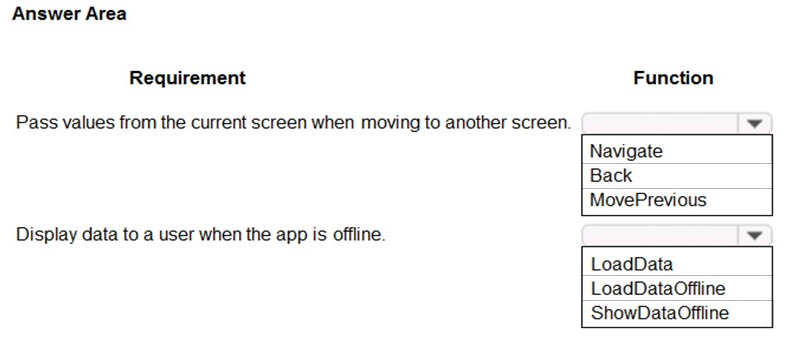

    
Answer

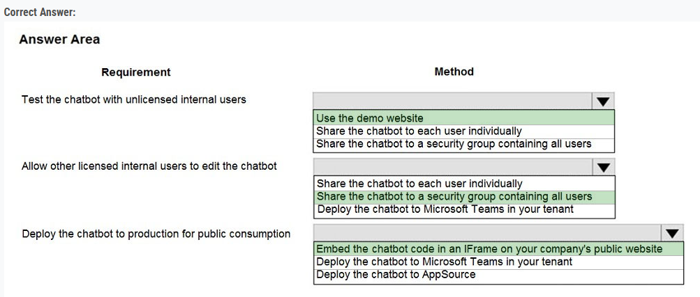

---

### Question - 9:

A company uses Power BI dashboards.  
A manager wants to understand the raw data in one of the charts.  
You need to present the data.  
What should you do?

-   A. Export the dashboard to Microsoft PowerPoint.
-   B. Export the dashboard to Microsoft Excel.
-   C. Change to focus mode.
-   D. Drill down in the dashboard controls.

    
Answer

-   B. Export the dashboard to Microsoft Excel.

---

### Question - 10:

You are a consultant. A client asks you to remove several solutions in one of their Microsoft Dataverse environments.  
The client wants to know what effect removing the solutions will have on the rest of the system.  
You need to explain the results of removing the solutions.  
Which components will be affected? To answer, select the appropriate options in the answer area.  
NOTE: Each correct selection is worth one point.

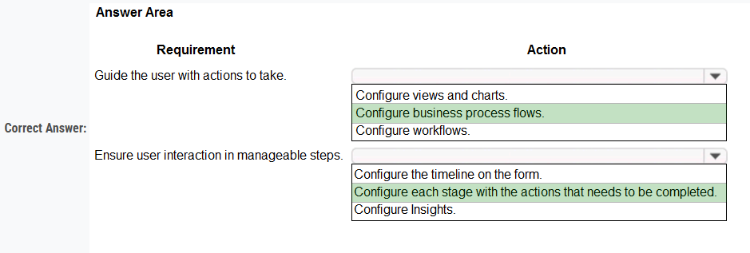

    
Answer

1. Solution only
2. Solution and column label
3. Solution, table, and data in table

---

### Question - 11:

You are creating tables for use with Microsoft Power Platform components.  
The display names of the tables must not be changed when the solution is promoted to the user acceptance testing environment.  
You need to apply this restriction to the solution.  
Where should you make the changes?

-   A. Segmented solution
-   B. Default solution
-   C. Power Apps
-   D. Unmanaged solution
-   E. Managed solution

    
Answer

-   E. Managed solution

---

### Question - 12:

A company uses a model-driven app with Microsoft Dataverse in a single environment.  
The company requires a canvas app that includes the same data as the model-driven app.  
You need to create the canvas app.  
Which three actions should you perform in sequence? To answer, move the appropriate actions from the list of actions to the answer area and arrange them in the correct order.

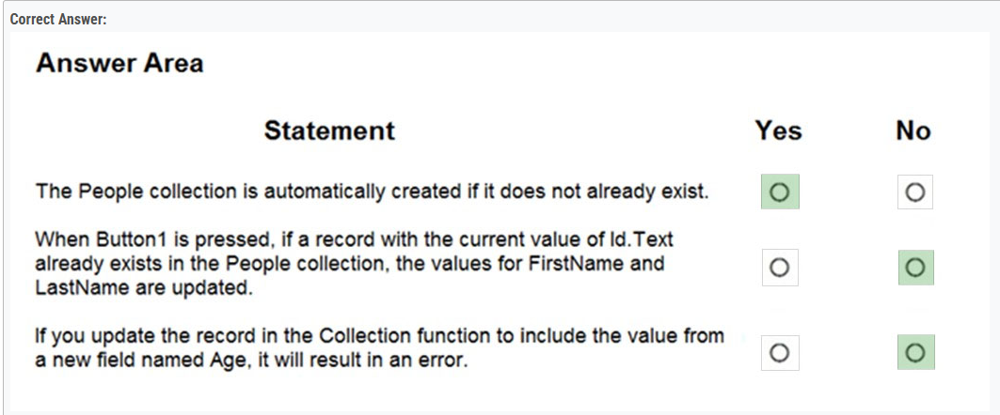

    
Answer

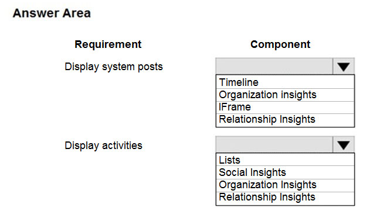

---

### Question - 13:

A company that manufactures medical devices uses Power Apps to manage their sales and device maintenance.  
A table named Devices in Microsoft Dataverse has a column named Status. The Status column must have a new status value of Review added to the existing Choice values of Active and Inactive.  
The table must be added to a solution to be promoted once the change is made.  
Only this change must be promoted to the test environment. The changes must not be able to be changed once promoted.  
You need to add the change to a solution for promotion.

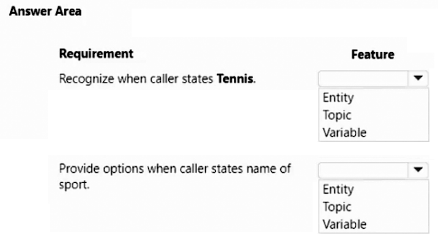

    
Answer

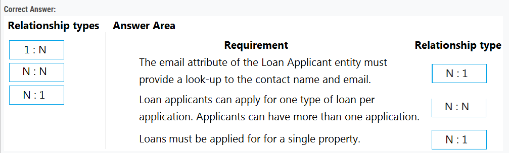

---

### Question - 14:

A company is updating a Power Apps solution that contains two tables named Services and Equipment.  
The company is creating a new solution to update the current solution for the following requirements:  
• The Services table must be updated to include change tracking.  
• The Equipment table must be updated to include four new columns.  
• The solution must update only the components that need to be added or changed.  

You need to create the solution.  
Which table option should you use? To answer, drag the appropriate options to the correct tables. Each option may be used once, more than once, or not at all. You may need to drag the split bar between panes or scroll to view content.  
NOTE: Each correct selection is worth one point.

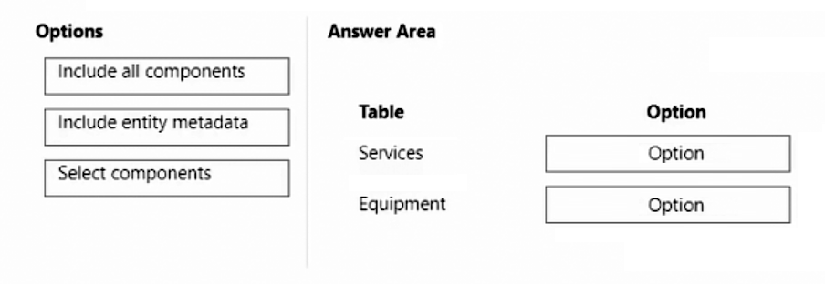

    
Answer

1. Include entity metadate
2. Select components

---

### Question - 15:

A company uses a model-driven app. The app uses a Power Virtual Agents chatbot.  
The company has two locations in different countries/regions with separate environments for each location. Each location has a development environment, a testing environment, and a production environment. The company uses the Application Lifecycle Management (ALM) process for the environments.  
You need to create the different Power Virtual Agents bot environments.  
How many Power Virtual Agents bot environments are required?

-   A. 1
-   B. 2
-   C. 3
-   D. 6

    
Answer

-   D. 6

---

### Question - 16:

A company plans to create an app by using Power Apps.  
The company has the following requirements:  
• The app must be able to enter data into Microsoft SharePoint.  
• Users must be able to add the app into Microsoft Teams.  

You need to recommend which app to create.  
Which type of app should you recommend?

-   A. model-driven app as a personal app
-   B. model-driven app as a tab app
-   C. canvas app as a personal app
-   D. Canvas app as a tab app

    
Answer

-   D. Canvas app as a tab app

---

### Question - 17:

A company records data in Microsoft SharePoint Online. The company is creating a mobile app by using Microsoft Power Platform only.  
The company requires the app to connect directly to SharePoint Online to collect data.  
You need to recommend which Microsoft Power Platform product or feature to implement.  
What should you recommend?

-   A. Power Automate
-   B. Power Pages
-   C. Canvas app
-   D. Model-driven app

    
Answer

-   C. Canvas app

---

### **Study-Case-1**

This is a case study. Case studies are not timed separately. You can use as much exam time as you would like to complete each case. However, there may be additional case studies and sections on this exam. You must manage your time to ensure that you are able to complete all questions included on this exam in the time provided.  

To answer the questions included in a case study, you will need to reference information that is provided in the case study. Case studies might contain exhibits and other resources that provide more information about the scenario that is described in the case study. Each question is independent of the other questions in this case study.  

At the end of this case study, a review screen will appear. This screen allows you to review your answers and to make changes before you move to the next section of the exam. After you begin a new section, you cannot return to this section.  

#### To start the case study -

To display the first question in this case study, click the Next button. Use the buttons in the left pane to explore the content of the case study before you answer the questions. Clicking these buttons displays information such as business requirements, existing environment, and problem statements. If the case study has an All Information tab, note that the information displayed is identical to the information displayed on the subsequent tabs. When you are ready to answer a question, click the Question button to return to the question.

#### Background -

Bellows College is a post-secondary school that wants to start a football team. The college uses Microsoft Power Platform to manage its recruiting efforts. The registration team and assistants use model-driven apps. The coaches use canvas apps on their mobile devices.  

Prospects are considered underage if they are younger than 18 years old at the time of registration.  

#### Current environment -

##### Environment -

-   Custom code is not allowed in the system.
-   Server-side synchronization is configured for emails, appointments, contacts, and tasks.
-   The database and file storage of Dataverse must be minimized to keep costs low.

##### Contact table -

-   Birthdate is a custom date and time field.
-   Age at Registration is a calculated field that displays the age of the prospect at the time of registration.
-   Current Age is a calculated field that displays the age of the prospect based on the current date and time.

##### Evaluation table -

-   The Evaluation table is a custom table used to track evaluation criteria.
-   Evaluation records cannot be manually created.
-   Users must not be able to continue until an evaluation record is created automatically for the prospect.

##### Consent table -

-   The consent forms completed by the parents are stored as records in the Consent table.
-   Occasionally, a parent cannot complete the consent online and a paper copy must be printed. The signed copy must be scanned and stored with the consent record.

##### Team website -

-   The team website is created by using Power Pages.
-   A starter layout template was used to create the site.
-   The site consists of five pages:
    -   Home: A page open to everyone to view the announcements from the team. o Schedule: A page open to everyone to view the tryout and game schedule. o Evaluations: A page that displays tracking from the evaluation table. Prospects are able to view their own information only. o Forms: A page that displays the consent form. o Contact Us: A page for anyone to submit questions and comments.
-   Two web roles for authenticated users are created: Primary Contact User and Prospect User. o All primary contacts and prospects are assigned to their respective roles.

#### Requirements -

##### Registration -

-   Parents and prospects are created as contacts and must be linked.
-   The registration team must be able to rapidly create prospects without navigating away from the Parents form. Only the First Name, Last Name, and Birthdate fields should be displayed for the team.
-   Assistants must be able to update prospect information and add teams that the prospect has previously played on to a subgrid.

##### Parental consent -

-   When a prospect is underage, a Primary Contact field will appear. The field must be populated before the prospect record can be saved.
-   A view named Underage Prospects that lists all underaged prospects is required.
-   The Underage Prospects view must run once a week without requiring modifications to display correct information.
-   A consent email must meet the following requirements:
    -   be sent to the primary contact of each new underage prospect o contain a link to the team website o be automatically sent weekly and tracked to the contact record in Dataverse o include the current date using the full month name, date, and year

##### Evaluations -

-   Coaches rate prospects each day on a scale of 1-10 in three categories: endurance, coordination, and skill.
-   The total of the three categories is displayed at the bottom of the form. If the total for the day is greater than 25, the number should appear green.

You need to format the Current Date field for parental consent.  
What should you use?

### Question - 18 (study-case):

-   A. switch
-   B. dynamic content
-   C. expression
-   D. condition

    
Answer

-   C. expression

---

### Question - 19 (Study-case):

You need to store scanned consent forms.  
Where should you store the forms?

-   A. Attachment
-   B. Column
-   C. Notes
-   D. SharePoint

    
Answer

-   D. SharePoint

---

### Question - 20:

A company has implemented server-side synchronization in Dataverse.  
Users have the following synchronization requirements:  
• As emails are moved to specific locations within an inbox, the emails must relate back to a specific record in Dataverse.  
• Information about key individuals must sync automatically to Outlook.  
• Tagged appointments in Outlook must sync automatically to Dataverse.  

You need to recommend a solution for each requirement.  
What should you recommend? To answer, move the appropriate features to the correct requirements. You may use each feature once, more than once, or not at all. You may need to move the split bar between panes or scroll to view content.  
NOTE: Each correct selection is worth one point.  

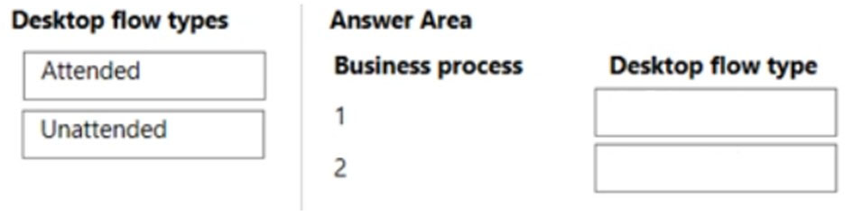

    
Answer

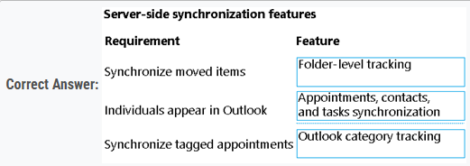

---

### Question - 21:

You are creating a model-driven app that has an embedded Power BI report. Another functional consultant set up an environment variable for the report.  
You add the dashboard to a solution in the development environment and then import the changes to a production environment as a managed solution.  
When you test the report, the data appears the same as it did in the development environment.  
You delete the solution in production.  
You need to resolve the development environment issue before redeploying the solution.  
What should you do?

-   A. Update the environment variable current value
-   B. Remove the environment variable current value.
-   C. Update the environment variable default value.
-   D. Create a new environment variable.

    
Answer

-   A. Update the environment variable current value

---

### Question - 22:

You are creating tables for use with Microsoft Power Platform components.  
The display names of the tables must not be changed when the solution is promoted to the user acceptance testing environment.  
You need to apply this restriction to the solution.  
Where should you make the changes?

-   A. Segmented solution
-   B. Default solution
-   C. Unmanaged solution
-   D. Managed solution

    
Answer

-   D. Managed solution

---

### Question - 23:

A company is using Dataverse with a custom table named Prospects. The Prospects table has a lookup to the Account table.  
SharePoint document management is configured in the environment but is not configured for the Prospects table. All documents saved as part of the integration must be accessed by using an Account row linked to the Prospects table.  
Based on new requirements from end users, the Prospects table must be reconfigured for use with the document management feature.  
You need to configure the integration.  
Which four actions should you perform in sequence? To answer, move the appropriate actions from the list of actions to the answer area and arrange them in the correct order.

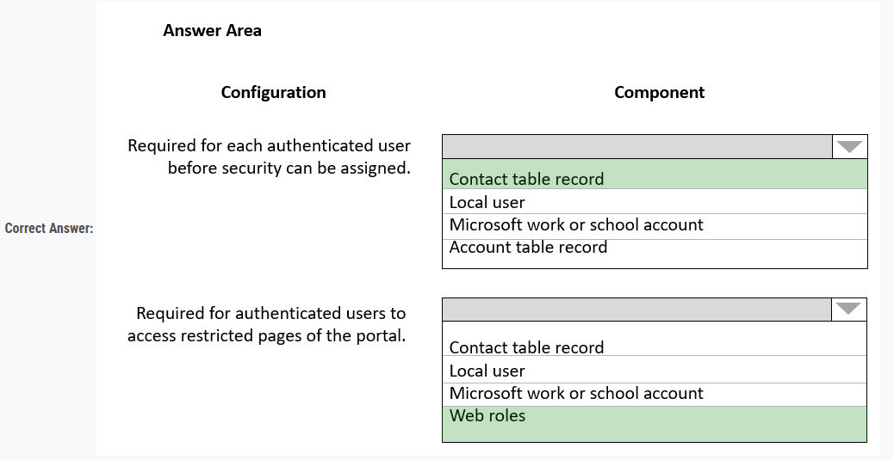

    
Answer

1. Navigate to Document Management settings.
2. Enable server-based SharePoint integration.
3. Select the Prospects table.
4. Clear the Based on Entity checkbox.

---

### Question - 24:

A company is using a model-driven app in a production environment.  
You must set up server-side synchronization for all users to connect with the company’s Exchange Online instance.  
You need to determine the locations to use to complete the configuration.  
Where should you navigate to? To answer, select the appropriate options in the answer area.  
NOTE: Each correct selection is worth one point.

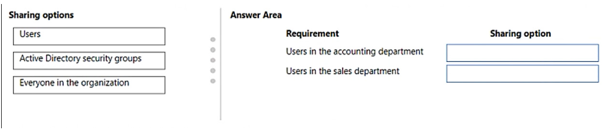

    
Answer

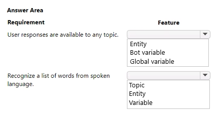

---

### **Study-Case-2**:

This is a case study. Case studies are not timed separately. You can use as much exam time as you would like to complete each case. However, there may be additional case studies and sections on this exam. You must manage your time to ensure that you are able to complete all questions included on this exam in the time provided.  

To answer the questions included in a case study, you will need to reference information that is provided in the case study. Case studies might contain exhibits and other resources that provide more information about the scenario that is described in the case study. Each question is independent of the other questions in this case study.  

At the end of this case study, a review screen will appear. This screen allows you to review your answers and to make changes before you move to the next section of the exam. After you begin a new section, you cannot return to this section.  

#### To start the case study-

To display the first question in this case study, click the Next button. Use the buttons in the left pane to explore the content of the case study before you answer the questions. Clicking these buttons displays information such as business requirements, existing environment, and problem statements. If the case study has an All Information tab, note that the information displayed is identical to the information displayed on the subsequent tabs. When you are ready to answer a question, click the Question button to return to the question.

#### Background-

Contoso Suites is an animal shelter that specializes in finding homes for dogs that have been given up by their owners. The shelter can house up to 20 dogs.  
The shelter is implementing one model-driven Power Apps app to track the dogs and schedule meetings with potential adopters. No other apps will be created.  
The model-driven app uses Dataverse with out-of-the-box functionality when possible. Dataverse is set up with the following configuration:

-   The solution prefix “cs” is used for all new components.
-   Only the root business unit is used.
-   All tables are stored in Dataverse and do not require rapid scaling.
-   Exchange server-side sync is not configured.

##### Adopters-

-   Adopter information is stored in a Contact table.
-   Contacts are considered to be duplicates if they have the same email address and last name.
-   Adopters are often late to meetings, so a reminder email is sent to them two hours before their meeting.
-   The email reminders must not be tracked in the system.

##### Dogs-

-   Dog information is stored in a Dog table, which is organization owned.
-   Breed, size, and weight are fields in the table.

Dog residency-

-   A Resident table tracks the stay of each dog.
-   Each resident record has a lookup for the dog and its food.
-   The food type and amount are logged on each resident record. Auto-posting is not configured for changes to food type and amount.
-   A fee of $120 is in a currency column named Adoption Fee. This fee can be changed depending on the adoption circumstances.
-   A formula column named Deposit is automatically populated with 20% of the adoption fee.
-   A resident record is generated automatically when a dog record is created. This is the only way a resident record can be created.

##### Exercise and feedings-

-   Exercise for the dogs is tracked in an Exercise table.
-   Feedings are tracked in a Feeding table.
-   Exercise and feeding records appear in a resident record timeline.

##### Care staff-

-   The care staff must be able to view who changed the food type and the amount that was given, for up to three months ago.
-   The staff must be able to update the weight of a dog on the resident record.
-   The staff report that the buttons are too small on the touch screen they use to log exercise and feeding.
-   The staff must be able to view who the adopters are for upcoming meetings. The staff must not be able to update adopter information.

##### Administrative staff-

-   Administrative staff must receive a weekly list of duplicate contacts. Duplicate alerts must not appear when a staff member saves a new contact.  
-   When an adopter wants to adopt a dog, the staff must perform a series of adoption duties in order. The following duty list must be displayed on the screen:  
-   Commitment:
    -   Obtain adopter signature in a commitment document.
    -   Collect deposit.
-   Pre-pickup:
    -   Document spay or neutering date.
    -   Perform spay or neutering.
    -   Document pickup date.
-   Pickup:
    -   Collect full payment.
    -   Verify dog is picked up.
-   A dog must be picked up no sooner than two days after spaying or neutering.
-   A pop-up window must appear with an error message if the Pickup date is too soon.
-   Only administrative staff must be able to add new adopters and dogs.

### Question - 25:

You need to create reminders for the adopters.  
What should you use for each requirement? To answer, select the appropriate options in the answer area.

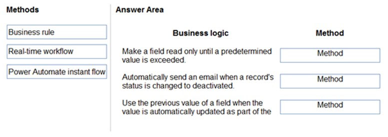

    
Answer

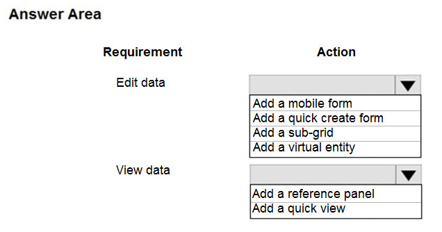

---
