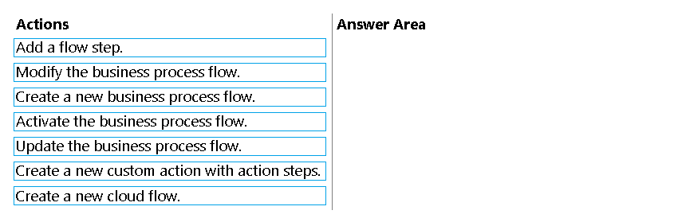
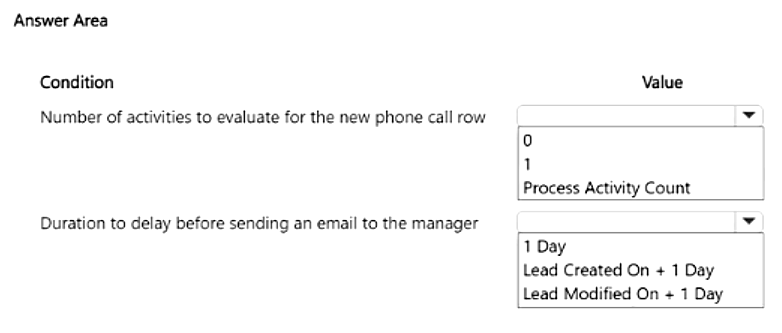
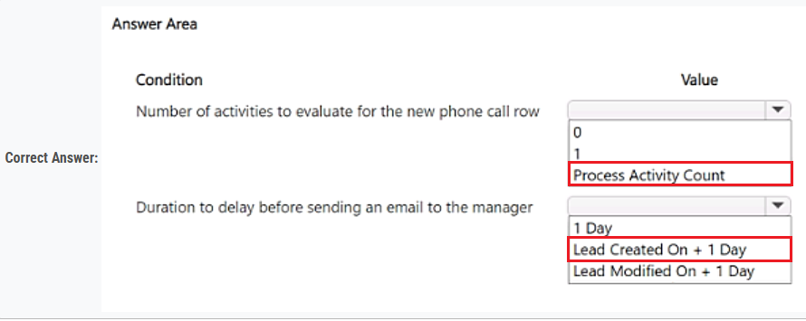
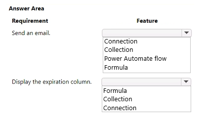
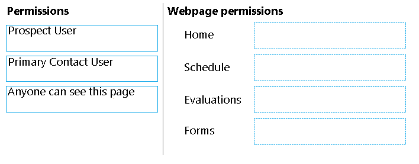

### Question - 51:

A company uses Power Apps.  
You create a custom table and configure a child table relationship with the contact table.  
You need to configure the cascading rules for each action.  
Which behavior should you use? To answer, drag the appropriate behaviors to the correct actions. Each behavior may be used once, more than once, or not at all. You may need to  
drag the split bar between panes or scroll to view content.  

  
Answer

1. Restrict
2. Cascade None
 

---

### Question - 52:

You plan to add a Power Apps app to Microsoft Teams.  
A Microsoft Dataverse for Teams environment has not been provisioned.  
You need to create a Dataverse for Teams environment.  
Which two actions can you perform? Each correct answer presents a complete solution.  
NOTE: Each correct selection is worth one point.  

-   A. Create a new app in Teams.
-   B. Install an existing app in Teams.
-   C. Create a new environment in the Microsoft Power Platform Admin Center.
-   D. Create an app permission policy in the Teams admin center.

  
Answer

-   A. Create a new app in Teams.
-   B. Install an existing app in Teams.

---

### Question - 53:

A company uses Power Apps with Microsoft Dataverse.  
The company enables auditing on the Dataverse database. The company tenant reaches the maximum storage capacity.  
You need to delete some auditing data.  
Which three deletion options should you use? Each correct answer presents a complete solution.  
NOTE: Each correct selection is worth one point.  

-   A. by record
-   B. between two specified dates
-   C. by table
-   D. older than a specified date
-   E. by column

  
Answer

-   A. by record
-   C. by table
-   D. older than a specified date

---

### Question - 54:

A company uses a Power Apps app with Microsoft Dataverse.  
The company requires the import of records into Dataverse. Duplicate records in the data must be deleted without user intervention.  
You create a duplicate detection rule.  
You need to configure the rule for the data import.  
Which option should you configure?  

-   A. Enable the During data import option.
-   B. Enable the Templates for Data Import option.
-   C. Disable the Allow Duplicates option.
-   D. Enable the When a record is created or updated option.

  
Answer

-   A. Enable the During data import option.

---

### Question - 55:

A company has a model-driven app that uses Microsoft Dataverse.  
Users need to add an alternate phone number when entering their account information. The users also require a list that displays the customers that do not have an alternate phone number.  
You need to enable the required features.  
Which features should you use? To answer, drag the appropriate features to the correct requirements. Each feature may be used once, more than once, or not at all. You may need to drag the split bar between panes or scroll to view content.  

  
Answer

---

### Question - 56:

You create a model-driven app for an automobile parts help desk.  
A help desk agent uses a form to gather information about customers’ automobiles in two custom tables. The names of the tables are Client and Automobile.  
The form must prepopulate the following information about the customer from the client table:  
• First name  
• Last name  

The agent must be able to type the following information about the automobile:  
• Automobile make  
• Automobile model  

You need to implement the form.  
What should you configure? To answer, select the appropriate options in the answer area.  
NOTE: Each correct selection is worth one point.  

  
Answer

1. Relationship
2. Table
 

---

### Question - 57:

A company uses Power Apps. You enable auditing in Microsoft Dataverse.  
Users report the following issues when viewing the audit logs:  
• Unable to view the read access audit logs.  
• Unable to view the Account table audit logs.  

You need to troubleshoot the issues.  
What are the causes of the issues? To answer, select the appropriate options in the answer area.  

  
Answer

---

### Question - 58:

A company is implementing a data model by using Dataverse.  
The company requires the following columns in a new custom table:  

You need to choose the column type that uses the least amount of database storage for each column.  
Which column types should you choose? To answer, select the appropriate options in the answer area.  

  
Answer

---

### Question - 59:

Accompany plans to implement a model-driven app. The company will enter data through the app.  

The company has the following requirements:  
• Users must be able to search for the data inside the app.  
• Users must be able to search for the data outside the app.  

You need to configure a solution for each requirement.  
What should you use? To answer, select the appropriate options in the answer area.  

    
Answer

-   Quick find Search
-   Microsoft Search

---

### Question - 60:

A company is implementing Microsoft Power Platform solutions.  
The company requests information on the features that are supported by Power Fx.  
You need to identify the features of Power Fx.  
What should you identify?  

-   A. It uses an undefined value for uninitialized variables.
-   B. It uses formulas that are similar to Microsoft Excel formulas.
-   C. It uses synchronous data operations.
-   D. It uses the model-driven app formula language.

    
Answer

-   B. It uses formulas that are similar to Microsoft Excel formulas.

---

### Question - 61:

A company is evaluating the capabilities in Dataverse and the scenarios for using virtual tables.  
You need to identify the capabilities of virtual tables.  
What is a capability of virtual tables?  

-   A. Virtual tables store data in the Dataverse environment.
-   B. Virtual tables retrieve data from an external data source.
-   C. Virtual tables can be configured for user and team ownership.
-   D. Virtual tables support Dataverse auditing.

    
Answer

-   B. Virtual tables retrieve data from an external data source.

---

### Question - 62:

Note: This question is part of a series of questions that present the same scenario. Each question in the series contains a unique solution that might meet the stated goals. Some question sets might have more than one correct solution, while others might not have a correct solution.  
After you answer a question in this section, you will NOT be able to return to it. As a result, these questions will not appear in the review screen.  
A company uses a Dataverse environment. The environment is accessed from canvas and model-driven apps.  

The Dataverse environment contains a table that has the following columns:  
• Name  
• Company  
• Contacted On  

The company requires that the table not contain any duplicate rows when users create data in the environment.  
You need to implement a solution that meets the requirement.  
Solution: Create an alternate key for the columns.  
Does the solution meet the goal?  

-   A. Yes
-   B. No

    
Answer

-   A. Yes

---

### Question - 63:

Note: This question is part of a series of questions that present the same scenario. Each question in the series contains a unique solution that might meet the stated goals. Some question sets might have more than one correct solution, while others might not have a correct solution.  
After you answer a question in this section, you will NOT be able to return to it. As a result, these questions will not appear in the review screen.  
A company uses a Dataverse environment. The environment is accessed from canvas and model-driven apps.  

The Dataverse environment contains a table that has the following columns:  
• Name  
• Company  
• Contacted On  

The company requires that the table not contain any duplicate rows when users create data in the environment.  
You need to implement a solution that meets the requirement.  
Solution: Create a Microsoft Power Fx formula for the columns.  
Does the solution meet the goal?  

-   A. Yes
-   B. No

    
Answer

-   B. No

---

### Question - 64:

Note: This question is part of a series of questions that present the same scenario. Each question in the series contains a unique solution that might meet the stated goals. Some question sets might have more than one correct solution, while others might not have a correct solution.  
After you answer a question in this section, you will NOT be able to return to it. As a result, these questions will not appear in the review screen.  
A company uses a Dataverse environment. The environment is accessed from canvas and model-driven apps.  

The Dataverse environment contains a table that has the following columns:  
• Name  
• Company  
• Contacted On  

The company requires that the table not contain any duplicate rows when users create data in the environment.  
You need to implement a solution that meets the requirement.  
Solution: Create a duplicate detection rule for the columns.  
Does the solution meet the goal?  

-   A. Yes
-   B. No

    
Answer

-   B. No

---

### Question - 65:

Note: This question is part of a series of questions that present the same scenario. Each question in the series contains a unique solution that might meet the stated goals. Some question sets might have more than one correct solution, while others might not have a correct solution.  
After you answer a question in this section, you will NOT be able to return to it. As a result, these questions will not appear in the review screen.  
A company uses a Dataverse environment. The environment is accessed from canvas and model-driven apps.  

The Dataverse environment contains a table that has the following columns:  
• Name  
• Company  
• Contacted On  

The company requires that the table not contain any duplicate rows when users create data in the environment.  
You need to implement a solution that meets the requirement.  
Solution: Create a business rule for the columns.  
Does the solution meet the goal?  

-   A. Yes
-   B. No

    
Answer

-   B. No

---
