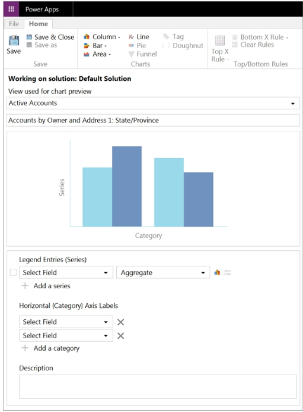
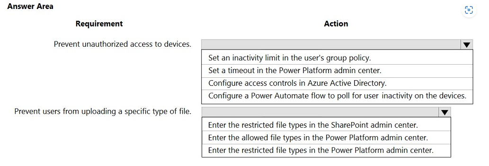
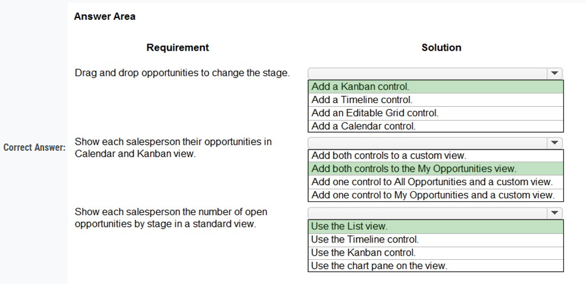

## Question - 1:

The owner of a company needs to know who signs into the system.
You need to ensure that the owner can view the user audit logs.
Where does each action need to be performed? To answer, select the appropriate options in the answer area.
NOTE: Each correct selection is worth one point.

  
Answer

  
  

## Question - 2:

Your organization does not permit the use of custom code for solutions.
You need to create a view that can be viewed by all users in an organization.
Where should you create the view?

-   A. List view of the entity
-   B. Microsoft Visual Studio
-   C. Templates area
-   D. Maker portal

  
Answer

  
  - D. Maker portal

## Question - 3:

You create a Power Apps portal to provide training and documentation for students. Students create a profile on the portal and then select and pay for courses.
You plan to add free courses to the training portfolio. Free courses must be automatically available to all students after they sign in.
You need to assign default permissions to students.
What should you do?

-   A. Create a Students web role and set the Authenticated Users Role option to true. Assign the web role to each registered user.
-   B. Create an entity for managing free courses. Create entity permission records to provide access to entity records for free courses and assign the entity permissions to users when they register on the portal for the first time.
-   C. Create an entity for managing free courses. Create a Students web role and set the Authenticated Users role option to true. Create appropriate entity permissions to access the free course entity records and assign the entity permissions to the web role.

  
Answer

  
  - C. Create an entity for managing free courses. Create a Students web role and set the Authenticated Users role option to true. Create appropriate entity permissions to access the free course entity records and assign the entity permissions to the web role.

## Question - 4:

You create workflows to automate business processes.
You need to configure a workflow to meet the following requirements:

-   Be triggered when a condition is met.
-   Run immediately.
-   Perform an action when a condition is met.
    You need to create a workflow that automatically sends emails based on a mail merge template. To answer, select the appropriate configuration in the answer area.
    NOTE: Each correct selection is worth one point.

  
Answer

  
  

## Question - 5:

You are a Dynamics 365 Customer Service administrator.
You need to configure the following automation for the sales team:

-   Send an email when the status changes on an Opportunity.
-   Text the sales manager when an Opportunity is created.
    Create a Wunderlist task when an Opportunity is open for 30 days.

Which tool should you use for each requirement? To answer, select the appropriate options in the answer area.
NOTE: Each correct selection is worth one point.

  
Answer

  
  

## Question - 6:

A company uses Microsoft Dataverse to manage prospects. The company has a business process flow named BPFA that is associated with the Prospect entity to streamline the prospect management process.
You add a field named Category to the Prospect entity. You create additional business process flows. You apply the business process flows to Prospect records based on the selected category. Users can switch to any other newly configured business process flows but must not use BPFA. 
You need to configure the solution. 
What are two possible ways to achieve this goal? Each correct answer presents a complete solution. 
NOTE: Each correct selection is worth one point.

-   A. Remove all of the privileges for BPFA.
-   B. Use a business rule to prevent users from switching to BPFA.
-   C. Deactivate BPFA.
-   D. Change the display order of the business process flows to move BPFA to the bottom of the list.

  
Answer

-   A. Remove all of the privileges for BPFA
-   C. Deactivate BPFA.

## Question - 7:

You are creating a business rule to implement new business logic.
You must apply the business logic to a canvas app that has a single screen named Screen1. 
You need to configure the scope for the business rule. 
Which scope should you use?

-   A. Screen1
-   B. Entity
-   C. All Forms
-   D. Global

  
Answer

-   B. Entity

## Question - 8:

You are a Dynamics 365 Customer Services administrator. You have a Production instance and Sandbox instance. 
Users record Production instance data in the Sandbox instance.
You need to ensure that the users only record data in the Production instance. 
Which security function needs to be edited to prevent access to the Sandbox? To answer, select the appropriate options in the answer area. 
NOTE: Each correct selection is worth one point.

  
Answer

-   Groups
-   Roles

## Question - 9:

You must create a new entity to support a new feature for an app. Records for the entity must be associated with a business unit and specify security roles for the business unit. 
You need to configure entity ownership. 
Which entity ownership type should you use?

-   A. user or team owned
-   B. organization-owned
-   C. none
-   D. business-owned

  
Answer

-   A. user or team owned

## Question - 10:

You need to ensure that there are no leads for a customer before you create a new opportunity for the customer. 
How can you use duplicate detection rules to achieve this goal? To answer, select the appropriate options in the answer area. 

  
Answer

-   Opportunity
-   Account

## Question - 10:

  
Answer

## Question - 11:

You have two Microsoft Power Platform environments.  
Users in one environment must not be able to see the other environment.  
You need to grant salespeople access to the sales company environment.  
What should you do?

-   A. Add salespeople to an Office 365 security group.
-   B. Add salespeople to a security role.
-   C. Set privileges.
-   D. Set app security.

  
Answer

-   A. Add salespeople to an Office 365 security group.

## Question - 12:

A veterinary office plans to use Power Platform to streamline customer experiences. The customer creates a canvas apps to manage appointments.  
On the client appointment form, there is a dropdown field for clients to select their type of pet. If a client selects the option   Other, the veterinarian wants a text field to appear so that additional details can be added. 
You need to create a dynamically visible field. 
What should you configure?

-   A. workflow
-   B. business process flow
-   C. business rule

  
Answer

-   C. business rule

## Question - 13:

You create an app for the sales team at a company.  
Members of the sales team cannot access the app.  
You need to ensure that sales team members can access the app.  
Where should you configure app permissions?

-   A. Dynamics administration center
-   B. Manage Roles
-   C. Security Roles

  
Answer

-   C. Security Roles

## Question - 14:

You create a parent entity and a child entity. The parent entity has a 1:N relationship with the child entity.  
You need to ensure that when the owner changes on the parent record that all child records are assigned to the new owner.  
You need to configure the relationship behavior type.  
What should you use?

-   A. Referential
-   B. Referential, Restrict Delete
-   C. Parental
-   D. Restrict

  
Answer

-   C. Parental

## Question - 15:

You need to recommend a role for users to perform several required tasks. The solution must use the principle of least privilege.  
Which roles should you recommend? To answer, drag the appropriate roles to the correct functions. Each role may be used once, more than once, or not at all.  >
You may need to drag the split bar between panes or scroll to view content.  
NOTE: Each correct selection is worth one point.  
Select and Place:

  
Answer

## Question - 16:

You are designing an app for a bank.  
You must create entities for the app and configure relationships between entities:  

Which relationship types should you use? To answer, drag the appropriate relationship types to the correct requirements. Each relationship type may be used once, more than once, or not at all. You may need to drag the split bar between panes or scroll to view content.  
NOTE: Each correct selection is worth one point.  
Select and Place:

  
Answer

## Question - 17:

Note: This question is part of a series of questions that present the same scenario. Each question in the series contains a unique solution that might meet the stated goals. Some question sets might have more than one correct solution, while others might not have a correct solution. 
After you answer a question in this section, you will NOT be able to return to it. As a result, these questions will not appear in the review screen. 
You administer the Microsoft 365 and Power Platform environments for Contoso, Ltd. The company has a model-driven app that is used to track customer interactions with employees. The app uses standard table types for customers. A user named Elisabeth Rice signs in to the app by using the following sign in name: Elisabeth.Rice@contoso.com.  
After marriage, Elisabeth changes her legal name to Elisabeth Mueller.  
You need to update the sign in name for the user without losing any application history.  
Solution: Change Elizabeth's username in the user record for the app.  
Does the solution meet the goal?

-   A. Yes
-   B. No

  
Answer

-   B. No

## Question - 18:

Note: This question is part of a series of questions that present the same scenario. Each question in the series contains a unique solution that might meet the stated goals. Some question sets might have more than one correct solution, while others might not have a correct solution. 
After you answer a question in this section, you will NOT be able to return to it. As a result, these questions will not appear in the review screen. 
You administer the Microsoft 365 and Power Platform environments for Contoso, Ltd. The company has a model-driven app that is used to track customer interactions with employees. The app uses standard table types for customers. A user named Elisabeth Rice signs in to the app by using the following sign in name: Elisabeth.Rice@contoso.com. 
After marriage, Elisabeth changes her legal name to Elisabeth Mueller.  
You need to update the sign in name for the user without losing any application history.  
Solution: Ask the Microsoft 365 administrator to sign in to the admin portal and change the username.  
Does the solution meet the goal?

-   A. Yes
-   B. No

  
Answer

-   A. Yes

## Question - 19:

Note: This question is part of a series of questions that present the same scenario. Each question in the series contains a unique solution that might meet the stated goals. Some question sets might have more than one correct solution, while others might not have a correct solution.  
After you answer a question in this section, you will NOT be able to return to it. As a result, these questions will not appear in the review screen.  
You administer the Microsoft 365 and Power Platform environments for Contoso, Ltd. The company has a model-driven app that is used to track customer interactions with employees. The app uses standard table types for customers. A user named Elisabeth Rice signs in to the app by using the following sign in name: Elisabeth.Rice@contoso.com.  
After marriage, Elisabeth changes her legal name to Elisabeth Mueller.  
You need to update the sign in name for the user without losing any application history.  
Solution: Delete the user account in the Power Platform admin portal and recreate the account by using the new name.  
Does the solution meet the goal?

-   A. Yes
-   B. No

  
Answer

-   B. No

---

### Question - 20:

You need to create a system chart for the Account entity. 
The chart must display a count of accounts grouped by owner and then display the accounts by Address 1: State/Province for each owner. You begin to configure chart options as shown in the image below. 

How should you complete the configuration? To answer, select the appropriate options in the answer area.  
NOTE: Each correct selection is worth one point. The chart must display a count of accounts grouped by owner, and then display the accounts by Address 1 to  
State/Province for each owner.  

  
Answer

---

### Question - 21:

A user has access to an existing Common Data Service database.  
You need to ensure that the user can create canvas apps that consume data from Dataverse.   You must not grant permissions that are not required.  
Which out-of-the-box security role should you assign to the user?

-   A. Environment Admin
-   B. System Customizer
-   C. Common Data Service User
-   D. Environment Maker

  
Answer

-   D. Environment Maker

---

### Question - 22:

A company deploys several model-driven apps. The company uses shared devices in their warehouse. The devices are always powered on. Users log on to the devices and then launch the apps to perform actions.  
Unauthorized users recently uploaded several files after another user failed to log out of a device. The company needs to prevent these incidents from occurring in the future.  
You need to configure the solution to prevent the reported security incidents.  
What should you do? To answer, select the appropriate options in the answer area.  
NOTE: Each correct selection is worth one point.  

  
Answer

-   Set a timeout in the Power Platform admin center
-   Enter the restricted file types in the PowerPlatform Admin center

---

### Question - 23:

A company's sales staff wants a simplified way to manage their opportunities in Dynamics 365 Sales without adding custom code.  
You need to provide a solution for each requirement.  
Which solutions should you provide? To answer, select the appropriate options in the answer area.  
NOTE: Each correct selection is worth one point.  

  
Answer

---

### Question - 24:

Note: This question is part of a series of questions that present the same scenario. Each question in the series contains a unique solution that might meet the stated goals. Some question sets might have more than one correct solution, while others might not have a correct solution.  
After you answer a question in this section, you will NOT be able to return to it. As a result, these questions will not appear in the review screen.  
You administer the Microsoft 365 and Power Platform environments for Contoso, Ltd. The company has a model-driven app that is used to track customer interactions with employees. The app uses standard table types for customers. A user named Elisabeth Rice signs in to the app by using the following sign in name: Elisabeth.Rice@contoso.com.  
After marriage, Elisabeth changes her legal name to Elisabeth Mueller.  
You need to update the sign in name for the user without losing any application history.  
Solution: From Dynamics 365 Settings, select Email Configuration. In the active mailbox for the user, update the name.  
Does the solution meet the goal?  

-   A. Yes
-   B. No

  
Answer

-   No

---

### Question - 25:

You plan to implement Microsoft Dataverse.  
You must track changes for two columns in the Account table. You must maintain a historical log of changes for the two columns and track only what is necessary.  
You configure the appropriate organization settings.  
You need to configure the system to track changes for the two columns.  
Which two actions should you perform? Each correct answer presents part of the solution.  
NOTE: Each correct selection is worth one point.  

-   A. Enable auditing for the Account table.
-   B. Enable auditing for the two specific columns.
-   C. Enable change tracking for the Account table.
-   D. Enable change tracking for the two specific columns.

  
Answer

-   A. Enable auditing for the Account table.
-   B. Enable auditing for the two specific columns.

---

### Question - 26:

Note: This question is part of a series of questions that present the same scenario. Each question in the series contains a unique solution that might meet the stated goals. Some question sets might have more than one correct solution, while others might not have a correct solution.  
After you answer a question in this section, you will NOT be able to return to it. As a result, these questions will not appear in the review screen.  
On a Contact record, a user creates a Note record that contains the word running.  
One week later, the user reports that they cannot find the Contact record associated with the Note record.  
You need to find the Note record.  
Solution: Use Categorized Search to search for the word run.  
Does the solution meet the goal?  

-   A. Yes
-   B. No

  
Answer

-   B. No

---

### Question - 27:

Note: This question is part of a series of questions that present the same scenario. Each question in the series contains a unique solution that might meet the stated goals. Some question sets might have more than one correct solution, while others might not have a correct solution.  
After you answer a question in this section, you will NOT be able to return to it. As a result, these questions will not appear in the review screen.  
On a Contact record, a user creates a Note record that contains the word running.  
One week later, the user reports that they cannot find the Contact record associated with the Note record.  
You need to find the Note record.  
Solution: Use Relevance Search to search for the word run.  
Does the solution meet the goal?  

-   A. Yes
-   B. No

  
Answer

-   Yes

---

### Question - 28:

Note: This question is part of a series of questions that present the same scenario. Each question in the series contains a unique solution that might meet the stated goals. Some question sets might have more than one correct solution, while others might not have a correct solution.  
After you answer a question in this section, you will NOT be able to return to it. As a result, these questions will not appear in the review screen.  
On a Contact record, a user creates a Note record that contains the word running.  
One week later, the user reports that they cannot find the Contact record associated with the Note record.  
You need to find the Note record.  
Solution: Use Quick Find search on the Notes list to search for the word run.  
Does the solution meet the goal?  

-   A. Yes
-   B. No

  
Answer

-   No

---

### Question - 29:

You are implementing a model-driven app to support a new line of business.  
There are several places where automated business logic must be applied.  
You need to determine how to apply the business logic.  
Which method should you use? To answer, drag the appropriate methods to the appropriate business logic statements. Each method may be used once, more than once, or not at all. You may need to drag the split bar between panes or scroll to view content.  
NOTE: Each correct selection is worth one point.  

  
Answer

-   Business rules
-   Real-time workflow
-   Real-time workflow

---

### Question - 30:

Your organization does not permit the use of custom code for solutions.  
You need to create a view that can be viewed by all users in an organization.  
Where should you create the view?  

-   A. Advanced Find
-   B. Entities component of a solution
-   C. Microsoft Excel template
-   D. Templates area

  
Answer

-   B. Entities component of a solution

